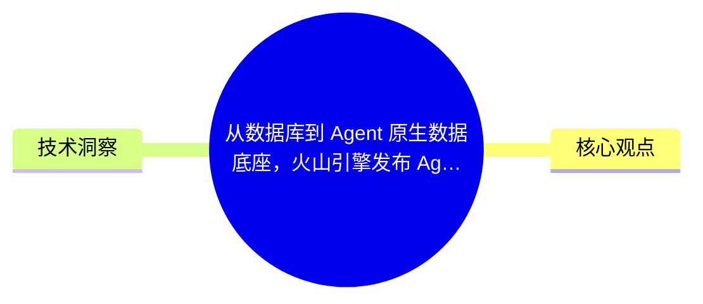
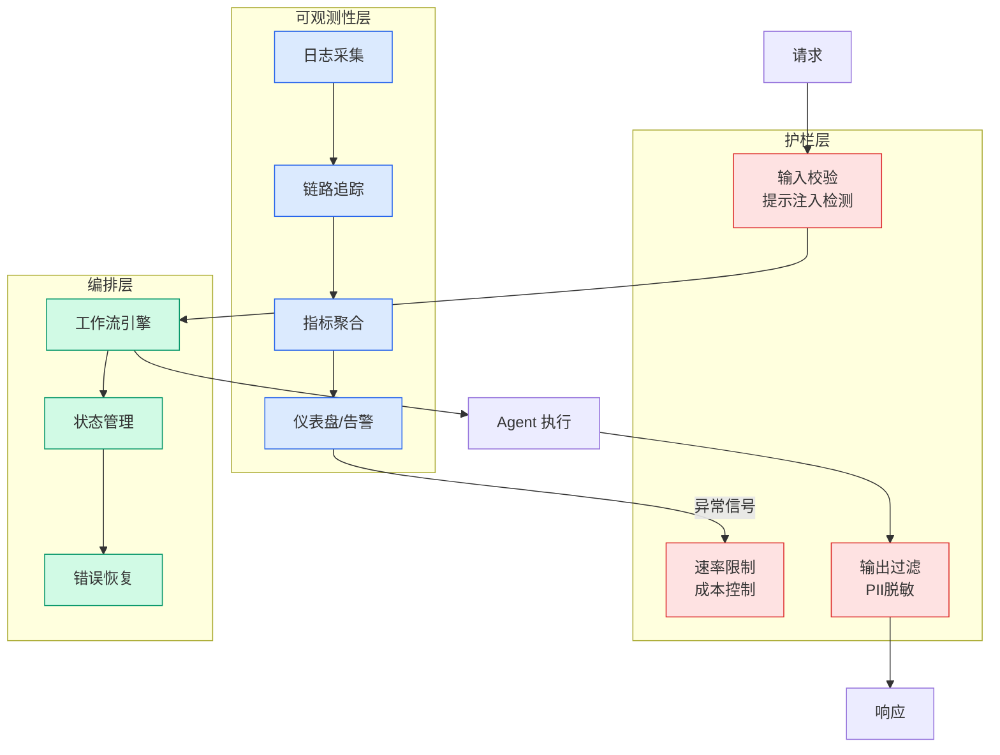

# 从数据库到 Agent 原生数据底座，火山引擎发布 Agentic 全栈数据管理服务

## Ch04.023 从数据库到 Agent 原生数据底座，火山引擎发布 Agentic 全栈数据管理服务

> 📊 Level ⭐ | 3.3KB | `entities/从数据库到-agent-原生数据底座火山引擎发布-agentic-全栈数据管理服务.md`

# 从数据库到 Agent 原生数据底座，火山引擎发布 Agentic 全栈数据管理服务

当数据消费主体从 “Human + Application” 扩张至千万级 AI Agent，传统数据库的能力边界已被彻底打破——海量 AI Agent 全天候自主检索、推理、协作、调度数据，传统数据底座已无法适配全新的业务逻辑。2026 火山引擎 FORCE 原动力大会·SUMMER，火山引擎数据库推出“**Agentic Data Management and Services** ”产品体系，并完成全栈产品升级。

## 概念导图

## 核心观点

> 本文通过article、agent、volcano-engine视角，分析了的技术进展和应用场景。

当数据消费主体从 “Human + Application” 扩张至千万级 AI Agent，传统数据库的能力边界已被彻底打破——海量 AI Agent 全天候自主检索、推理、协作、调度数据，传统数据底座已无法适配全新的业务逻辑。2026 火山引擎 FORCE 原动力大会·SUMMER，火山引擎数据库推出“**Agentic Data Management and Services** ”产品体系，并完成全栈产品升级。  

  

**市场拐点：AI Agent 正从 AI 助手，进化为企业可规模化部署的自主系统**

  

过去一年，市场明确形成了 **A3H 四元消费结构** ：AI、Agent、Application、Human，其中 AI Agent 的体量正呈指数级暴涨：

  

  * 市场增速：Grand View Research 数据显示，全球 AI Agent 市场年复合增速超 40%，2030 年规模有望突破 500 亿美元；中国 2023-2033 年 CAGR 高达 50.8%；

  * 规模增长：IDC 预测，活跃 Agent 将从 2025 年 2860 万暴涨至 2030 年 22.16 亿，CAGR 高达 139%；

  * 企业渗透：Gartner 预测，2026 年底 40% 企业应用会嵌入任务型 AI Agent，远高于 2025 年不足 5% 的渗透率。

  

这反映了一个核心事实：AI Agent 已是规模飞速扩张的新型数据消费主体，数据使用者已然迭代，底层数据基础设施也必须重构升级。

  

**在这场底层变革中，数据库为何如此举足轻重？**

  

以往数据库的访问对象是规整、可控的业务代码，人类手动编写 SQL 完成查询；而现在，调度数据的是一批具备自主规划、反复试错、瞬时并发暴涨特性的 AI...

## 技术洞察

本文的核心技术价值在于：
- 当数据消费主体从 “Human + Application” 扩张至千万级 AI Agent，传统数据库的能力边界已被彻底打破——海量 AI Agent 全天候自主检索、推理、协作、调度数据，传统数据...

→ [原文存档](https://github.com/QianJinGuo/wiki-book/tree/main/docs/raw/articles/从数据库到-agent-原生数据底座火山引擎发布-agentic-全栈数据管理服务.md)

---
## 关联
- 相关概念: [Harness Engineering](https://github.com/QianJinGuo/wiki/blob/main/concepts/harness-engineering-framework.md)
- 相关: [Agent 架构](https://github.com/QianJinGuo/wiki/blob/main/concepts/agent-architecture.md)

---

