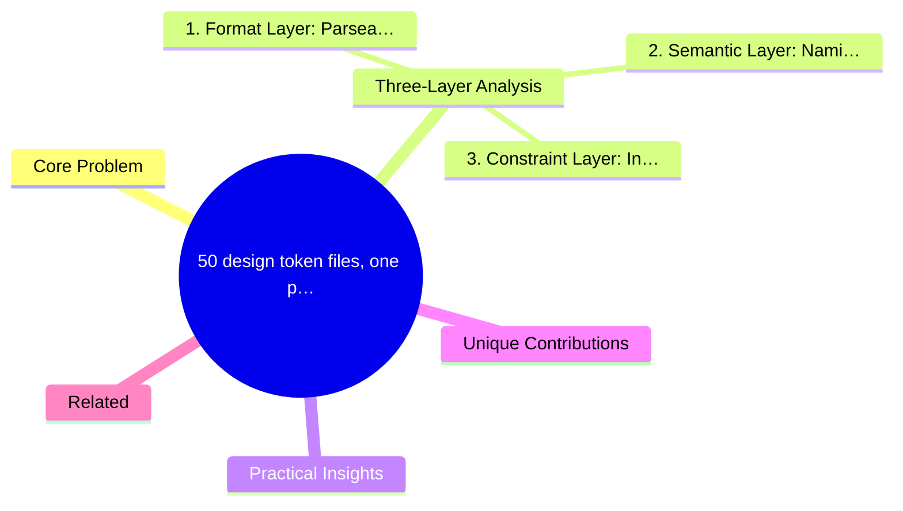
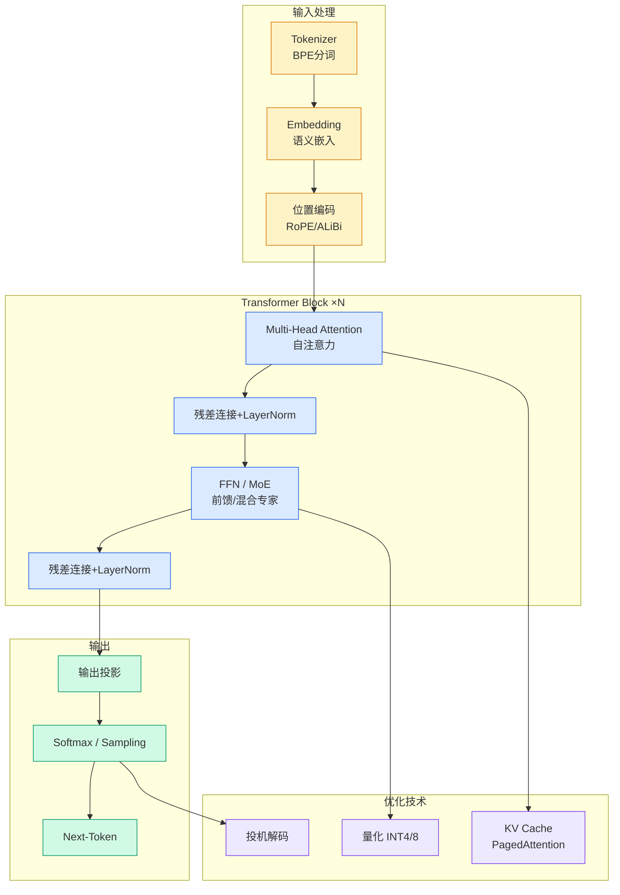

# 50 design token files, one problem: your agents can't read the meaning

## Ch04.025 50 design token files, one problem: your agents can't read the meaning

> 📊 Level ⭐ | 3.1KB | `entities/design-token-agent-readability-50-systems.md`

# 50 design token files, one problem: your agents can't read the meaning

> **Background**: Based on learn.thedesignsystem.guide analysis of 50 real design system token files, exploring how AI Agents consume structured design data.

## 概念导图

## Core Problem

Design tokens are the atomic variables of design systems -- colors, spacing, fonts, shadows. When AI Agents need to operate design systems, a key obstacle emerges: **token file semantics are opaque to agents**.

Findings from 50 design systems:
- Token file formats are fragmented (JSON, YAML, CSS custom properties, SCSS variables)
- Naming conventions lack a unified semantic layer (color.primary.500 vs --brand-blue-dark)
- Agents cannot infer token usage and constraints from file structure alone

## Three-Layer Analysis

### 1. Format Layer: Parseability of Token Files

Different design systems export tokens in vastly different formats. JSON is most agent-friendly, but CSS variables and SCSS mixed formats require additional conversion layers.

### 2. Semantic Layer: Naming Convention Comprehensibility

Agents need to understand whether spacing.large and margin.xl are equivalent. Currently no cross-system semantic mapping standard exists.

### 3. Constraint Layer: Inter-Token Dependencies

Color tokens may depend on theme tokens, spacing tokens may have grid alignment constraints. These implicit constraints are invisible to agents.

## Practical Insights

- **Production Prompt Templates**: The article provides prompt engineering templates for agents to consume token files
- **Tool Comparison**: Compares Style Dictionary, Token Studio, Cobalt UI for agent-friendliness
- **50 System Data**: Covers Material Design, Ant Design, Chakra UI and other mainstream systems

## Unique Contributions

1. **50-system empirical data** -- not theoretical, real structured comparison of token files
2. **Agent readability framework** -- format/semantic/constraint three-layer analysis model
3. **Production prompt templates** -- directly reusable prompt engineering for agent token consumption

## Related

- [DESIGN.md](../ch01/896-agent-ai.html) -- also an AI Agent interface for design systems
- [Claude Design Skill](../ch01/1150-claude-design-skill.html) -- agent operating design systems in practice

-> [Original Article Archive](https://github.com/QianJinGuo/wiki-book/tree/main/docs/raw/articles/design-token-agent-readability-50-systems.md)

---

