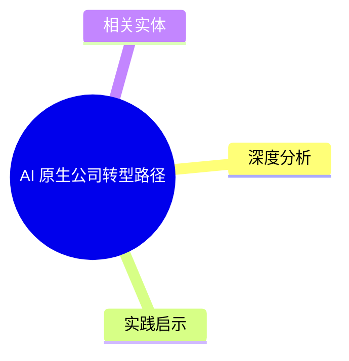
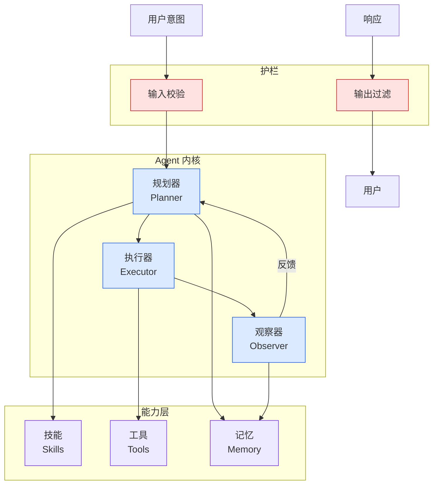

# AI 原生公司转型路径

## Ch04.026 AI 原生公司转型路径

> 📊 Level ⭐ | 1.8KB | `entities/ai-native-company-transformation.md`

# AI 原生公司转型路径

企业向 AI 原生转型的组织变革：从工具采用到流程重构到组织重塑。关键挑战在于中层管理的角色重定义、知识传递机制、以及人类与 Agent 的协作边界。

## 概念导图

## 深度分析

本页作为知识图谱锚点，连接了以下关键实体：[超级个体到超级组织：李志飞 CodeBanana 组织转型实践](../ch01/913-20.html)。 相关主题通过 [Agent 时代的生产力悖论：协作成为新瓶颈](../ch03/035-agent.html) 延伸。

> 本页内容将在入库相关溯源素材后进一步深化。

## 实践启示

1. 本领域系统性内容尚待采集——当前知识库在此方向的覆盖密度偏低
2. 建议优先采集 AI 原生公司转型路径 相关的一手来源（论文/官方文档/工程博客）
3. 通过交叉链接密度评估本领域的知识图谱成熟度

## 相关实体

- [超级个体到超级组织：李志飞 CodeBanana 组织转型实践](../ch01/913-20.html)
- [Agent 时代的生产力悖论：协作成为新瓶颈](../ch03/035-agent.html)
- [AI Native 时代研发组织何去何从](../ch05/018-ai-native.html)
- [AI Native 时代 —— 研发组织何去何从](../ch05/018-ai-native.html)
- [AI 原生团队的脏乱差：CEO 数字分身失败案例与 AI 销售线索分配的兴衰](../ch05/018-ai-native.html)

---

