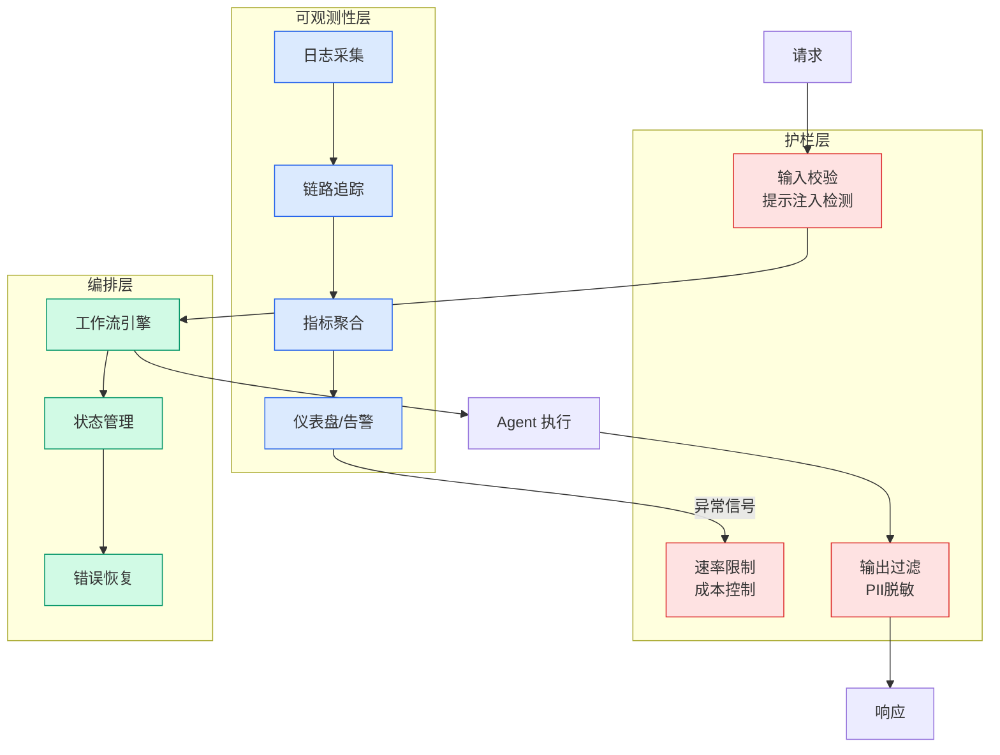

# Pod 组织结构

## Ch04.027 Pod 组织结构

> 📊 Level ⭐ | 1.7KB | `entities/pod-organization-structure.md`

# Pod 组织结构

Pod 组织结构：小型跨职能自治团队（通常 3-8 人），在 AI 时代可作为 Agent 协作的人类对等单元。Pod 内部的人类与 Agent 混合编排是前沿探索方向。

## 深度分析

本页作为知识图谱锚点，连接了以下关键实体：[AI Native 时代 —— 研发组织何去何从](../ch05/018-ai-native.html)。 相关主题通过 [Agent 时代的生产力悖论：协作成为新瓶颈](../ch03/035-agent.html) 延伸。

> 本页内容将在入库相关溯源素材后进一步深化。

## 实践启示

1. 本领域系统性内容尚待采集——当前知识库在此方向的覆盖密度偏低
2. 建议优先采集 Pod 组织结构 相关的一手来源（论文/官方文档/工程博客）
3. 通过交叉链接密度评估本领域的知识图谱成熟度

## 相关实体

- [AI Native 时代 —— 研发组织何去何从](../ch05/018-ai-native.html)
- [Agent 时代的生产力悖论：协作成为新瓶颈](../ch03/035-agent.html)
- [AI Native 时代研发组织何去何从](../ch05/018-ai-native.html)
- [超级个体到超级组织：李志飞 CodeBanana 组织转型实践](../ch01/913-20.html)
- [AI Native 团队搭建：七层模型与六步演进路线](../ch05/018-ai-native.html)

---

