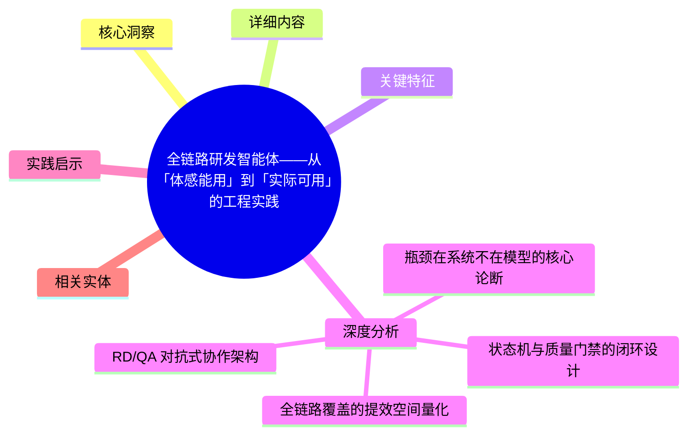
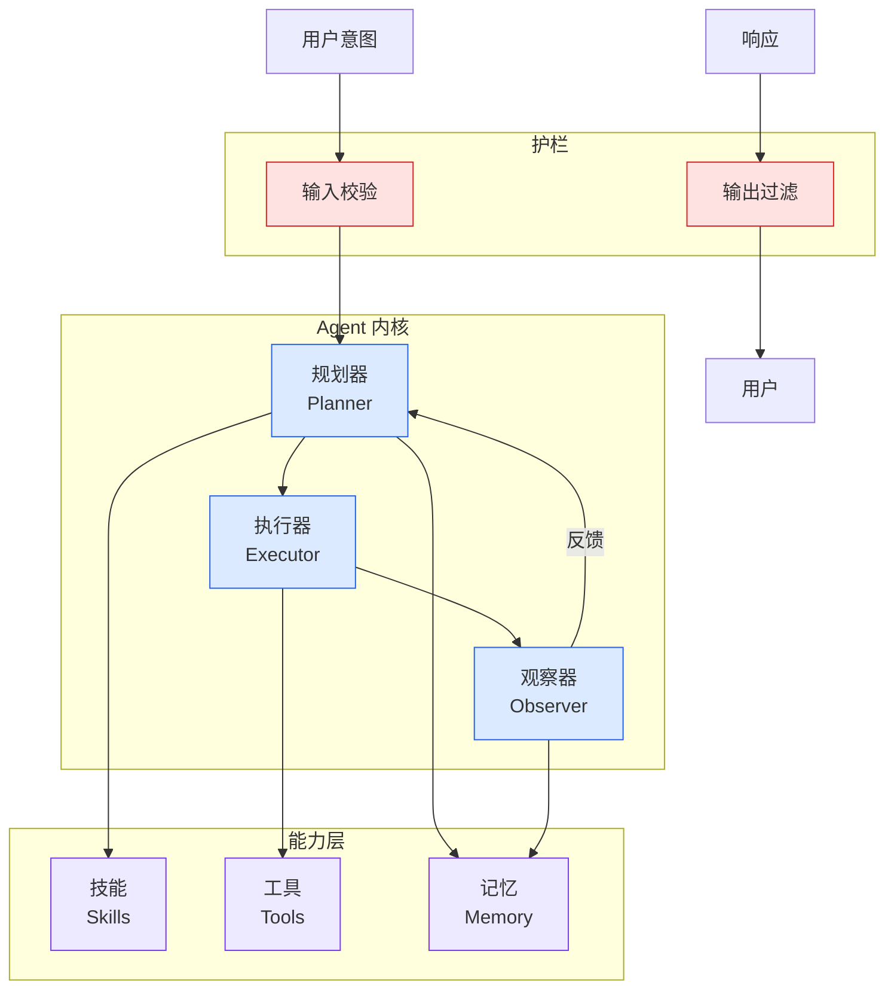

# 全链路研发智能体——从「体感能用」到「实际可用」的工程实践

## Ch04.407 全链路研发智能体——从「体感能用」到「实际可用」的工程实践

> 📊 Level ⭐⭐ | 7.5KB | `entities/full-chain-rd-agent-baidu-geek.md`

# 全链路研发智能体——从「体感能用」到「实际可用」的工程实践

> **Source**：百度Geek说，发布于 2026-06-24。本文是对 百度Geek说 关于 全链路研发智能体 实践的系统整理。

## 概念导图

## 核心洞察

百度Geek说团队从真实交付复盘出发，提出 Harness 全链路研发智能体架构：将大模型放进可控研发流程，覆盖需求分析、接口设计、代码生成、自动CR、单测、冒烟验证、环境部署、问题排查的完整闭环，附带需求可执行性检查、状态机与质量门禁设计、失败回流机制等工程实践。

## 详细内容

# 全链路研发智能体 ——从"体感能用"到"实际可用"的工程实践

。

点击蓝字，关注我们

作者 |  阿拉丁RD&QA团队

导读  introduction  AI Coding 已改变研发方式，但单点代码生成只占研发工时 10-32%，整体提效有限。本文从我们团队在项目的真实交付复盘出发，提出 Harness 全链路研发智能体：把大模型放进一套可控的研发流程，将需求分析、接口设计、代码生成、自动 CR、单测、冒烟验证、环境部署、问题排查串成带反馈控制的闭环，让 AI 从"会写代码"升级为"能完成可验证交付"。本文系统阐述其需求可执行性检查、状态机与质量门禁设计、失败回流机制、复杂度感知编排、RD/QA 协同模式，并以行业研究（METR RCT、Google DORA、SWE-bench 等）做交叉印证。
_ 全文 6746 字，预计阅读时间 7 分钟  _ GEEK TALK

01

问题定义：AI Coding 为什么"用起来不错，但没省多少时间"？

** 1.1 我们自己的复盘：coding 快了，但需求没更快交付  **

2026 年 4 月起，我们团队在项目里全

## 关键特征

- 来源为 百度Geek说 的技术实践分享
- 涵盖 Harness Engineering / Agent 框架的设计与工程落地
- 包含实际代码架构与工程经验沉淀

## 深度分析

### 瓶颈在系统不在模型的核心论断

百度 Geek 说团队的核心发现——"瓶颈在系统不在模型"——与 METR RCT、Google DORA 和 SWE-bench 等多组独立研究相互印证。SWE-bench 在 30 个月内从 2% 涨到 80%+，说明模型解题能力已经过剩；而 METR 研究发现裸用模型甚至可能减速。真正决定实际产出的是模型外的 scaffolding——即一套可控的研发流程。这一论断是 Harness 工程范式的重要理论基础：AI Coding 的关键不是让模型更快地写代码，而是把清晰的需求、可执行的流程、可验证的质量门禁串成全链路。

### 状态机与质量门禁的闭环设计

全链路研发智能体的核心工程创新是状态机驱动的闭环执行系统。每个阶段都有明确的输入、输出、成功条件、失败条件和回流目标。任一门禁失败时，系统不是停下来等人，而是保存失败上下文→选择回流阶段→在轮次上限内修复→重跑验证→记录全过程。这种"失败不是终点，而是修复输入"的设计，让 AI 从线性生成变成了带反馈控制的工程系统。复杂度感知编排确保简单需求走轻链路，复杂需求走重链路，避免了"一刀切"的效率损失。

### RD/QA 对抗式协作架构

行业实践中一个隐蔽的质量风险是"AI 自己写、自己验"——当开发和测试共享同一份上下文时，模型容易跳步、伪造 Mock 输出，甚至以 bug 验证 bug。百度团队的解法是将测试拆为独立的 QA SubAgent，采用"隔离式架构"（各自维护专属上下文）和"对抗式校验"（双模型开发与验证，QA Agent 标准化验收为唯一放行依据）。这是对 AI 测试可信度问题的系统性回应，其价值在于承认了"共享上下文"和"独立判定"之间的根本矛盾。

### 全链路覆盖的提效空间量化

团队的数据复盘显示，编码环节仅占研发工时的 10-32%，即使提效 55%，整体也只节省 5-16%。真正的提效空间分布在需求分析、验证、环境部署、线上排查等"编码外"环节。基于这一量化理解，全链路智能体将需求可执行性检查、接口设计、代码生成、自动 CR、单测、冒烟验证、环境部署、问题排查全部纳入闭环。与 Antenna、Stripe、GitHub 等业界研究的数据交叉印证，这一量化框架具有较强的通用参考价值。

### 环境部署与运维纳入 AI 流程

百度团队将环境部署从"人工附加步骤"改造为全链路的一环：RD 或无背景同学不需要从零摸索环境搭建，代码生成和基础验证后可直接进入测试环境部署。同时，非 Coding 高频事务（日志排查、配置变更、答疑）通过群聊助手远端触发，降低了触达门槛。这标志着 AI Coding 的边界从"写代码"扩展到了"完整交付"，将运维经验从口头支持转化为流程中的可执行能力。

## 实践启示

1. **量化提效空间，避免盲区**：先测量编码环节在总工时中的实际占比（10-32%），再决定优化方向。只优化编码而忽略需求、验证、环境等环节，整体提效有限。
2. **质量门禁必须有失败回流机制**：不要让 AI 在失败时停下来等人。状态机驱动的回流（保存上下文→选择回流阶段→修复→重跑）是实现自主闭环的关键工程模式。
3. **测试必须独立于开发**：共享上下文导致"自己写、自己验"的认知偏差。隔离 QA 上下文、采用双模型校验是保证测试可信度的有效手段。
4. **复杂度感知编排避免一刀切**：简单改文案和复杂跨服务需求走不同链路，避免用重流程拖慢轻任务、用轻流程漏掉重验证。
5. **把非编码环节纳入 AI 覆盖范围**：环境部署、线上排查、配置变更这些"不写代码但高频"的工作是真正的提效空间，通过远端触发和工具化将其纳入流程。

## 相关实体

[Claude Code Large Codebase Harness Configuration](../ch03/078-claude-code.html)、[超级Ai背后的秘密武器Agent Harness深度解析](../ch05/058-agent-harness.html)、[Harness Engineering](../ch05/120-harness-engineering.html)、[Claude Code Founder Harness 100 Lines](../ch03/078-claude-code.html)、[Tencent Knowledge Harness Practice](../ch05/009-harness.html)

## 原文存档

→ [原文存档](https://github.com/QianJinGuo/wiki-book/tree/main/docs/raw/articles/全链路研发智能体-从体感能用到实际可用的工程实践.md)

---

