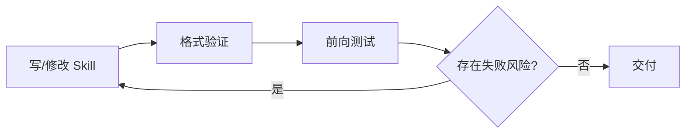

# AI Agent Skill 系统设计：淘宝技术工程实践

## Ch04.408 AI Agent Skill 系统设计：淘宝技术工程实践

> 📊 Level ⭐⭐ | 6.8KB | `entities/skill-system-design-taobao-technology-2026.md`

# AI Agent Skill 系统设计：淘宝技术工程实践

大淘宝技术（会员技术团队）系统阐述了 AI Agent Skill 系统的设计理念与工程实践。核心观点是将 Skill 视为**行为编程**而非文档，通过结构化设计（YAML+Markdown、DOT 流程图、检查表）和严格的约束机制（门控、合理化防御、说服原则）来规范 Agent 的行为。

## 核心洞察

### Skill 工程化的 6 个独特贡献

1. **HARD-GATE 门控语法**：`<HARD-GATE>...</HARD-GATE>` 显式声明条件门，在条件满足前禁止后续动作。不同于软性建议，门控是**执行边界**，让 Skill 在关键路径上更像程序而非建议
2. **自由度三级分级**：高（结构原则+示例）/中（模板+字段说明）/低（脚本确定性），附带具体场景映射。一个常见错误是把脆弱操作写成开放建议，另一个是把需要判断的任务写成死流程
3. **前向测试（Forward Testing）协议**：用子代理模拟真实用户任务，但不泄露预设诊断和预期答案。测试污染的主要来源就是「审稿人模式」
4. **合理化（Rationalization）防御**：AI Agent 在压力下会给跳过规则找到合理的借口。Skill 需要提前写出这些借口并给出反驳，这是人类文档思维和 Agent 行为编程的关键分水岭
5. **DOT 流程图嵌入**：用 GraphViz DOT 格式直接在 SKILL.md 中嵌入可执行流程图，处理非线性判断、循环、回退等纯文本难以稳定的分支
6. **平台适配策略**：写行为规则，用平台层适配具体工具名，平台能力不足时优雅降级

### 「发现层 vs 执行层」分离原则

`name` 和 `description` 是发现层（路由），正文是执行层。不要把触发条件放在正文里——Agent 在决定是否触发时看不到正文。`description` 也不能变成完整工作流摘要，否则 Agent 可能凭描述就开始执行。

### 验证的完整链路

## 与现有知识库的关联

- [Skill 设计模式](ch04/262-skill.md) — **互补**：设计模式讲 Skill 内部结构组织（线性/Tool Wrapper/Generator 等），本文讲 Skill 的工程过程（创建/验证/门控/适配）
- [Anthropic 14 个 Agent Skills 设计模式](ch04/247-anthropic-agent.md) — **互补**：Anthropic 14 模式讲 Skill 怎么写（渐进披露/上下文预算/排除条款等），本文补充了前向测试/门控/自由度分级等工程保障
- [Anthropic Claude Skill 9 类任务分类法](../ch07/056-anthropic-claude-skill-9.md) — **互补**：9 类分类告诉你做什么类型的 Skill，本文告诉你怎么做和怎么验证
- [Perplexity 内部 Skill 设计指南](ch04/262-skill.md) — Perplexity 的四维评价体系与本文的验证方法论可对照

## 深度分析

### 行为编程 vs 文档写作：Skill 工程的范式转换

这篇文章最核心的贡献不是具体的技巧，而是把 Skill 写作从「文档行为」重新定义为「行为编程」。这两者的区别是根本性的：

- **文档思维**：把已知的背景知识完整写进去，让读者理解（人类审核时感觉"很清楚"）
- **行为编程**：只补充 Agent 完成任务时缺少的程序性知识、资源边界和验证方式（Agent 执行时"更难走错"）

这个转换解释了为什么很多 Skill "写得很好但用起来不对"——它们通过了人类审稿，但没有通过 Agent 行为测试。HARD-GATE、合理化防御、前向测试这三个机制，本质上是把软件开发中的测试驱动理念移植到 Skill 工程中。

### HARD-GATE 的架构意义

HARD-GATE 语法是对 Anthropic "渐进披露"理念的工程化加强。Anthropic 说"信息要按需加载"，HARD-GATE 说"条件不满足就禁止执行"。两者的关系类似于正向约束和负向约束：渐进披露规定了**什么时候加载什么**，HARD-GATE 规定了**什么时候绝对不能做什么**。在安全敏感场景（删表、写生产、发消息），HARD-GATE 比渐进披露更有效。

### 前向测试 vs 传统 QA 的差异

前向测试设计精巧地解决了 AI Agent 测试的一个根本矛盾：测试者不能既当命题人又当阅卷人。用子代理做前向测试时，如果子代理只有在看到你（测试设计者）的结论后才能成功，说明 Skill 本身不够清楚或者测试设置已经泄露答案。这个观点比传统软件测试的 "test oracle" 问题多了一层 AI 特有的「暗示污染」风险。

### 合理化防御与说服原则

合理化防御（提前写出 Agent 可能用来跳过规则的借口并给出反驳）是这篇文章最有原创性的洞察之一。它揭示了 AI Agent 和普通软件的本质区别：普通软件不会找借口，而 AI Agent 会。这意味着 Skill 不仅要在正常路径上引导 Agent，还要在异常压力路径上预先堵住「走捷径的合理化通道」。这在传统软件开发中没有对应概念，是 Agent 工程独有的设计模式。

## 实践启示

1. **从「先写后验」改为「先收集例子，再规划结构，最后写内容」**：不从抽象能力开始写 Skill，从具体触发场景开始
2. **每个 Skill 都要有 HARD-GATE**：至少在关键路径上（写生产、改数据、发消息）加一个显式门控
3. **前向测试用子代理 + 原始任务**：不给子代理任何你的预设结论，让它像真实用户一样执行
4. **维护一个「合理化借口」清单**：每次测试发现 Agent 绕过了规则，把它的"理由"加到 Skill 的防御段落里
5. **平台适配层放在 agents/ 目录**：`agents/openai.yaml` 等文件负责映射工具名，SKILL.md 只写行为规则
6. **自由度由任务脆弱度决定，不由作者自信决定**：脆弱操作（旋转 PDF = 低自由度）和判断操作（写方案 = 高自由度）分开处理

## 原始存档
→ [原文存档](https://github.com/QianJinGuo/wiki/blob/main/raw/articles/skill-system-design-taobao-technology-2026.md)

---

