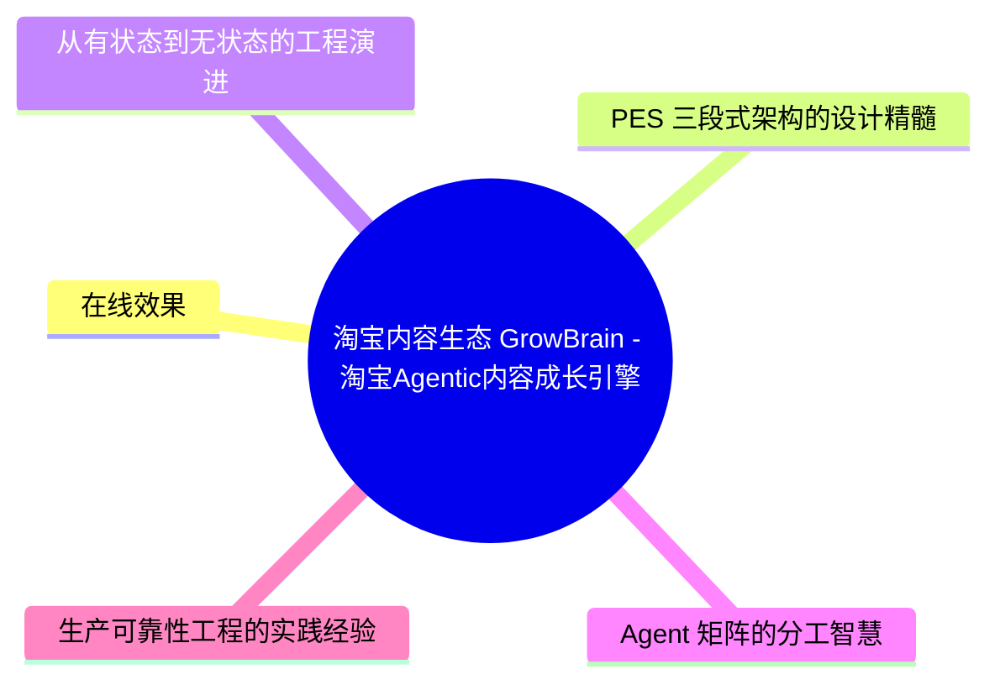
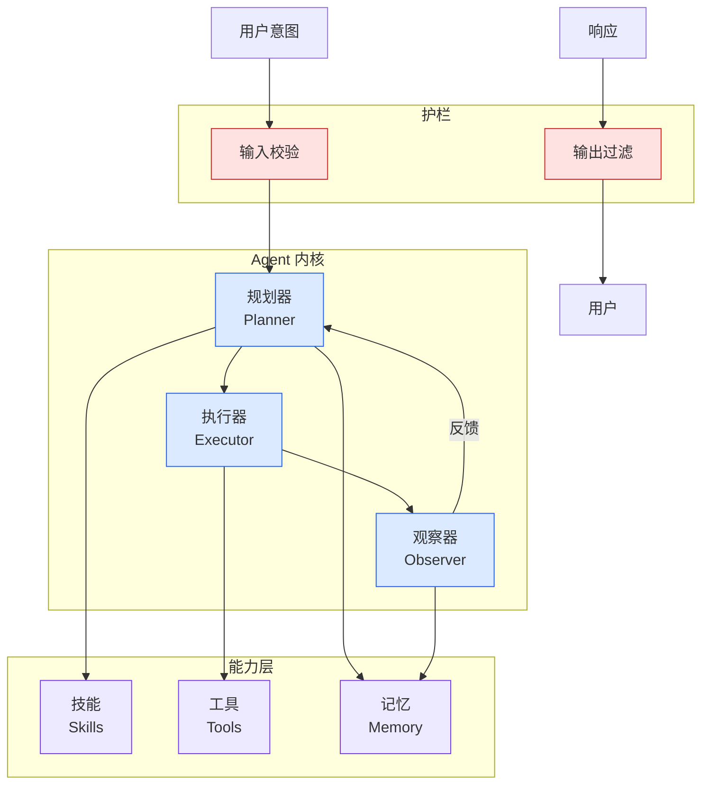

# 淘宝内容生态：GrowBrain - 淘宝Agentic内容成长引擎

## Ch04.429 淘宝内容生态：GrowBrain - 淘宝Agentic内容成长引擎

> 📊 Level ⭐⭐ | 7.2KB | `entities/淘宝内容生态growbrain-淘宝agentic内容成长引擎.md`

# 淘宝内容生态：GrowBrain - 淘宝Agentic内容成长引擎

> **GrowBrain** 是淘宝推出的以 LLM Agent 为决策大脑的全自动内容成长引擎。该系统通过 Planning-Execute-Summarize（PES）三段式编排范式统一调度多个子 Agent 组成的能力矩阵（潜力预估、流量分配、漏斗诊断等），服务内容成长全周期，让内容成长决策从「规则拍板+人工兜底」升级为 Agent 驱动的智能决策。

淘宝每天有大量新发内容，一条内容在发布初期的曝光机会基本决定了它的成长上限。GrowBrain 的诞生源于三个瓶颈：多信号融合困难（十余路信号规则写不完）、决策说不清楚（传统模型只输出分数不解释原因）、新场景接入慢（需求以周为单位）。

## 概念导图

## 核心架构

GrowBrain 采用 PES 三段式架构替代了传统的 ReAct 模式。在 ReAct 模式下，小模型需要同时承担决策调度和内容生成两个职责，容易产生幻觉；PES 将规划和执行解耦——Planning 阶段 LLM 只拆任务，Execute 阶段框架按拓扑顺序确定性执行，Summary 阶段 LLM 只做总结。这一转变使计算开销可控、行为可预测、小模型也能胜任。

Agent 矩阵按任务分工：潜力预估 Agent 负责分析新内容获流潜力，流量分配 Agent 负责流量投资决策，流量诊断 Agent 负责回溯分发日志进行归因。系统支持双 Pipeline 物理隔离（SystemPipeline 服务线上中控，ChatPipeline 服务产运对话），共享同一套能力底座。

## 在线效果

在工程层面，GrowBrain 将 Agent 从有状态设计重构为无状态执行引擎，状态跟着请求走，能力按需加载，Memory 用完即释放。最终实现了成长链路流量投资 ROI +8.67%。其决策可解释性白盒化——Agent 天然输出思考链和决策理由，不再需要额外挂解释模块；新场景接入从周级缩短到天级。

## 深度分析

### PES 三段式架构的设计精髓

GrowBrain 最关键的工程决策是从 ReactAgent（ReAct 模式）演进到 PES（Plan-Execute-Summarize）三段式架构。在 ReactAgent 模式中，LLM 同时承担"决策调度"和"内容生成"两个职责，小模型（如 Qwen3-0.6B）容易被输出 Schema 的格式"带偏"，跳过 Tool 调用直接编造数据。PES 将规划、执行、总结三个职责在时序上彻底解耦——Planning 阶段 LLM 只拆任务不操作，Execute 阶段框架确定性执行，Summary 阶段 LLM 只做总结。这一设计使小模型也能稳定胜任生产链路中的 LLM 任务，是 [Harness Engineering](https://github.com/QianJinGuo/wiki/blob/main/concepts/harness-engineering-framework.md) 中"职责分离"原则在 Agent 架构中的典范应用。

### 从有状态到无状态的工程演进

GrowBrain 团队在生产环境中经历了三个"拆"的演进：把状态从 Agent 里拆出来（引入 AgentContext 请求级容器）、把 Memory 从 Agent 级拆到请求级（实现 MemoryManager 三级隔离）、把 Skills/Tools 从构造时拆到运行时（通过 Registry 实现动态加载）。这使 Agent 从一个"有状态的大而全的对象"变成"无状态的执行引擎"——状态跟着请求走，能力按需加载，Memory 用完即释放。这一演进路线对任何将 Agent 从原型推向生产的团队都有直接参考价值。

### Agent 矩阵的分工智慧

GrowBrain 没有使用一个大模型端到端解决所有问题，而是拆成多个职责专一的子 Agent：潜力预估 Agent、流量分配 Agent、流量诊断 Agent。这一设计体现了 [Agent 架构](https://github.com/QianJinGuo/wiki/blob/main/concepts/agent-architecture.md) 中的"关注点分离"原则——每个 Agent 只负责一个决策维度，出问题时能精确定位到具体环节和模型版本。同时，多 Pipeline（SystemPipeline + ChatPipeline）共享能力底座的设计使得能力新增一次、全线受益。

### 生产可靠性工程的实践经验

GrowBrain 的生产化过程积累了大量可靠性工程经验：CoT Distillation 让小模型在推理链中生成可解释的决策理由、Prompt 驱动策略调整实现秒级业务响应、双 Pipeline 物理隔离保障线上稳定性。这些实践共同回答了"Agent 系统如何在工业级延迟和稳定性约束下运行"这一核心问题。

## 实践启示

1. **慎用 ReAct 模式做生产**：GrowBrain 的实践明确表明，ReAct 模式在小模型 + 高并发的工业场景下不可靠。PES 三段式架构是更好的默认选择，特别当模型能力不足以同时处理"决策调度"和"内容生成"时。

2. **无状态 Agent 是生产化的前提**：在生产环境中，Agent 实例应是无状态的执行引擎，所有状态通过请求级别容器管理。这避免了高并发下的 Memory 污染和上下文混乱问题。

3. **按维度拆分 Agent 而非用一个模型包办**：将复杂任务拆分为多个职责专一的子 Agent（如潜力预估、流量分配、流量诊断），比让一个大模型端到端处理所有决策更可靠、更可调试。

4. **CoT Distillation 是实现可解释性的有效路径**：GrowBrain 用反向推理→正向推理→CoT Distillation 的流程，将大模型的思考链蒸馏到轻量级模型，同时保留了决策过程的白盒化——这对需要监管合规的决策系统尤为重要。

5. **Prompt 驱动的策略调整可实现秒级业务响应**：将策略框架内嵌于 prompt，使得业务方可以通过修改 prompt 指令实时调整策略（如类目扶持、质量管控等），响应速度从天级降至秒级，无需代码变更。这是 Agent 系统相对于传统规则系统的关键优势。

→ [原文存档](https://github.com/QianJinGuo/wiki-book/tree/main/docs/raw/articles/淘宝内容生态growbrain-淘宝agentic内容成长引擎.md)

---
## 关联
- 相关概念: [Harness Engineering](https://github.com/QianJinGuo/wiki/blob/main/concepts/harness-engineering-framework.md)
- 相关: [Agent 架构](https://github.com/QianJinGuo/wiki/blob/main/concepts/agent-architecture.md)

---

