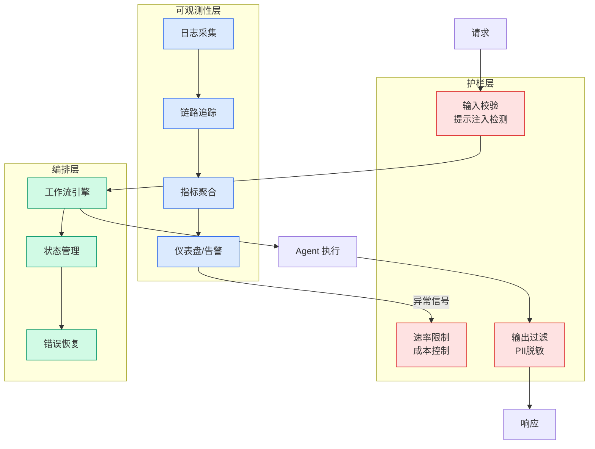

# We Ran 250 AI Agent Evals to Find Out if Skills Beat Docs. The Answer Is More Complicated Than We Expected

## Ch04.547 We Ran 250 AI Agent Evals to Find Out if Skills Beat Docs. The Answer Is More Complicated Than We Expected

> 📊 Level ⭐⭐ | 5.0KB | `entities/we-ran-250-ai-agent-evals-to-find-out-if-skills-beat-docs-th.md`

# We Ran 250 AI Agent Evals to Find Out if Skills Beat Docs. The Answer Is More Complicated Than We Expected

> Source: [We Ran 250 AI Agent Evals to Find Out if Skills Beat Docs. The Answer Is More Complicated Than We Expected](https://www.wix.engineering/post/we-ran-250-ai-agent-evals-to-find-out-if-skills-beat-docs-the-answer-is-more-complicated-than-we-ex) | Score: v*c=64

## Overview

Published Time: 2026-05-06T11:16:26.529Z

Markdown Content:

The industry has a new obsession: AI skills.

The logic seems bulletproof: if you want an AI agent to use your platform, you shouldn’t just give it raw documentation. You should give it a "skill", a curated, condensed, and optimized guide. This will allow the agent to perform tasks on your platform better than if they have to trawl through your docs. Skills are intuitive and trendy, but do they really provide agents with an edge over just using the docs and, if so, in what cases?

At Wix, we decided to **question the hype and start measuring**. We ran 250 controlled evaluations comparing how AI agents perform tasks using standard docs, AI-optimized docs, and purpose-built skills. The results were surprising and they challenged our entire strategy for the AI-native developer experience.

As it turns out, a slightly stale skill isn’t just inefficient, it’s a liability. Here’s why your documentation might actually be a better "skill" than the ones you’re manually writing.

## The Problem We Were Trying to Solve

At Wix, the tech writers team writes and maintains developer documentation. This includes API references, guides, tutorials, and anything else an external developer needs to build apps on the Wix platform. Increasingly, the audience for our docs is shifting from human developers to AI agents. To handle this shift, our team took on responsibility for making sure our docs actually work for agents, not just humans.

Around the same time, we started seeing skills appear. Teams throughout the company began writing skills, teaching agents how to do specific developer tasks. These skills contained a mix of information extracted from docs, combined with curated instructions and information for guiding agents. All the skills were maintained independently, without coordination with the documentation they were derived from.

The concern was obvious to us: the moment the underlying product changes, a scaffold updates, an API gets a new required field, a method is deprecated, any skill derived from stale docs drifts.

But beyond the maintenance problem, there was a deeper question nobody was asking: are skills actually better? The assumption was that they are. They're purpose-built for the task, condensed, optimized. But the assumption was unexamined. And we were watching a parallel documentation layer grow outside our control, on the basis of that assumption.

We wanted **evidence**.

## Methodology

We designed a quantitative evaluation across two task families, 250 runs total:

*   **CLI extensions:**Building [Wix CLI](https://dev.wix.com/docs/wix-cli)app extensions: dashboard pages, backend APIs, site widgets, event handlers, embedded scripts, modals, and plugins.

→ [原文存档](https://github.com/QianJinGuo/wiki-book/tree/main/docs/raw/articles/we-ran-250-ai-agent-evals-to-find-out-if-skills-beat-docs-th.md)

---
## 关联
- 相关概念: [Harness Engineering](https://github.com/QianJinGuo/wiki/blob/main/concepts/harness-engineering-framework.md)
- 相关: [Agent 架构](https://github.com/QianJinGuo/wiki/blob/main/concepts/agent-architecture.md)

---

