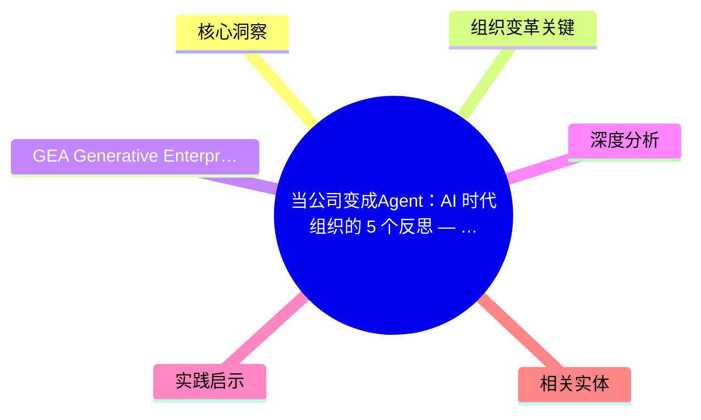
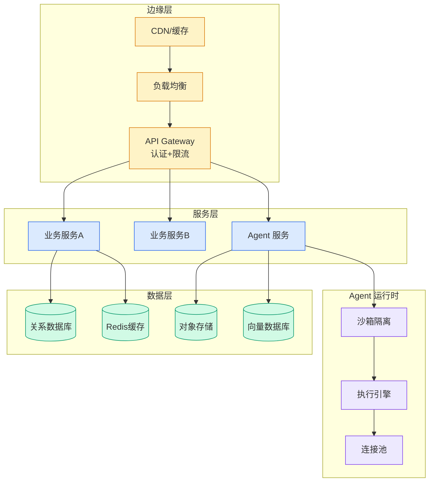

# 当公司变成Agent：AI 时代组织的 5 个反思 — 范凌访谈

## Ch04.552 当公司变成Agent：AI 时代组织的 5 个反思 — 范凌访谈

> 📊 Level ⭐⭐ | 5.0KB | `entities/fanling-company-as-agent-ai-org-reflection.md`

# AI 时代组织的 5 个反思 — 范凌访谈

## 概念导图

## 核心洞察
1. **AI 不是提效工具，是资源分配器** — AI 让产品经理用 Cursor 直接拿到研发资源，跨越角色边界
2. **Pod + Community 双轨制** — 3-10人跨职能小队闭环交付 + 横向社区补齐跨界能力
3. **创始人下场 Build** — 创始人亲自做 AI 产品，午餐秀 demo，形成 dogfooding 文化
4. **分层上下文系统** — 个人层 / Pod 层 / 公司层，schema.md 索引过去积累的亿级文档
5. **GEA 架构** — Lead Agent + Sub-Agent + Skills + Context，7×24 虚拟公司

## 组织变革关键

- **AI 反工业革命** — 打破"一人一岗、逐级晋升"的工业时代组织假设
- **Pod Leader 新能力** — P&L、商业直觉、耐心、管理 Agent 比管理人多更难
- **场景驱动** — Pod leader 30%-40% 时间收集客户场景，SPIS 方法论结构化

## GEA (Generative Enterprise Agent)
企业级 Agent 架构：不执着于单个 Agent，重点在 Context + Orchestration，在用户洞察、内容增长、产品创新等领域搭出企业专属 Agent 项目组。
→ [原文存档](https://github.com/QianJinGuo/wiki-book/tree/main/docs/raw/articles/fanling-company-as-agent-ai-org-reflection-v2.md)

## 深度分析
范凌的核心洞察在于"AI 是资源分配器而非提效工具"这一范式转换。传统组织是层级化的资源分配器（人 → 预算 → 产出），AI 时代的组织变成以 Context 为核心的分配器——Pod Leader 的核心能力从"管理人"变成"管理 Agent + 上下文工程"。
GEA 架构的实践意义：企业不需要执着于打造"超级 Agent"，而是在关键业务节点（用户洞察、内容增长、产品创新）部署 Agent 网络，通过 Orchestration 层串联，形成组织能力的数字化映射。

## 实践启示
1. **组织架构先行**：先设计 Pod + Community 双轨制，再引入 Agent 工具，而非相反
2. **Context 是护城河**：投入建设分层上下文系统（个人/Pod/公司层），让数据积累产生复利
3. **创始人躬身入局**：AI 转型需要创始人亲自 build、demo、迭代，形成自上而下的文化牵引
4. **渐进式 Agent 化**：从非核心流程开始试点 GEA，验证后再向核心业务延伸

## 相关实体

- [AI Native 时代研发组织何去何从](../ch05/018-ai-native.html)
- [AI in Cybersecurity Training Resources | SANS Institute](../ch05/094-ai.html)
- [AI MAP: Security Testing for AI Agent Infrastructure — Bishop Fox](ch04/438-introducing-aimap-security-testing-for-ai-agent-bishop-f.html)
- [AI tool poisoning exposes a major flaw in enterprise agent security](ch04/313-ai-tool-poisoning-exposes-a-major-flaw-in-enterprise-agent-s.html)
- [十年老技术开发的 AI Agent 探索之路](ch04/298-ai-agent.html)
- [James Cowling Engineering Philosophy Ai Era](../ch05/094-ai.html)

---

