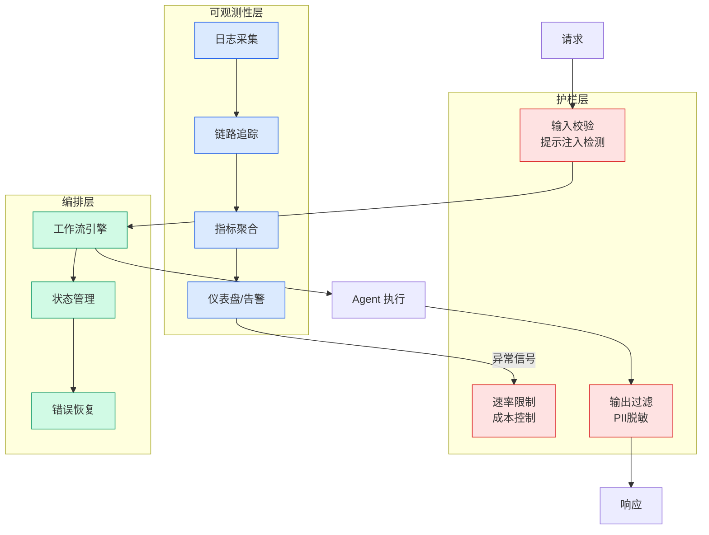

# Amazon Bedrock AgentCore: 知识扩展与持续学习新能力

## Ch04.561 Amazon Bedrock AgentCore: 知识扩展与持续学习新能力

> 📊 Level ⭐⭐ | 4.9KB | `entities/new-in-amazon-bedrock-agentcore-build-agents-with-broader-kn.md`

# Amazon Bedrock AgentCore: 知识扩展与持续学习新能力

> **背景**：2026-06-17 AWS 发布 AgentCore 平台更新，引入三大知识层接入（组织/世界/付费）与持续学习能力，是 AgentCore 从"managed harness"向"agent economy infrastructure"演进的里程碑。

## 三大知识层架构

AgentCore 通过三层知识架构扩展 agent 的可达性：

### 组织知识层：Bedrock Managed Knowledge Base
- **解决痛点**：企业知识散落在 SharePoint / Google Drive / Confluence / S3 / Wiki，传统需要数月构建 RAG pipeline
- **核心创新**：Agentic retriever — 不只做相似度匹配，而是 **query planning + 跨文档概念连接 + 中间结果评估 + re-ranking**
- **管理责任转移**：vector store、embedding、re-ranking、扩容、限流全部由 AWS 接管

### 世界知识层：Web Search on AgentCore
- **复用基础**：Amazon 自家搜索基础设施（Alexa+, Quick Suite, Kiro）
- **差异化设计**：multi-source grounding（公开 web + Amazon 知识图谱）— 实体数据、验证事实、实时行情
- **安全边界**：所有 query 留在客户 AWS 账户内，无第三方 vendor onboarding

### 付费知识层：AgentCore payments + WAF AI 流量变现
- **agent 侧**：AgentCore payments 允许 agent 在执行 loop 内发现、访问、付费
- **provider 侧**：WAF AI traffic monetization（GA）— 内容方可选 block / allow / 收费
- **互联互通**：使用 WAF 的 provider 自动识别 AgentCore 验证的 agent，建立信任通道
- **战略意义**：构建 agent economy 的双边基础设施

## 三个独有贡献（不应合并到现有 entity）

1. **三层知识架构抽象** — 组织/世界/付费三层分类，是 AWS 对 agent 可达性问题的系统化分类法
2. **Agentic retriever vs 传统 RAG** — 主动 query planning + 中间结果评估，而非被动相似度匹配
3. **Agent economy 基础设施** — WAF AI traffic monetization + AgentCore payments 双边架构，是 agent 商业化的产品级实现

## 持续学习与生产可观测性

### 最危险的失败模式
- agent 错误确认未执行的订单
- API 超时时编造产品可用性
- 跳过审批步骤但 dashboard 显示 99% 成功率
- **共同特征**：不抛 error，dashboard 正常，问题在数周后用户投诉中暴露

### 修复策略
- 修 prompt、改 tool 描述、调 orchestration — 全靠猜测，无结构化方法判断改动是否真的改善

## 与现有 [AgentCore Harness](ch04/224-agentcore-managed-harness.html) 实体的差异化

| 维度 | 旧 entity (2026-05-21) | 本次 (2026-06-17) |
|------|---------------------|-----------------|
| 焦点 | Harness 工程三阶段 + 编排 | 知识层架构 + 持续学习 |
| 核心组件 | Runtime / Memory / Identity | Knowledge / Web Search / Payments |
| 抽象层级 | "模型之外的一切" | "agent 之外的可达性" |
| 客户案例 | 通用框架 | Sony 具体引用 |

## 关键引用

> "At Sony, we're building an enterprise AI agent platform on AgentCore where teams across business units can develop, share, and reuse AI agents"
> — Masahiro Oba, Senior General Manager, Sony Group Corporation

## 相关主题

- [Agentcore Managed Harness](ch04/224-agentcore-managed-harness.html) — 前篇：Harness 编排框架
- [Agentcore Harness](ch04/689-agentcore-harness.html) — 同期：其他 AgentCore 工程实践
- [Agentcore Payments X402 Agentic Commerce](../ch11/066-agentcore-payments.html) — 同期：x402 商业化
- [原文存档](https://github.com/QianJinGuo/wiki-book/tree/main/docs/raw/articles/new-in-amazon-bedrock-agentcore-build-agents-with-broader-kn.md)

---

