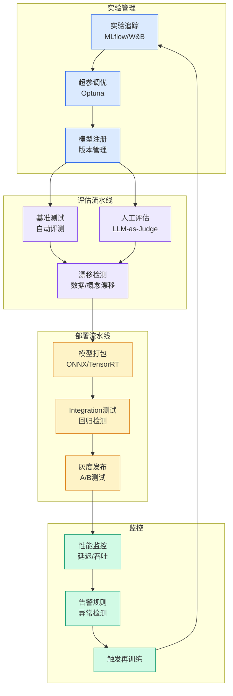

# Why Real Workload Performance is the Metric that Matters

## Ch04.562 Why Real Workload Performance is the Metric that Matters

> 📊 Level ⭐⭐ | 4.9KB | `entities/why-real-workload-performance-is-the-metric-that-matters.md`

# Why Real Workload Performance is the Metric that Matters

> Source: [Why Real Workload Performance is the Metric that Matters](https://www.snowflake.com/en/blog/engineering/measuring-real-workload-performance) | Score: v*c=56

## 概念导图

## Overview

Published Time: 2026-06-25T16:39:29.676Z

Markdown Content:
_Benchmarks can produce misleading results when they use nonproduction workloads, misconfigured systems or unavailable products. When appropriately configured, Snowflake Interactive Analytics outperforms Databricks' Reyden (now in beta) based on the published numbers shared during the keynote at production-relevant scales (12.5s vs. 13.2s at 100 GB; 28.2s vs. 71s at 1 TB). Use the four-question framework in this blog to evaluate performance claims, including those from Snowflake._

Customers want predictable performance for their workloads. In practice, that means testing with their own queries and data when possible, using representative synthetic workloads when needed, and finally, relying on well-known benchmarks as an additional point of comparison.

However, many published benchmarks measure only a narrow slice of real-world performance. They rarely answer the question customers actually care about: how will my workloads perform at my scale, with my users and at my cost?

Here’s the framework we use to evaluate any benchmark, including our own.

## Defining the problem: What real-time analytics actually requires

Interactive Analytics involves serving thousands of concurrent users, applications, dashboards and AI agents with sub-second latency, on data that changes continuously, with a query mix you can't fully predict. That combination stresses systems in ways traditional analytical benchmarks were not designed to expose: concurrency collapse, p95/p99 latency spikes, freshness gaps, cache dependence, queueing behavior and cost anomalies under bursty demand.

The [TPC-inspired benchmarks](https://www.tpc.org/) that we often see in comparisons typically measure raw single-user throughput on a known workload and simple concurrency simulations based on a subset of data, often only a subset of query patterns. While this exercises a significant part of the functionality for data engines and are useful regression tests, it doesn't measure behavior under real-world load, latency distribution as users multiply, or cost as data scales from hundreds of gigabytes to hundreds of terabytes.

That distinction matters, and it’s important to keep in mind for every benchmark result that follows.

## Four questions to ask about any benchmark

When you see a performance claim from us or from anyone else, these are the questions that can tell you if it translates to your situation.

**1. Does the workload shape match yours?**A single-user TPC-H power run and a 1,000-concurrent-user dashboard are different problems. If you're building for concurrency, single-user throughput numbers are the least predictive metric you can look at.

**2. Is the configuration production-ready?**Every platform has standard settings that trade raw benchmark scores for production reliability: connection handling, result caching, scale out support for higher concurrency workloads and more. Benchmarks that omit those settings

→ [原文存档](https://github.com/QianJinGuo/wiki-book/tree/main/docs/raw/articles/why-real-workload-performance-is-the-metric-that-matters.md)

---
## 关联
- 相关概念: [Harness Engineering](https://github.com/QianJinGuo/wiki/blob/main/concepts/harness-engineering-framework.md)
- 相关: [Agent 架构](https://github.com/QianJinGuo/wiki/blob/main/concepts/agent-architecture.md)

---

