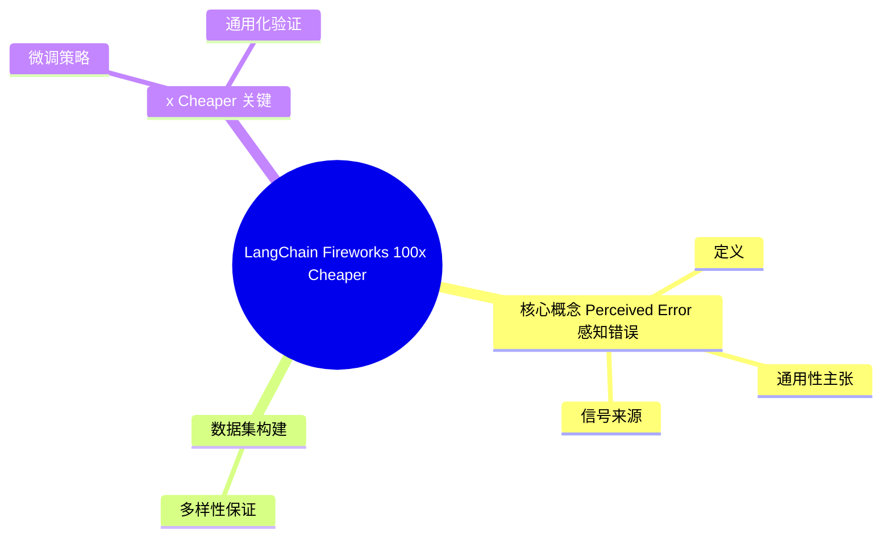
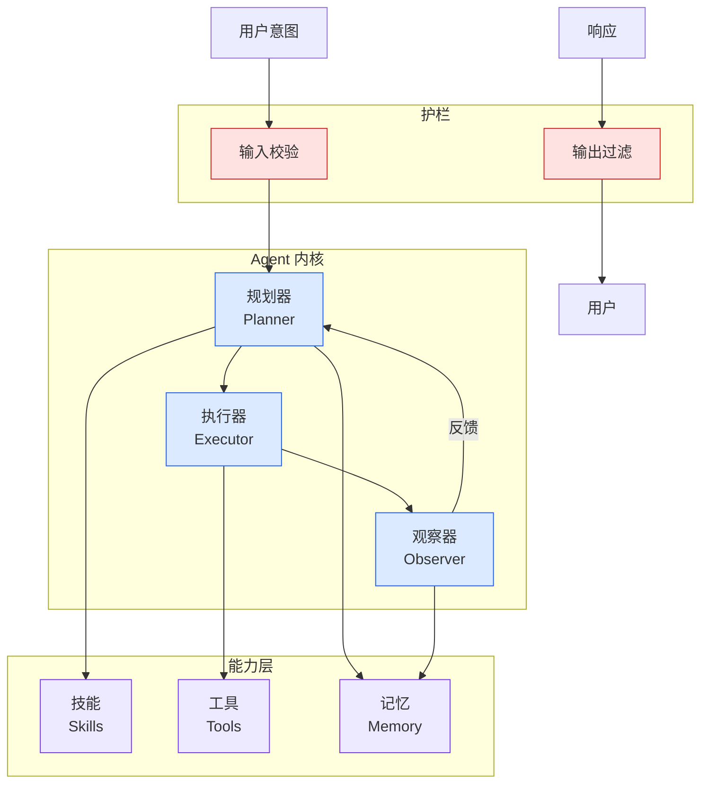

# LangChain × Fireworks 100x Cheaper Trace Judge — 通用 trace 评估器

## Ch04.563 LangChain × Fireworks 100x Cheaper Trace Judge — 通用 trace 评估器

> 📊 Level ⭐⭐ | 4.8KB | `entities/langchain-100x-cheaper-trace-judge-fireworks.md`

# LangChain × Fireworks 100x Cheaper Trace Judge — 通用 trace 评估器

> Source: [原文存档](https://github.com/QianJinGuo/wiki-book/tree/main/docs/raw/articles/langchain-100x-cheaper-trace-judge-fireworks.md)


## 概念导图



## 背景

LangChain 与 Fireworks 合作，**针对 trace 评估场景对 Qwen judge 模型进行微调，实现 100x 成本降低**。文章 2026-06-16 发布于 LangChain Blog。

## 核心概念：Perceived Error（感知错误）




### 定义

> Perceived error is when the user thinks the assistant made a mistake or produced something that needed correction.

**关键区别**：
- Perceived Error ≠ 客观正确性
- Perceived Error ≠ 用户满意度
- 反映的是用户主观"觉得 agent 错了"的信号

### 通用性主张

LangChain 通常推荐团队构建**应用特定的评估器**（因为判断 trace 需要应用上下文），但认为"perceived error"是少数可以**通用化**的评估器之一。理论依据：感知错误的信号在不同应用中是**普遍一致的**。

### 信号来源

从 trace 中推断感知错误：
- 用户纠正（user corrections）
- 拒绝 agent 行为（rejection of an agent action）
- 重复请求（repeated requests）
- assistant 主动承认错误（acknowledgements of errors）

### 输出格式

```json
{"perceived_error": true, "reason": "The user corrects the meeting date the assistant used."}
```

## 数据集构建

### 来源

从两个 LangChain 内部生产 trace 数据集采样：

1. **chat-langchain** — LangChain 文档 Q&A agent（处理概念问题、调试问题、构建帮助）
2. **Fleet** — LangSmith Fleet 产品的真实用户 trace

### 多样性保证

通过内部不同应用场景的 trace，保证 judge 模型见到"perceived error"的**不同表现形式**，避免过拟合单一应用。

## 100x Cheaper 关键

### 微调策略

- **基座模型**：Qwen（具体规格未在文章中明确）
- **训练数据**：人工标注的 perceived error 样本 + 内部 trace
- **推理平台**：Fireworks AI（专用推理基础设施）
- **目标**：保持 frontier 性能的同时降低推理成本

### 通用化验证

文章明确做了**泛化性实验**：测试 judge 在训练集以外的 trace 上是否仍然准确识别 perceived error。这是 trace 评估器能否成为"通用工具"的关键。

## 实践启示

1. **通用 trace 评估器是可行的** — perceived error 是一个跨应用、跨域的稳健信号
2. **专用小模型 + Fireworks 推理 = 100x 成本下降** — 比用 GPT-4 类大模型评估每条 trace 便宜两个数量级
3. **trace 评估器分层构建** — 应用特定的 evaluator 仍然必要，但通用层（如 perceived error）可以作为基线
4. **agent 时代 trace 是金矿** — "agents now produce a majority of the world's data"，trace 评估会变成核心基础设施

## 适用场景

- **LangSmith 用户** — 可直接使用 LangChain 提供的 perceived error evaluator 增强 trace
- **自建 agent observability** — 可借鉴"信号推断 + 小模型 + 专用推理"的范式
- **evaluator 研发** — 验证"特定评估任务是否可以通用化"的方法论

## 原文链接

## 相关实体
- [langsmith engine: trace-based self-improving agent](../ch03/035-agent.html)
- [skillsui 企业 agent 中间层](../ch03/104-skillsui.html)
- [gaode uplift model iteration agent long running harness](../ch05/009-harness.html)

→ [原文存档](https://github.com/QianJinGuo/wiki-book/tree/main/docs/raw/articles/langchain-100x-cheaper-trace-judge-fireworks.md)

---

