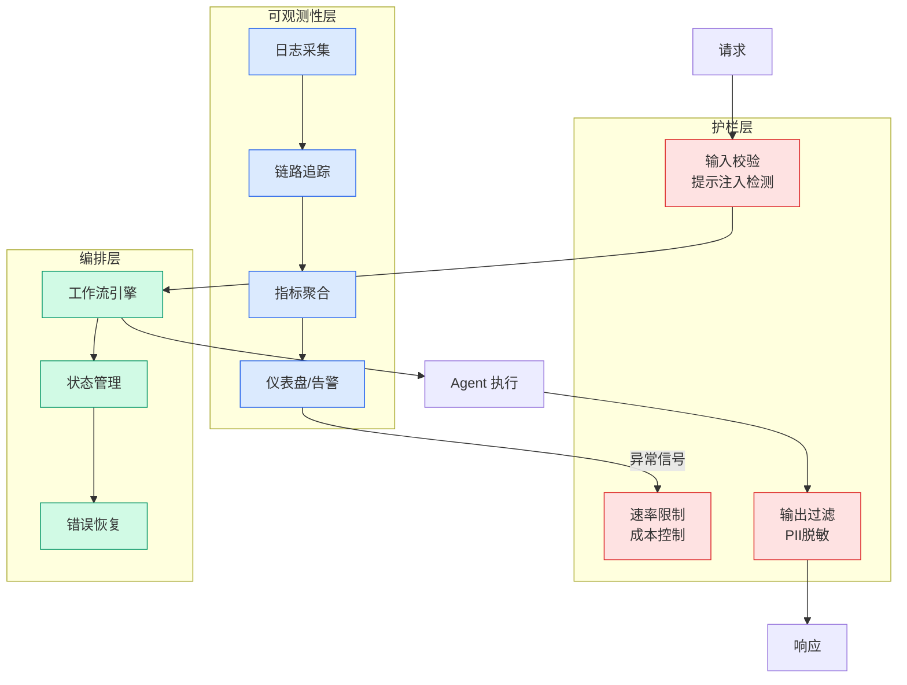

# Evaluating AI Agents: A Production Blueprint with Strands and AgentCore

## Ch04.566 Evaluating AI Agents: A Production Blueprint with Strands and AgentCore

> 📊 Level ⭐⭐ | 4.8KB | `entities/evaluating-ai-agents-production-blueprint-strands-agentcore.md`

# Evaluating AI Agents: A Production Blueprint with Strands and AgentCore

## Overview

AWS blog post (2026-07-23) by Amit Deol, Hin Yee Liu, and Ryan Cormack presenting a production evaluation blueprint for AI agents using the Strands Agents SDK (`strands-agents-evals`) for build-time testing and Amazon Bedrock AgentCore Evaluations for production monitoring. Uses Motorway's dealer stock search agent as a worked example.

## Three-Layer Build-Time Assessment

The evaluation framework operates across three distinct layers with pass/fail thresholds:

**Layer 1: Tool Usage (>95% threshold)** — Validates correct tool selection and parameter passing. Uses deterministic code-based graders (`ToolSelectionGrader`, `TrajectoryOrderGrader`) to verify which tools were called and the call sequence. Example: "Diesel vehicles from £7,000 to £20,000" should use `search_vehicles` with typed filters.

**Layer 2: Reasoning (>85% threshold)** — Assesses logical decision-making using LLM-as-judge evaluators (`HelpfulnessEvaluator`, `TrajectoryEvaluator` from strands-agents-evals). Ensures the agent's reasoning holds together; agents arriving at the right response through illogical reasoning will fail unpredictably.

**Layer 3: Output Quality (>90% threshold)** — Measures response helpfulness, accuracy, and actionability using LLM-as-judge evaluation (`OutputEvaluator`, `GoalSuccessRateEvaluator`).

All three layers must pass before deployment.

## strands-agents-evals Framework

The `strands-agents-evals` framework provides three primitives:
- **Experiment**: A collection of test cases run against the agent
- **Case**: Input query, expected output, and expected tool trajectory
- **Evaluator**: Scoring logic (deterministic or LLM-based)

Three grader types:
- **Code-based deterministic** (Layer 1): Fast, cheap, reproducible — measures tool selection, parameter passing, trajectory ordering
- **LLM-as-judge (Claude Sonnet 4.6)** (Layers 2-3): Flexible but non-deterministic — measures reasoning quality, output helpfulness, goal success
- **Human review** (Calibration): Expensive, used to calibrate LLM judge prompts — handles edge cases and safety

## Handling Non-Determinism

The `run_all_layers()` function accepts a `num_trials` parameter. Two key metrics:
- **pass@k**: likelihood of succeeding at least once in k attempts
- **pass^k** (pass to the kth): probability of succeeding in k consecutive trials — more important for customer-facing agents

Multi-turn conversation testing uses `ActorSimulator` to generate realistic multi-turn interactions and `InteractionsEvaluator` to score context retention.

## Production Monitoring with AgentCore Evaluations

Two complementary modes:
- **On-demand evaluation**: analyzes specific agent interactions by selecting spans from CloudWatch logs — useful for debugging
- **Online evaluation**: automatically samples live traffic (1-5% sampling recommended) with up to 10 evaluators

Built-in evaluators: `Builtin.Helpfulness` (TRACE), `Builtin.GoalSuccessRate` (SESSION), `Builtin.ToolSelection` (TOOL_CALL), `Builtin.Correctness` (TRACE). Custom evaluators (e.g., `DataFreshnessEvaluator`, `SafetyGuardrailEvaluator`, `DealerDataScopingEvaluator`) handle domain-specific constraints.

## Deployment Pipeline with Evaluation Gates

Five-phase pipeline: Build-time evaluation → Staging validation (on-demand AgentCore) → Shadow mode (4h minimum, 2% deviation threshold) → A/B testing (5% traffic) → Production rollout (100% traffic with continuous online evaluation). Each phase has defined thresholds that block deployment on failure.

## Results

After implementing the pipeline: Tool selection accuracy 87%→98%, Task completion rate 82%→96%, Context retention 71%→94%, Production incidents 12→2 per month, Mean time to detect from hours to minutes.

## Source

> [AWS Machine Learning Blog](https://aws.amazon.com/blogs/machine-learning/evaluating-ai-agents-a-production-blueprint-with-strands-and-agentcore)

---
## 关联
→ [原文存档](https://github.com/QianJinGuo/wiki-book/tree/main/docs/raw/articles/evaluating-ai-agents-a-production-blueprint-with-strands-and.md)
- 相关概念: [Harness Engineering](https://github.com/QianJinGuo/wiki/blob/main/concepts/harness-engineering-framework.md)

---

