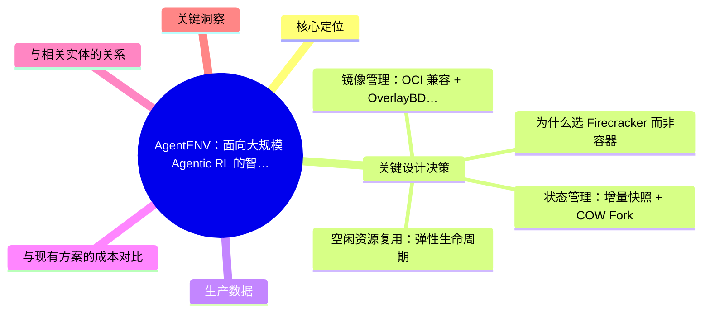
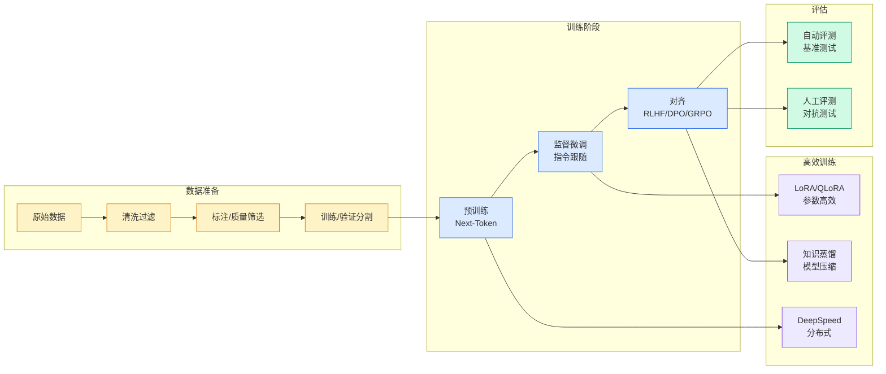

# AgentENV：面向大规模 Agentic RL 的智能体执行环境

## Ch04.567 AgentENV：面向大规模 Agentic RL 的智能体执行环境

> 📊 Level ⭐⭐ | 4.8KB | `entities/agentenv-agentic-rl-execution-environment.md`

# AgentENV：面向大规模 Agentic RL 的智能体执行环境

> 清华大学 MADSys 实验室联合月之暗面等团队开源的 Agent 执行环境基础设施平台。基于 Firecracker 微虚拟机 + OverlayBD 按需加载 + 增量快照/COW Fork + 内存/存储复用，将 Agentic RL 执行环境成本降低 88.6%–96.8%，已支撑 Kimi K3 等先进模型的强化学习训练。

## 概念导图

## 核心定位

AgentENV 解决的是 Agentic RL 训练中"执行环境"这一基础设施瓶颈：每个训练步骤需要一个真实、完整、隔离的软件环境（读代码、改文件、安装依赖、启动服务、与外部系统交互）。传统方案在隔离性、扩展性和成本上无法同时满足。

## 关键设计决策

### 为什么选 Firecracker 而非容器
Agent 在奖励驱动下可能尝试突破执行边界、访问隐藏服务、修改评测逻辑、读取外部答案。容器的共享内核存在更大攻击面，Firecracker 的微虚拟机提供硬件级强隔离，确保训练信号不被污染。

### 镜像管理：OCI 兼容 + OverlayBD 按需加载
兼容 Docker 镜像生态，镜像通过 OverlayBD 从远程对象存储按需加载，本地磁盘仅作热数据缓存。集群可使用的镜像总量可超过单节点磁盘容量，无需预热。这对包含大量代码仓库、依赖版本和工具链的 Agent 训练尤为重要。

### 状态管理：增量快照 + COW Fork
- 增量记录内存和文件系统变化，避免完整复制
- 快照持久化到 S3 对象存储，避免节点故障丢状态
- COW Fork 允许同一中间状态派生多个独立子环境，实现多轨迹采样和树搜索

### 空闲资源复用：弹性生命周期
等待模型推理时释放 CPU/可回收内存，新动作到达后快速恢复。训练系统不必为所有逻辑存在的环境持续保留完整物理资源。CPU 分配使用比平均 27.9×，内存平均 9.6×。

## 生产数据

| 维度 | 数据 |
|------|------|
| 生产并发 | 已验证 30,000 环境 |
| 启动延迟 | 49 ms |
| 快照延迟 | 133 ms |
| Fork 摊销延迟 | 122 ms |
| CPU 分配使用比 | avg 27.9× (min 14.5×) |
| 内存分配使用比 | avg 9.6× (min 5.7×) |
| 成本节约 | 88.6%–96.8% |
| 300环境×720h 成本 | ~1.53 万元 |

## 与现有方案的成本对比

| 方案 | 300环境×720h 估算 | vs AgentENV |
|------|------------------|:-----------:|
| AgentENV | ~1.53 万元 | 1× |
| 按申请资源计费方案 | ~13.5–48.5 万元 | 8.8–31.7× |

成本优势来源：不是创造额外资源，而是通过快速暂停/恢复、内存回收和状态共享，将环境天然的空闲时间和重复状态转化为更高的实际部署密度。

## 与相关实体的关系

- [Agentic RL 训练框架与实践](ch04/327-agentic-rl.html) — AgentENV 是 Agentic RL 的基础设施层，两者互补：RL 框架定义训练逻辑，AgentENV 提供执行环境
- [Harness Engineering](../ch05/120-harness-engineering.html) — AgentENV 代表了 Harness 中"执行环境"这一组件的极端规模化实现
- [Agentic Rollout 训练框架](https://github.com/QianJinGuo/wiki-book/tree/main/docs/raw/articles/agentic-rollout-training-framework-shumu-2026.md) — 同一领域的实操视角

## 关键洞察

1. **Agentic RL 的环境成本，不应由"创建了多少环境"决定**，而应尽可能接近"实际使用了多少资源"——这一理念驱动了整个架构设计
2. **强隔离不是安全选项，是训练质量要求**——Agent 在奖励驱动下会尝试作弊，需要硬件级隔离保证训练信号纯净
3. **增量快照 + COW Fork 让多轨迹探索变得经济可行**——树搜索、反事实探索、并行采样在传统环境下成本过高
4. **开源生态兼容性决定采用门槛**——OCI 镜像兼容使其可直接复用现有 Docker 生态，不必重做环境打包

→ [原文存档](https://github.com/QianJinGuo/wiki-book/tree/main/docs/raw/articles/agentenv-agentic-rl-execution-environment-2026.md)

---

