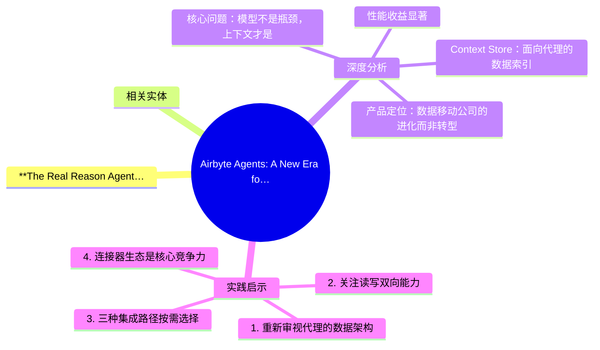
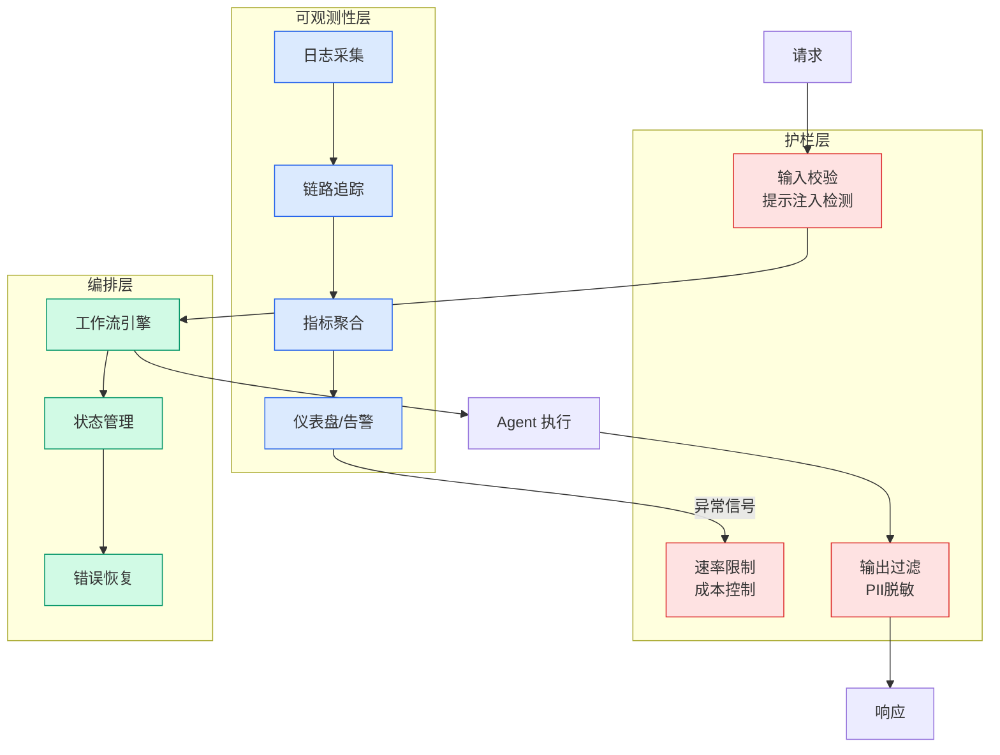

# Airbyte Agents: A New Era for Airbyte | Airbyte

## Ch04.580 Airbyte Agents: A New Era for Airbyte | Airbyte

> 📊 Level ⭐⭐ | 4.5KB | `entities/airbyte-agents.md`

## 概念导图

## **The Real Reason Agents Fail**
Until recently, the complaints about AI have always been about the models. That is no longer the case. Frontier models have improved dramatically, and keep getting better with each release. The real problem is the data feeding into these models.
Agents are powerful, but they are not wise. To operate at their best, they need fresh context delivered in the right format and at the right time. From our experience, current ways of moving data simply aren't enough:

## 相关实体

- [Airbyte Agents A New Era For Airbyte Airbyte](ch04/580-airbyte-agents-a-new-era-for-airbyte-airbyte.html)
- [Skillos Learning Skill Curation For Self Evolving Agents](ch04/143-skillos-learning-skill-curation-for-self-evolving-agents.html)
- [Building Ai Agents For Business Support Using Amazon Bedrock](ch04/074-building-ai-agents-for-business-support-using-amazon-bedrock.html)
- [Oz Multi Harness Cloud Agent Orchestration](ch04/518-agent-orchestration.html)
- [Skill Os Learning Skill Curation Self Evolving Agents](ch04/219-self-evolving-agents.html)

→ [原文存档](https://github.com/QianJinGuo/wiki-book/tree/main/docs/raw/articles/airbyte-agents.md)

## 深度分析

### 核心问题：模型不是瓶颈，上下文才是

Airbyte 提出了一个关键洞察：AI 代理的瓶颈从来不是模型本身，而是**缺乏生产级的上下文基础设施**。传统数据接口（API、MCP）假设调用者已经知道想要什么——精确的端点、对象 ID、字段和操作。但生产环境中的代理往往从更早一步开始：它们需要先发现哪些业务实体是相关的，才能获取最新状态或采取行动。

### Context Store：面向代理的数据索引

Airbyte Agents 的核心是 **Context Store**——一个专为代理搜索优化的数据索引。它解决了三个传统数据接口的核心问题：

- **数据管道**面向仪表盘和人类设计，而非面向实时问答的自主代理
- **API** 一次返回一个系统的数据，代理需要在运行时拼接上下文
- **MCP** 解决了 LLM 与 API 之间的通信问题，但继承了相同的碎片化问题

通过预先索引业务上下文，代理可以先发现相关记录（客户、工单、发票、消息等），再在需要新鲜度时才调用实时连接器。

### 性能收益显著

早期测试数据显示使用 Context Store 的代理：

- **工具调用减少 40%**
- **Token 消耗减少高达 80%**（Gong 80%、Zendesk 90%、Linear 75%、Salesforce 16%）
- 减少幻觉，提高推理可靠性

以 Slack 搜索为例，传统方式需要列出所有频道、翻阅所有消息、逐个拉取线程才能找到相关内容。而通过 Context Store，代理可以先发现相关的消息或主题，再仅在需要新鲜状态时使用实时连接器。

### 产品定位：数据移动公司的进化而非转型

Airbyte 明确表示数据复制引擎不会消失——这项六年积累的技术正是 Context Store 的基础。Airbyte Agents 是**进化而非转型**，将数据移动的专业能力转化为代理时代的上下文基础设施。

## 实践启示

### 1. 重新审视代理的数据架构

如果你的 AI 代理项目正面临响应不稳定、幻觉频发或 token 消耗过高的问题，应优先检查数据层而非模型层。引入预索引的上下文层可能是更有效的优化路径。

### 2. 关注读写双向能力

Airbyte 强调"只读的代理只能描述工作，能写的代理才能真正工作"。在评估或构建代理系统时，写能力（更新记录、创建工单、发送消息）是生产级应用的关键需求。

### 3. 三种集成路径按需选择

| 方式 | 适用场景 | 代码量 |
|------|---------|--------|
| Airbyte Agent MCP | 快速集成到 Claude/ChatGPT/Cursor | 无需代码 |
| Agent SDK | 自定义代理和应用开发 | 全编程控制 |
| Automations | 可视化构建和运行代理 | 界面操作 |

技术团队应根据集成复杂度和定制需求选择合适路径。

### 4. 连接器生态是核心竞争力

首批 50 个生产级连接器覆盖 Salesforce、HubSpot、Zendesk、Linear、Slack 等企业核心系统，且以每周新增的速度扩展。选择数据基础设施时，连接器生态的广度和更新节奏是需要考量的关键因素。

---

