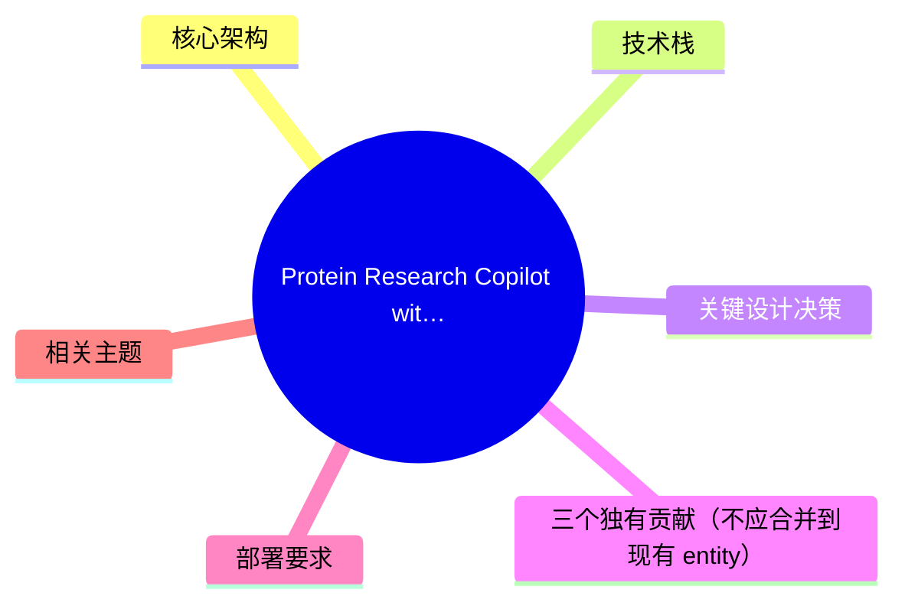
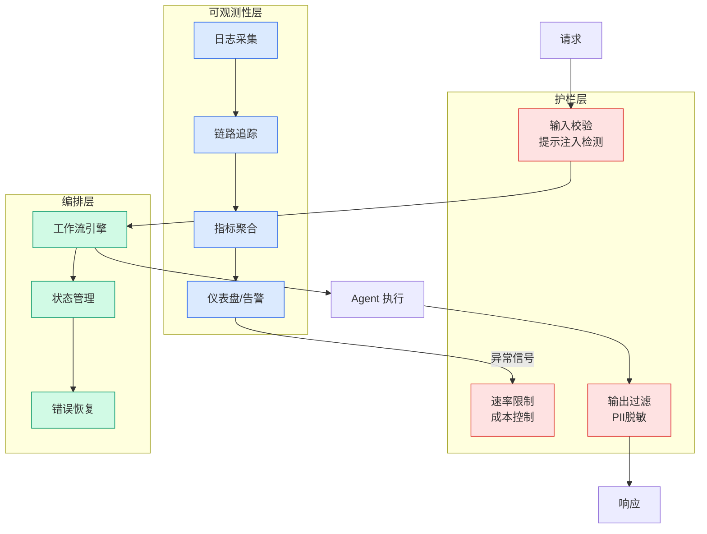

# Protein Research Copilot with Amazon Bedrock AgentCore

## Ch04.582 Protein Research Copilot with Amazon Bedrock AgentCore

> 📊 Level ⭐⭐ | 4.5KB | `entities/protein-research-copilot-amazon-bedrock-agentcore.md`

# Protein Research Copilot with Amazon Bedrock AgentCore

> **Background**：基于 AWS 官方技术博客（2026-06-23），介绍如何用 Strands Agents SDK + Amazon Bedrock AgentCore 构建一个蛋白质研究助手。核心创新在于将蛋白质语言模型（ESM-C 300M）嵌入到 Agent 工作流中，实现自然语言驱动的肽序列相似性搜索。


## 概念导图



## 核心架构

系统由三个专用工具编排在一个 Strands Agent 中：

1. **自然语言查询解析** — 从用户输入（如"Find 10 similar peptides to dengue virus peptide LPAIVREAI"）提取结构化搜索参数
2. **向量相似性搜索** — 使用 ESM-C 300M（Meta 蛋白质语言模型）生成肽序列嵌入，存储在 Amazon Aurora PostgreSQL + pgvector 中
3. **AI 摘要生成** — 对搜索结果进行科学摘要

```
用户自然语言查询
    │
    ▼
Strands Agent (Bedrock AgentCore Runtime)
    ├─ Tool 1: NL → 结构化参数
    ├─ Tool 2: pgvector 相似性搜索
    └─ Tool 3: LLM 摘要生成
```

## 技术栈




| 组件 | 技术选型 | 说明 |
|------|---------|------|
| Agent 框架 | Strands Agents SDK | AWS 开源 Agent SDK，支持 tool-use 模式 |
| 部署平台 | Amazon Bedrock AgentCore | 生产级 Agent 运行时 |
| 蛋白质模型 | ESM-C 300M | Meta 蛋白质语言模型，SageMaker Serverless 部署 |
| 向量存储 | Aurora PostgreSQL + pgvector | 元数据过滤 + 向量搜索一体化 |
| 基础模型 | Claude Sonnet 4.6 | 查询解析 + 摘要生成 |
| 容器化 | ECS Fargate | 无服务器容器部署 |

## 关键设计决策

**ESM-C 300M Serverless 部署**：使用 SageMaker Serverless Endpoint + bundled weights，实现快速冷启动。这对蛋白质模型尤为重要——ESM-C 有 3 亿参数，传统部署冷启动慢。

**单 Agent 多工具模式**：不同于多 Agent 协作，这里用单个 Strands Agent 编排三个专用工具。工具间通过 Agent 的上下文管理串联，避免了 Agent 间通信开销。

**pgvector 元数据过滤**：向量搜索不是纯 ANN，而是结合 SQL WHERE 子句做元数据过滤（如物种、肽长度），在单一查询中完成。

## 三个独有贡献（不应合并到现有 entity）

1. **ESM-C 蛋白质嵌入 + Agent 工作流** — 首次将蛋白质语言模型嵌入到 Agent 工具链中，实现自然语言驱动的蛋白质搜索
2. **SageMaker Serverless + bundled weights 模式** — 大模型（300M 参数）的 Serverless 部署方案，解决冷启动问题
3. **pgvector + 元数据过滤一体化** — 向量搜索与 SQL 过滤在同一查询中完成，避免了先 ANN 后 filter 的两阶段问题

## 部署要求

- AWS 账户 + Bedrock 基础模型权限（Claude Sonnet 4.6）
- Python 3.12+
- AWS CLI + IAM 权限（Bedrock, SageMaker, Aurora, ECS, CodeBuild）
- `pip install bedrock-agentcore-starter-toolkit`
- IEDB 病毒表位数据集
- 预计部署时间：30–45 分钟

## 相关主题

- [Bedrock AgentCore 多租户模式](ch04/561-amazon-bedrock-agentcore.html) — 同系列文章，聚焦 AgentCore 的多租户架构
- Amazon Bedrock AgentCore — AWS Agent 部署平台
- Strands Agents SDK — AWS 开源 Agent 框架
- pgvector — PostgreSQL 向量扩展

---
## 关联
- 相关概念: [Harness Engineering](https://github.com/QianJinGuo/wiki/blob/main/concepts/harness-engineering-framework.md)
- 相关: [Agent 架构](https://github.com/QianJinGuo/wiki/blob/main/concepts/agent-architecture.md)

---

