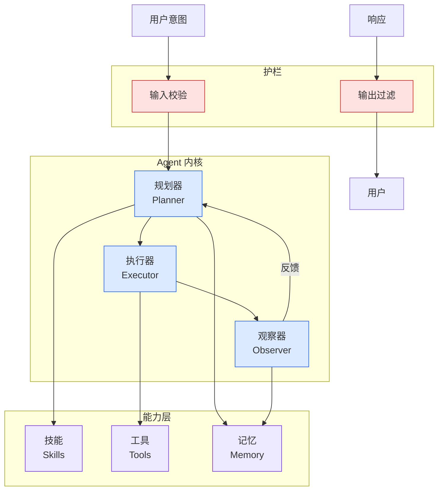

# Agents as Webs of Beliefs

## Ch04.585 Agents as Webs of Beliefs

> 📊 Level ⭐⭐ | 4.4KB | `entities/posts-m39z2cvyfaxzdaxr4-agents-as-webs-of-beliefs.md`

# Agents as Webs of Beliefs

> **Source**: [www.lesswrong.com](https://www.lesswrong.com/posts/M39Z2CvyfaxZdaxR4/agents-as-webs-of-beliefs)

Synthesizes ideas from active inference, agent foundations, and ML into a 'belief webs' framework. Original synthesis but lacks empirical data or implementation details. Good conceptual depth for agent foundations, but confidence is moderate due to lack of verifiable benchmarks.

## Content Summary

Published Time: 2026-06-27T21:45:29.440Z

Markdown Content:
In this post I’ll sketch out an informal model of intelligent agents as webs of beliefs (or belief webs for short). The belief webs framework pulls together ideas from active inference, agent foundations and machine learning. In doing so it aims to unify beliefs, goals and actions as three facets of a single phenomenon. Few of these ideas are original to me, but I haven't seen anyone tie them together in a single place before. I've flagged the frameworks I'm drawing from throughout the post.

### Beliefs are held together by local consistency constraints

The core premise of belief webs is that an agent’s beliefs are typically _locally_ consistent with nearby beliefs but not necessarily _globally_ consistent with all its other beliefs (except, perhaps, in the limit of ideal rationality). This poses a problem for frameworks which describe agents in terms of a single probability distribution (as causal graphs, Solomonoff induction, and active inference do).

Two frameworks which are capable of handling global inconsistency are [Richardson’s probabilistic dependency graphs](https://arxiv.org/abs/2202.11862) (PDGs) and [Garrabrant induction](https://www.lesswrong.com/posts/y5GftLezdozEHdXkL/an-intuitive-guide-to-garrabrant-induction). (They focus on empirical inconsistency and logical inconsistency respectively, but I’ll abstract away from that difference for now.) We can roughly analogize the nodes in PDGs to the propositions in Garrabrant inductors; I’ll call them “base-level beliefs”. The central type of base-level belief I think about is beliefs about sensory inputs.[1](http://www.lesswrong.com/posts/M39Z2CvyfaxZdaxR4/agents-as-webs-of-beliefs#fn38cdnvw1q1g)

There’s then a second layer of structure in both PDGs (namely hyperedges) and Garrabrant induction (namely traders) which imposes local constraints on base-level beliefs. I think of hyperedges/traders as steps towards formalizing the concept of “concepts”.[2](http://www.lesswrong.com/posts/M39Z2CvyfaxZdaxR4/agents-as-webs-of-beliefs#fnl4lxbcv75t) For example, if you see the front half of a cat starting to emerge from around the corner, a “cat” hyperedge/trader might make predictions about what you’ll see next, which shape your base-level beliefs.

However, having exactly two layers of structure seems rather artificial. In active inference/predictive processing, minds are viewed as hierarchical generative models, with each layer of the hierarchy forming new concepts with reference to lower-level concepts.[3](http://www.lesswrong.com/posts/M39Z2CvyfaxZdaxR4/agents-as-webs-of-beliefs#fnq6v6sftxiih) The success of deep learning suggests that there’s something fundamentally important about this kind of hierarchical concept formation. Whereas you can’t have hyperedges connecting other hyperedges, or traders trading on other traders.

So you can think of the term “belief webs” as a (still vague) pointer towards a framework which is

---
## 关联

- 相关概念: [Harness Engineering](https://github.com/QianJinGuo/wiki/blob/main/concepts/harness-engineering-framework.md)
- 相关: [Agent 架构](https://github.com/QianJinGuo/wiki/blob/main/concepts/agent-architecture.md)

---

