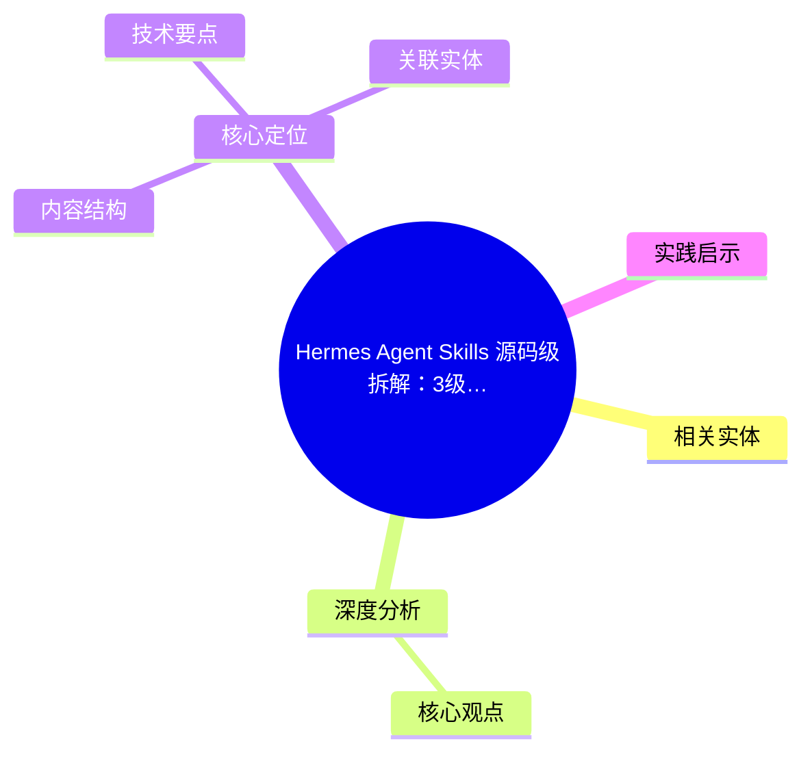
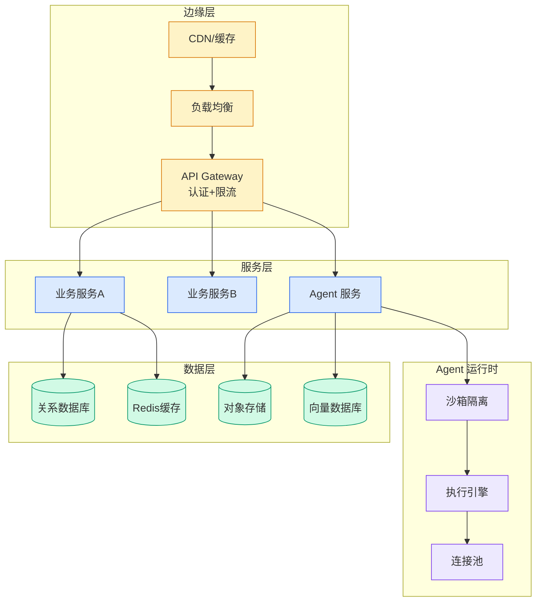

# Hermes Agent Skills 源码级拆解：3级渐进加载 × 6步调度 × 5维安全扫描

## Ch04.589 Hermes Agent Skills 源码级拆解：3级渐进加载 × 6步调度 × 5维安全扫描

> 📊 Level ⭐⭐ | 4.3KB | `entities/hermes-agent-skills-source-code-analysis-shuge.md`

# Hermes Agent Skills 源码级拆解：3级渐进加载 × 6步调度 × 5维安全扫描

## 概念导图

## 相关实体

- [hermes新顶流agent skills闭环系统深度解析](../ch07/017-hermes-skill.html)
→ [原文存档](https://github.com/QianJinGuo/wiki-book/tree/main/docs/raw/articles/hermes-agent-skills-source-code-analysis-shuge.md)

- [MOC](https://github.com/QianJinGuo/wiki/blob/main/moc/data-infrastructure.md)
## 深度分析

Hermes Agent Skills 源码级拆解：3级渐进加载 × 6步调度 × 5维安全扫描 涉及agent领域的核心技术议题。
### 核心观点
1. # Hermes Agent Skills 源码级拆解：3级渐进加载 × 6步调度 × 5维安全扫描
> 源码分析版（vs [Hermes Agent Skill 系统深度解析](../ch07/017-hermes-skill.html) winty版）
## 核心定位
Hermes 两套记忆机制：
- **通用记忆**（MEMORY.
2. md）：存储"知道什么"——用户偏好、项目信息
- **Skills**：过程性记忆（Procedural Memory），存储"怎么做"——工作流、最佳实践
Skills 遵循 **agentskills.
3. io 开放标准**，非私有格式。
4. ## 渐进式披露（Progressive Disclosure）
三个加载层级：
| Level | 调用 | 内容 | Token |
|---|---|---|---|
| 0 | `skills_list()` | `[{name, description, category}, .
5. ]` | ~3k |
| 1 | `skill_view(name)` | Full content + metadata | varies |
| 2 | `skill_view(name, path)` | Specific reference file | varies |
懒加载思路：Agent 先扫 Level 0 列表，判断相关 Skill，再按需加载完整内容。

### 内容结构
- Hermes Agent Skills 源码级拆解：3级渐进加载 × 6步调度 × 5维安全扫描
- 核心定位
- 渐进式披露（Progressive Disclosure）
- 6步斜杠命令调度
- 条件激活
- Skills Guard：五维安全扫描
- 四档信任等级
- Bundle 系统

### 技术要点

- **agent架构**: 本文在agent方向提出的设计理念与实现路径
- **工程挑战**: 实际落地中面临的关键问题与应对策略
- **aws趋势**: 相关技术演进方向与新兴范式
### 关联实体

- [两万字详解Claude Code源码核心机制](../ch03/078-claude-code.html)
- [Agentops Operationalize Agentic Ai At Scale With Amazon Bedr](ch04/299-agentops-operationalize-agentic-ai-at-scale-with-amazon-bed.html)
- [存之有序治之有矩Agent 记忆系统的工程实践与演进](../ch03/035-agent.html)
- [龙虾装上了可以用来干啥分享下我的 Openclaw 多智能体团队搭建经验 V2](../ch11/235-openclaw.html)
- [Karpathy 最新访谈从 Vibe Coding 到 Agentic Engineering](ch04/237-agentic.html)
- [构建基于多智能体架构的深度思考交易系统 V2](https://github.com/QianJinGuo/wiki/blob/main/entities/构建基于多智能体架构的深度思考交易系统-v2.md)

## 实践启示
1. **工程落地**: agent领域方案需关注可观测性、可维护性和成本效率
2. **技术选型**: 根据场景选择合适的技术栈，避免过度设计或盲目追新
3. **持续迭代**: 建立数据驱动的反馈闭环，持续优化系统表现
4. **风险管控**: 引入新技术需评估对现有系统稳定性的影响，做好降级预案

---

