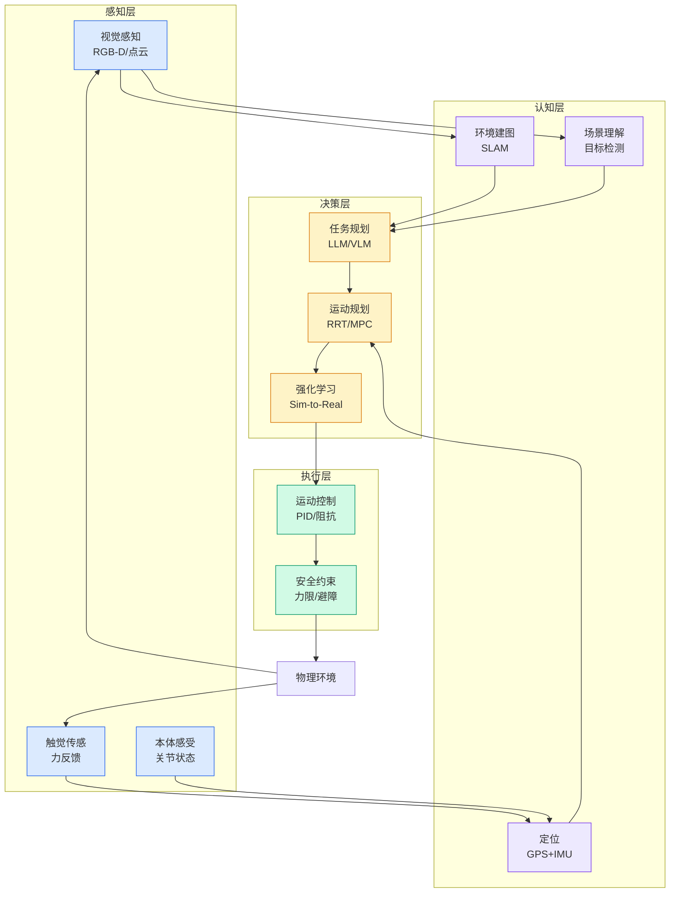

# Build a unified semantic layer across datasets with multi-dataset Topics in Amazon Quick

## Ch04.600 Build a unified semantic layer across datasets with multi-dataset Topics in Amazon Quick

> 📊 Level ⭐⭐ | 4.2KB | `entities/build-a-unified-semantic-layer-across-datasets-with-multi-da.md`

# Build a unified semantic layer across datasets with multi-dataset Topics in Amazon Quick

→ [原文存档](https://github.com/QianJinGuo/wiki-book/tree/main/docs/raw/articles/build-a-unified-semantic-layer-across-datasets-with-multi-da.md)

# Build a unified semantic layer across datasets with multi-dataset Topics in Amazon Quick

[Amazon Quick](<https://aws.amazon.com/quick/>) is an AI-powered unified intelligence service that connects structured data and unstructured enterprise content so teams can explore, analyze, and act from one place. Amazon Quick Sight, the business intelligence (BI) capability within Amazon Quick, delivers interactive dashboards, natural language querying, pixel-perfect reports, machine learning (ML)-driven insights, and embedded analytics. Topics in Quick function as the semantic layer that business users can use to ask questions in natural language and get answers directly from their data.

Until now, organizations modeled their semantic layers by creating enriched datasets and associating them one-to-one with topics. Also, when Quick Sight authors build analysis, one visual could be sourced from only one dataset. Quick Sight represents a dataset as a single flattened table. If a customer’s data source contains multiple tables, Quick Sight required customers to define the dataset by joining the source tables into a single table in Quick Sight data preparation. This one big denormalized table approach was initially designed to provide better performance by avoiding run-time joins. It worked well for straightforward datasets, which made up the majority of use cases during the early stages of Quick Sight. Today, we’re evolving this model. With **multi-dataset Topics (public preview)** , you can now add up to 12 datasets to a single topic and define relationships between them. The Quick chat agent automatically traverses those relationships when answering questions. The AI engine interprets user intent, identifies which datasets contain the relevant columns, constructs the appropriate SQL joins based on your defined relationships, and returns a unified answer. Your data stays normalized, your governance stays centralized, and your business users get richer answers without understanding the underlying schema. The same multi-dataset topic can be used for building the analysis or answering questions using the chat agent.

In this post, we walk through how multi-dataset Topics work, explain how the chat agent uses defined relationships to generate cross-dataset queries, and demonstrate an end-to-end implementation using a retail analytics scenario in Quick Sight.

## How multi-dataset Topics work

A Topic in Quick is the semantic layer between raw data and business users. It encapsulates the metadata, business rules, relationships, and context that the AI-powered natural language query (NLQ) engine uses to interpret natural language questions and translate them into precise analytical queries.

With multi-dataset Topics, this semantic layer now spans multiple datasets connected through explicitly defined relationships. The following diagram illustrates the end-to-end flow from data sources through to consumption.

_Figure 1: Multi-dataset Topics architecture flow

---
## 关联

- 相关概念: [Harness Engineering](https://github.com/QianJinGuo/wiki/blob/main/concepts/harness-engineering-framework.md)
- 相关: [Agent 架构](https://github.com/QianJinGuo/wiki/blob/main/concepts/agent-architecture.md)

---

