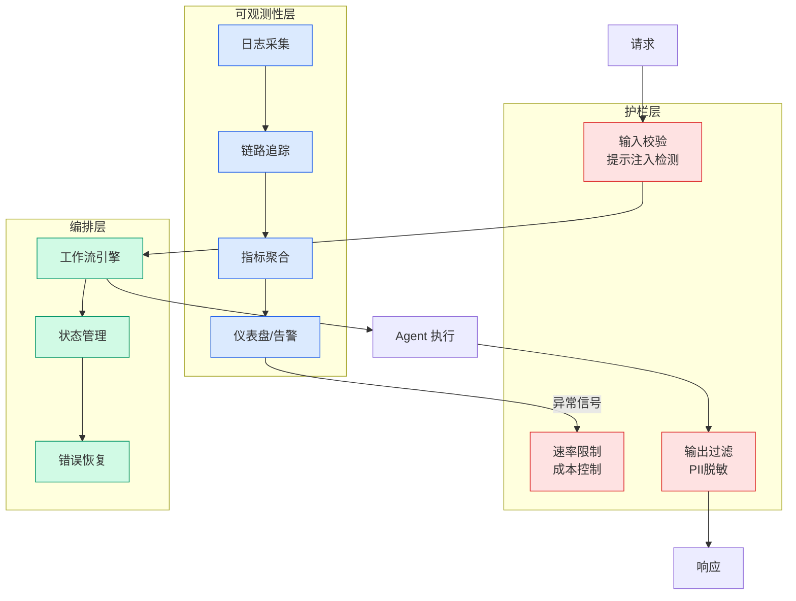

# Microsoft Foundry 生产级 Agent 工程：Harness 与模型的等价重要性

## Ch04.611 Microsoft Foundry 生产级 Agent 工程：Harness 与模型的等价重要性

> 📊 Level ⭐⭐ | 4.0KB | `entities/bytebytego-microsoft-foundry-production-agent-harness-model-equal-importance-2026.md`

# Microsoft Foundry 生产级 Agent 工程：Harness 与模型的等价重要性

> **Background**：本文基于 ByteByteGo 对 Microsoft Foundry VP Marco Casalaina 的深度访谈。涵盖 Microsoft Foundry 平台在 80,000+ 企业客户规模下运行生产级 AI Agent 的工程经验，重点关注 Harness 设计与模型演化的适配关系、Retrieval-as-a-subagent 模式、Agent 身份与审计、Rubric 评估系统等核心理念。

## 核心命题：Harness = Model

Microsoft Foundry 团队从大规模生产运行中学到的最大教训是：**"the harness matters as much as the model"**。

Harness 是模型之外的一切：运行时、工具、上下文检索、身份层、护栏、评估器、部署管道。每次模型更新都需要重新调优 Harness——当 Anthropic 发布 Claude Opus 4.8 时，GitHub Copilot CLI 团队必须先重新调优 Harness 并重跑评估才能上线。

## 从 Chatbot 到 Agent 的范式跃迁

Chatbot 出错的代价是"糟糕的体验"；Agent 出错的代价是"业务事故"。这个差异驱动了工程要求的根本变化。

Foundry 的 Voice Live 功能可以让现有文本 Agent 无重建转语音 Agent，反映行业正在离开 Chatbot 时代进入 Agent 执行时代。

## 三大工程设计理念

- **Retrieval-as-a-subagent**：检索不是静态 RAG 管道，而是活的子 Agent，能迭代、重查和细化搜索，这是对传统 RAG 架构的重要升级——将数据访问层从工具调用提升为自主智能体

- **Agent 身份与执行场所**：每个 Agent 拥有独立身份，支持审计追踪和权限控制，而非共享系统主体。这解决了多个 Agent 在共享执行环境中无法保留下游任务行为记录的问题

- **Rubric 评估 + 自动改进循环**：基于评分标准持续测量 Agent 质量，并自动重新调优。这填补了从原型敏捷评估到生产持续评估的工程缺口

## 生产 Agent 的失效模式

原型中不可见的六类生产失效：
- 模型依赖的文档数据过时
- 模型更新引入的行为细微变化（无法保证像数据库版本迁移一样的兼容性）
- 缺乏身份控制导致无审计追踪
- 无护栏保护时 Agent 自信输出错误内容
- 无可观测性时质量退化不可见
- 评估数据集无法覆盖真实用户的未知需求

## 规模数据

- 80,000+ 企业在 Foundry 上构建 Agent
- Microsoft 365 Copilot 服务 20M+ 用户
- 第一方 Agent 月活跃量同比增长 6x

## 相关实体
- [Microsoft Agent Framework Tools 总览](../ch03/035-agent.html)
- [Microsoft Build 2026：微软 AI 独立日](../ch03/035-agent.html)

→ [原文存档](https://github.com/QianJinGuo/wiki-book/tree/main/docs/raw/articles/bytebytego-microsoft-ships-ai-agents-enterprise-scale-foundry-2026.md)

---

