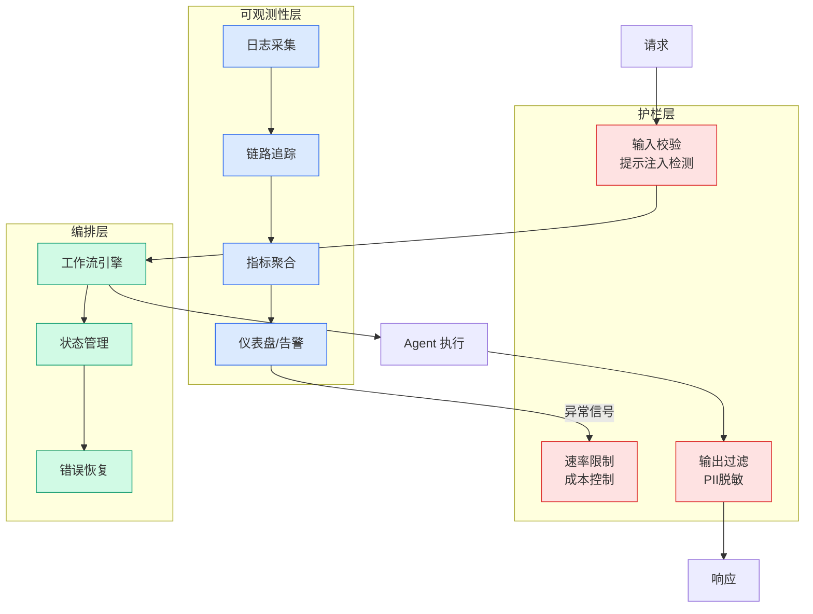

# GLM-5.2 is the step change for open agents

## Ch04.612 GLM-5.2 is the step change for open agents

> 📊 Level ⭐⭐ | 3.9KB | `entities/glm-52-is-the-step-change-for-open-agents.md`

# GLM-5.2 is the step change for open agents

→ [原文存档](https://github.com/QianJinGuo/wiki-book/tree/main/docs/raw/articles/glm-52-is-the-step-change-for-open-agents.md)

# GLM-5.2 is the step change for open agents

##### Housekeeping: Following my “[State of the blog](<https://www.interconnects.ai/p/state-of-the-blog-mid-2026>)” post last week, noting a slight increase in paid features, it’s a good time to remind folks that I offer [group subscriptions](<https://www.interconnects.ai/about#§group-paid-subscriptions>) with larger discounts proportional to the number of seats.   
I also released a new paper today on open RL recipes for terminal agents, read more [here](<https://natolambert.substack.com/p/tmax-an-open-rl-recipe-for-terminal>).

A bit over a week ago, when the AI world was still reeling from the shocking [export restriction, and effective banning](<https://www.interconnects.ai/p/welcome-to-the-agi-era-of-ai-governance>), of [Claude Fable 5](<https://www.interconnects.ai/p/claude-fable-5-and-new-ai-safety>), Z.ai released their latest model, GLM-5.2. This model was [rolled out](<https://x.com/Zai_org/status/2065704919299235870>) unusually on a Saturday, June 13th, to GLM Coding Plan members. This is an unusual release practice, normally when an AI model is released on a weekend it’s for a weird reason (most famously, [Llama 4](<https://www.interconnects.ai/p/llama-4>)).1 In this case, it seemed like Z.ai was excited to capitalize on the zeitgeist of “Anthropic being anti open-science” with their silent safeguards on AI researchers. For the past year or two, the Chinese open-weight labs have taken every opportunity they have for easy marketing wins like this.

[Share](<https://www.interconnects.ai/p/glm-52-is-the-step-change-for-open?utm_source=substack&utm_medium=email&utm_content=share&action=share>)

GLM-5.2, in a common naming convention across the industry, looked potentially like an incremental update following the popular GLM-5.1 model. At this point, Moonshot AI, makers of the Kimi models, and Z.ai, makers of the GLM models, have consolidated the top of the reputational market with the most beloved open-weight models among AI researchers. What unfolded is a common lesson in tracking AI models that often minor version numbers can have AI models crossing meaningful user experience thresholds. A small change in benchmarks and training can open a wide range of new use-cases.

What has followed is a slow, groundswell of hype for GLM-5.2. The official, MIT-licensed [model weights](<https://huggingface.co/zai-org/GLM-5.2>) and [release blog](<https://z.ai/blog/glm-5.2>) dropped three days after the initial rollout, on June 16th. One could ramble many technical details, such as the strong benchmark scores, the very popular RL framework that Z.ai uses ([SLIME](<https://github.com/THUDM/slime>)), the recommendation of always using the model on Max thinking effort, and so on, but the initial release blogs usually aren’t the thing to focus on. You can wait and read the ecosystem reaction to know if it’s the real deal. [Benchmarks are half dead these days](<https://www.interconnects.ai/p/opus-46-vs-codex-53

---
## 关联

- 相关概念: [Harness Engineering](https://github.com/QianJinGuo/wiki/blob/main/concepts/harness-engineering-framework.md)
- 相关: [Agent 架构](https://github.com/QianJinGuo/wiki/blob/main/concepts/agent-architecture.md)

---

