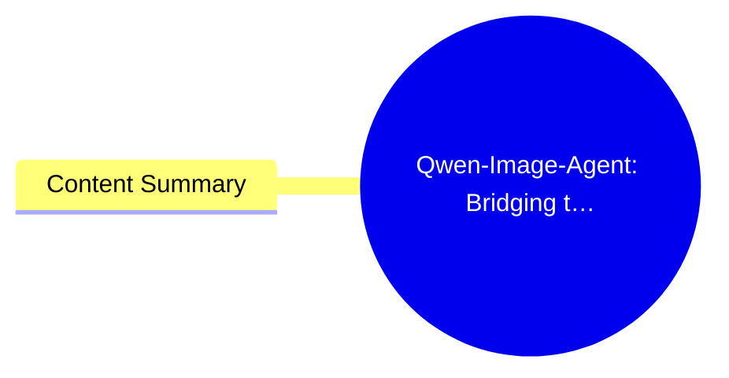
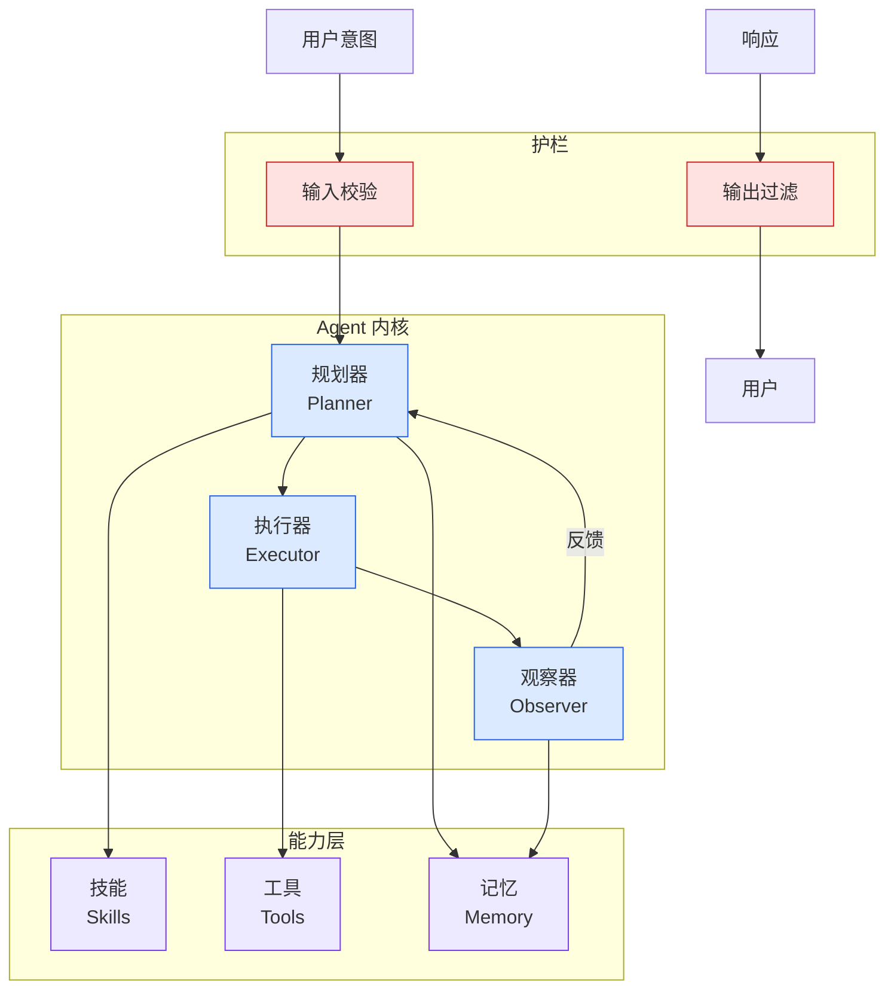

# Qwen-Image-Agent: Bridging the Context Gap in Real-World Image Generation

## Ch04.613 Qwen-Image-Agent: Bridging the Context Gap in Real-World Image Generation

> 📊 Level ⭐⭐ | 3.9KB | `entities/abs-2606-26907.md`

# Qwen-Image-Agent: Bridging the Context Gap in Real-World Image Generation

> **Source**: [arxiv.org](https://arxiv.org/abs/2606.26907)

Novel agentic framework (Qwen-Image-Agent) addressing a clearly defined problem (Context Gap). Full paper with architecture, methodology, and likely benchmarks. High originality and practical relevance for agent engineering.

## 概念导图

## Content Summary

Published Time: Mon, 29 Jun 2026 00:48:51 GMT

Markdown Content:
Authors:[Zekai Zhang](https://arxiv.org/search/cs?searchtype=author&query=Zhang,+Z), [Jiahao Li](https://arxiv.org/search/cs?searchtype=author&query=Li,+J), [Jie Zhang](https://arxiv.org/search/cs?searchtype=author&query=Zhang,+J), [Kaiyuan Gao](https://arxiv.org/search/cs?searchtype=author&query=Gao,+K), [Kun Yan](https://arxiv.org/search/cs?searchtype=author&query=Yan,+K), [Lihan Jiang](https://arxiv.org/search/cs?searchtype=author&query=Jiang,+L), [Ningyuan Tang](https://arxiv.org/search/cs?searchtype=author&query=Tang,+N), [Shengming Yin](https://arxiv.org/search/cs?searchtype=author&query=Yin,+S), [Tianhe Wu](https://arxiv.org/search/cs?searchtype=author&query=Wu,+T), [Xiaoyue Chen](https://arxiv.org/search/cs?searchtype=author&query=Chen,+X), [Xiao Xu](https://arxiv.org/search/cs?searchtype=author&query=Xu,+X), [Yan Shu](https://arxiv.org/search/cs?searchtype=author&query=Shu,+Y), [Yanran Zhang](https://arxiv.org/search/cs?searchtype=author&query=Zhang,+Y), [Yixian Xu](https://arxiv.org/search/cs?searchtype=author&query=Xu,+Y), [Yuxiang Chen](https://arxiv.org/search/cs?searchtype=author&query=Chen,+Y), [Zhendong Wang](https://arxiv.org/search/cs?searchtype=author&query=Wang,+Z), [Zihao Liu](https://arxiv.org/search/cs?searchtype=author&query=Liu,+Z), [Zikai Zhou](https://arxiv.org/search/cs?searchtype=author&query=Zhou,+Z), [Huishuai Zhang](https://arxiv.org/search/cs?searchtype=author&query=Zhang,+H), [Dongyan Zhao](https://arxiv.org/search/cs?searchtype=author&query=Zhao,+D), [Chenfei Wu](https://arxiv.org/search/cs?searchtype=author&query=Wu,+C)

[View PDF](http://arxiv.org/pdf/2606.26907)

> Abstract:While text-to-image (T2I) models have achieved remarkable progress, they struggle with real-world requests that are often underspecified, implicit, or dependent on up-to-date knowledge. We identify this challenge as the Context Gap: the mismatch between the user context and the sufficient generation context for T2I models. To bridge this gap, we propose Qwen-Image-Agent, a unified agentic framework that integrates plan, reason, search, memory and feedback in a context-centric manner. Qwen-Image-Agent treats user input as partial context and progressively constructs the generation context through Context-Aware Planning and Context Grounding. Specifically, Context-Aware Planning identifies missing context and plans how it should be acquired and used, while Context Grounding gathers this context from reason, search, memory, and feedback. To evaluate agentic image generation, we further introduce Image Agent Bench (IA-Bench), a benchmark covering four core image agent capabilities: Plan, Reason, Search, and Memory. Experiments on IA-Bench, Mindbench and WISE-Verified show that Qwen-Image-Agent outperforms strong baselines and achieves state-of-the-art performance.

Subjects:Computer Vision and Pattern Recognition (cs.CV)
Cite as:[arXiv:2606.26907](https://arxiv.org/abs/2606.2690

---
## 关联

- 相关概念: [Harness Engineering](https://github.com/QianJinGuo/wiki/blob/main/concepts/harness-engineering-framework.md)
- 相关: [Agent 架构](https://github.com/QianJinGuo/wiki/blob/main/concepts/agent-architecture.md)

---

