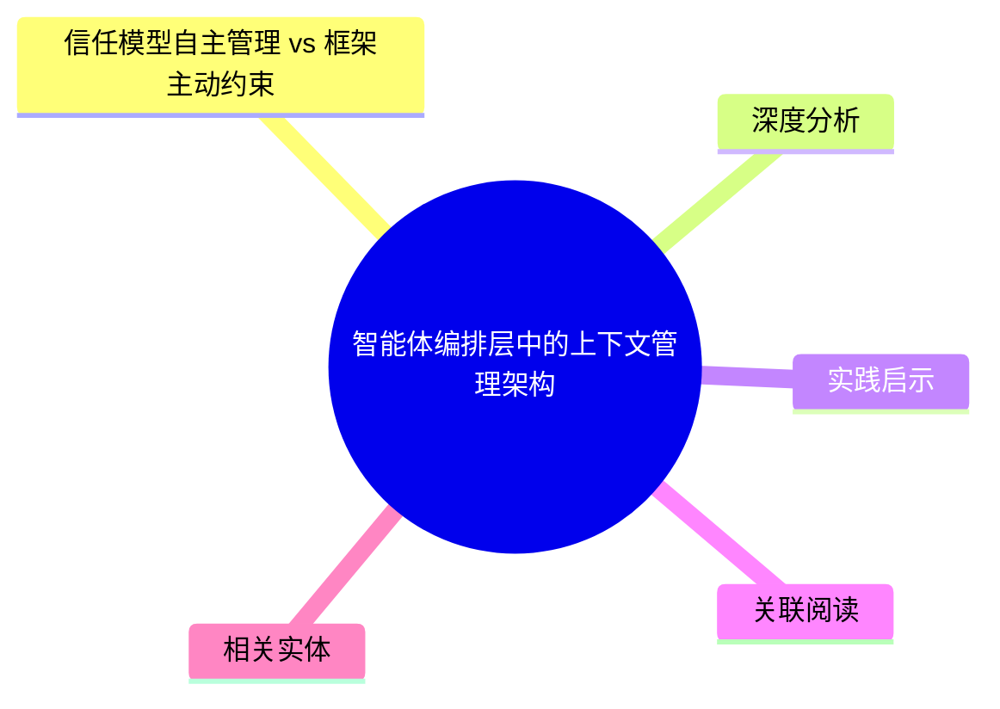
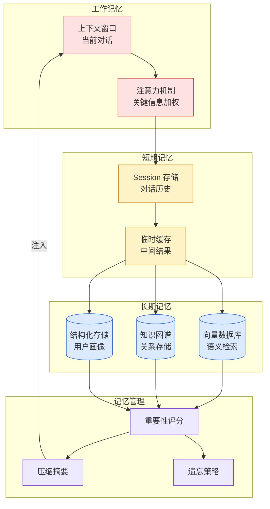

# 智能体编排层中的上下文管理架构

## Ch04.615 智能体编排层中的上下文管理架构

> 📊 Level ⭐⭐ | 3.9KB | `entities/agent-context-management-architecture-patterns.md`

## 概念导图

## 信任模型自主管理 vs 框架主动约束
1. **框架优先**：硬性保护上下文，教导模型学会分页。文件读取设置严格上限（行/字节），截断后附带继续提示，工具描述强化分页行为
2. **纵深防御**：在基础截断上叠加额外预算层。启动文件独立上限 → 所有文件总预算 → 首尾保留中间裁剪 → 工具输出独立预算

## 深度分析

1. **三元决策框架的普遍性**：所有框架都面临相同的三元权衡——保留什么、压缩什么、留待后续检索什么。这一矛盾是上下文管理的根本张力
2. **设计收敛到共同机制**：尽管哲学路径不同，所有框架最终都收敛到相同实现：先检查再读取、行数限制、offset/limit 分页、继续提示、溢出到磁盘。这种收敛印证了这些机制的必要性
3. **反射子代理的范式创新**：方案 4（反射子代理）将 Agent 记忆视为版本控制文件系统，将重要状态从临时对话迁移到持久记忆文件。这是最具雄心的设计思路
4. **子代理隔离是共同模式**：所有框架都隔离子代理会话，不传递父完整历史。这一共同设计确认了父子代理间信息隔离的重要性
5. **范式转变信号**：上下文管理正从"如何装入更多信息"转向"如何在恰当的时机披露恰当的信息"。这一转向对 Agent 架构设计具有深远意义

## 实践启示
1. **实现五层基础保护**：文件读取硬性上限、offset/limit 分页、工具结果大小限制、子代理会话隔离、token 阈值触发的 LLM 压缩——这五层是任何 Agent 框架的底线
2. **采用双层门控**：第一层用元数据检查文件大小，超出直接拒绝；第二层读取后进行 token 计数，捕获字节小但 token 密度高的文件。两层支持运行时动态调整
3. **设计状态持久化层**：参考持久化记忆层方案，将版本控制文件系统引入 Agent 架构。特定子目录固定到系统提示，目录外文件仅名称和描述可见直到主动读取
4. **会话压缩优先摘要而非截断**：当上下文压力达到阈值时，使用 LLM 摘要而非简单截断。方案 1-4 都使用 LLM 摘要，说明这是经过验证的有效方法
5. **子代理采用最小上下文**：子代理应使用空白内存会话或最小允许列表，而非继承父代理完整历史。这减少了 token 消耗并防止信息泄露

## 关联阅读
## 相关实体
- [Openclaw Prompt Context Harness](../ch11/235-openclaw.html)
- [Hermes Agent Goal Runtime Architecture State Persistence Judge Closed Loop](ch04/381-hermes-agent-goal.html)
- [Agent Memory Architecture Ruofei](ch04/121-agent-memory.html)
- [Code As Agent Harness Survey](../ch09/051-code-as-agent-harness.html)
- [打造可靠的 Ai 编程环境Claude Code Hooks 完整开发者指南 V2](../ch03/078-claude-code.html)

→ [原文存档](https://github.com/QianJinGuo/wiki-book/tree/main/docs/raw/articles/agent-context-management-architecture-patterns.md)

---

