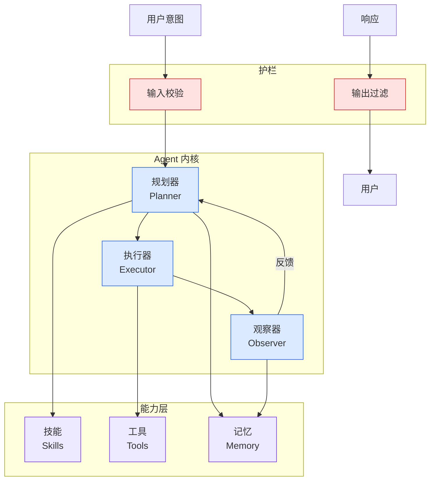

# Versa takes aim at fragmented enterprise security with CSPM, orchestration update, and AI agent controls | Network World

## Ch04.619 Versa takes aim at fragmented enterprise security with CSPM, orchestration update, and AI agent controls | Network World

> 📊 Level ⭐⭐ | 3.9KB | `entities/versa-takes-aim-at-fragmented-enterprise-security-with-cspm-orchestration-updat.md`

# Versa takes aim at fragmented enterprise security with CSPM, orchestration update, and AI agent controls | Network World

→ [原文存档](https://github.com/QianJinGuo/wiki-book/tree/main/docs/raw/articles/versa-takes-aim-at-fragmented-enterprise-security-with-cspm-orchestration-updat.md)

## 深度分析

Versa takes aim at fragmented enterprise security with CSPM, orchestration update, and AI agent controls | Network World 涉及agent领域的核心技术议题。
### 核心观点
1. URL Source: https://www.
2. com/article/4169706/versa-takes-aim-at-fragmented-enterprise-security-with-cspm-orchestration-updat.
3. html
Published Time: 2026-05-11T22:55:16-05:00
Markdown Content:
# Versa takes aim at fragmented enterprise security with CSPM, orchestration update, and AI agent controls | Network World
🚀 The new NetworkWorld.
4. com hybrid search: 🔍 Explore Network World content smarter, faster and AI powered.
5. 
- [Openclaw 完全指南这可能是全网最新最全的系统化教程了32W字建议收藏 V2](../ch11/235-openclaw.html)
- [Karpathy 最新访谈从 Vibe Coding 到 Agentic Engineering](ch04/237-agentic.html)
- [构建基于多智能体架构的深度思考交易系统 V2](https://github.com/QianJinGuo/wiki/blob/main/entities/构建基于多智能体架构的深度思考交易系统-v2.md)
- [一文带你弄懂 Ai 圈爆火的新概念Harness Engineering](../ch05/120-harness-engineering.html)
- [Karpathy Vibe Coding Agentic Engineering](ch04/126-karpathy-vibe-coding-agentic-engineering.html)

## 实践启示

1. **工程落地**: agent领域方案需关注可观测性、可维护性和成本效率
2. **技术选型**: 根据场景选择合适的技术栈，避免过度设计或盲目追新
3. **持续迭代**: 建立数据驱动的反馈闭环，持续优化系统表现
4. **风险管控**: 引入新技术需评估对现有系统稳定性的影响，做好降级预案

---

