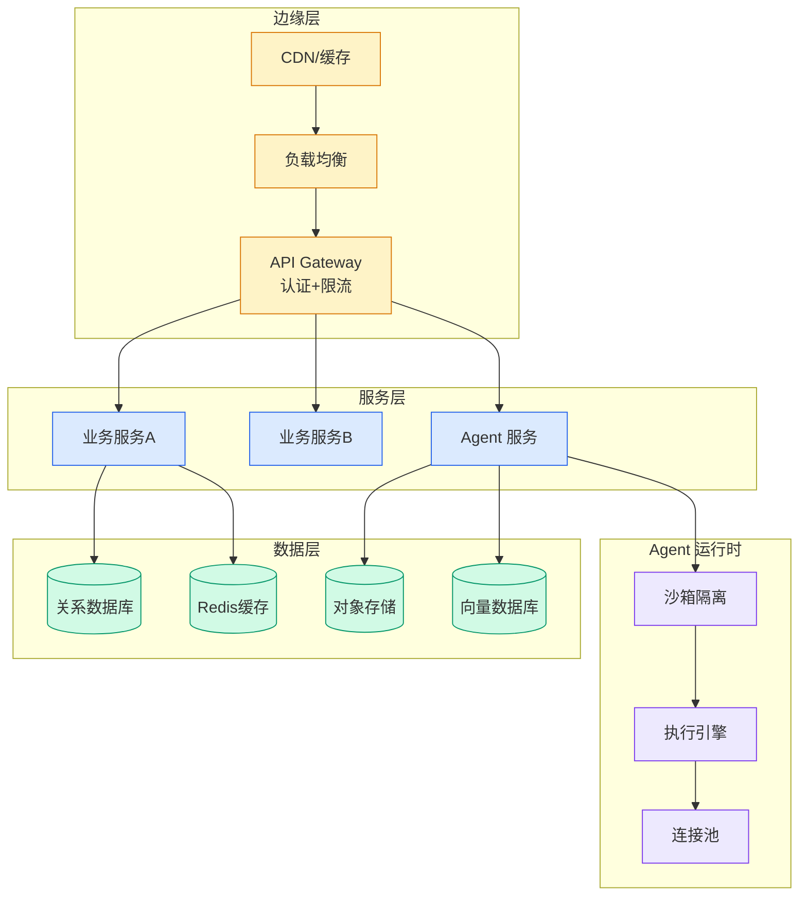

# 浏览器 Agent 的失忆问题：Autobrowse 如何让每次探索变成永久技能

## Ch04.629 浏览器 Agent 的失忆问题：Autobrowse 如何让每次探索变成永久技能

> 📊 Level ⭐⭐ | 3.8KB | `entities/autobrowse-browser-agent-persistent-skills-sense-ai.md`

# 浏览器 Agent 的失忆问题：Autobrowse 如何让每次探索变成永久技能

## 相关实体

- [浏览器 agent 的失忆问题：autobrowse 如何让每次探索变成永久技能](../ch07/040-autobrowse-browserbase-persistent-skill.html)
→ [原文存档](https://github.com/QianJinGuo/wiki-book/tree/main/docs/raw/articles/autobrowse-browser-agent-persistent-skills-sense-ai.md)

- [MOC](https://github.com/QianJinGuo/wiki/blob/main/moc/mlops-training-inference.md)
## 深度分析

浏览器 Agent 的失忆问题：Autobrowse 如何让每次探索变成永久技能 涉及agent领域的核心技术议题。
### 核心观点
1. > **Source**: https://mp.
2. com/s/QvYspe3V6eoA9ZUA0AxocA
> **Author**: Sense AI / 深思SenseAI
> **Date**: 2026-05-08
> **Category**: Browser Agent / Memory / Skills
# 浏览器 Agent 的失忆问题：Autobrowse 如何让每次探索变成永久技能
## 核心问题：探索税（Discovery Tax）
Browserbase 的 Kyle Jeong 提出的概念。
3. 浏览器 Agent 每次会话结束，学到的一切都跟着蒸发。
4. 成本曲线是一条没有任何学习斜率的直线。
5. > 凯恩斯在《概率论》里描述过一个「没有海马体的天才」的思想实验——这个人每次从零推导出同样精妙的结论，却无法在昨天的洞察上继续前进。

### 内容结构
- 浏览器 Agent 的失忆问题：Autobrowse 如何让每次探索变成永久技能
- 核心问题：探索税（Discovery Tax）
- 根本瓶颈是记忆，不是推理
- Autobrowse 是什么
- 五步学习循环
- 1. 目标（Objective）
- 2. 运行（Run）
- 3. 研究（Study）

### 技术要点

- **agent架构**: 本文在agent方向提出的设计理念与实现路径
- **工程挑战**: 实际落地中面临的关键问题与应对策略
- **data趋势**: 相关技术演进方向与新兴范式
### 关联实体

- [Agentops Operationalize Agentic Ai At Scale With Amazon Bedr](ch04/299-agentops-operationalize-agentic-ai-at-scale-with-amazon-bed.html)
- [龙虾装上了可以用来干啥分享下我的 Openclaw 多智能体团队搭建经验 V2](../ch11/235-openclaw.html)
- [Openclaw 完全指南这可能是全网最新最全的系统化教程了32W字建议收藏 V2](../ch11/235-openclaw.html)
- [Openclaw 完全指南这可能是全网最新最全的系统化教程了32W字建议收藏](../ch11/235-openclaw.html)
- [Ethan He Cosmos Grok Imagine Latent Space Video Agent 20260606](../ch03/035-agent.html)
- [存之有序治之有矩Agent 记忆系统的工程实践与演进](../ch03/035-agent.html)

## 实践启示
1. **工程落地**: agent领域方案需关注可观测性、可维护性和成本效率
2. **技术选型**: 根据场景选择合适的技术栈，避免过度设计或盲目追新
3. **持续迭代**: 建立数据驱动的反馈闭环，持续优化系统表现
4. **风险管控**: 引入新技术需评估对现有系统稳定性的影响，做好降级预案

---

