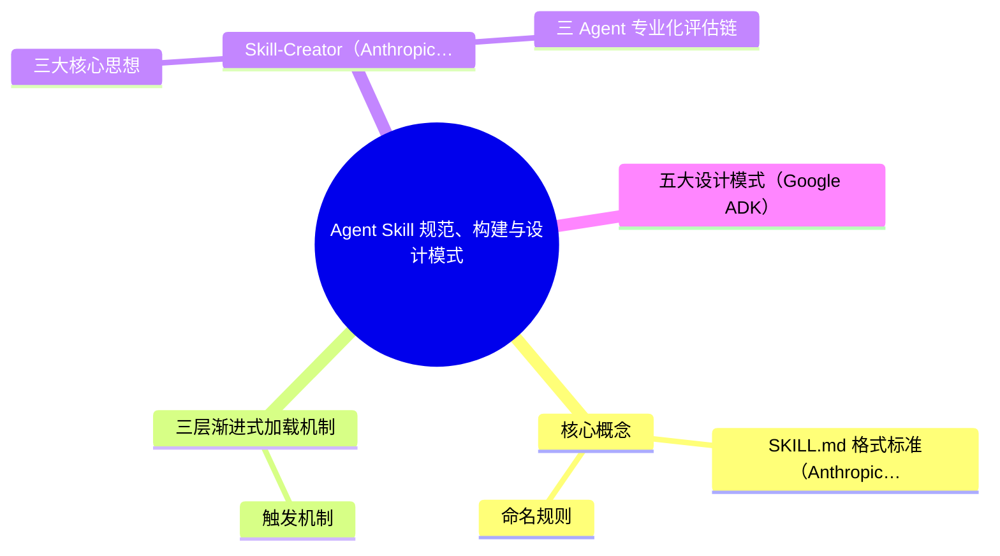
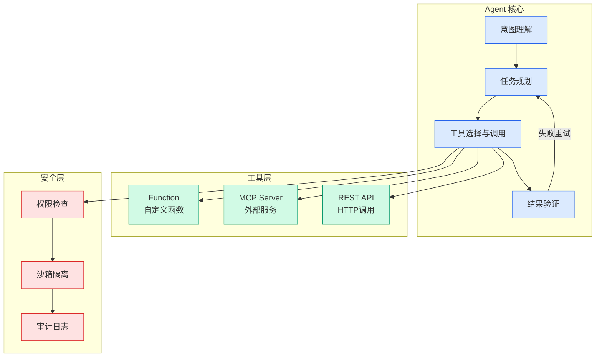

# Agent Skill 规范、构建与设计模式

## Ch04.634 Agent Skill 规范、构建与设计模式

> 📊 Level ⭐⭐ | 3.8KB | `entities/agent-skill-spec-building-design-patterns.md`

# Agent Skill 规范、构建与设计模式

基于 Anthropic Agent Skills 规范、Skill-Creator 方法论、Superpowers Writing-Skills 框架及 Google ADK 设计模式的系统性总结。

## 概念导图

## 核心概念

**Skill ≠ Prompt**：Skill 是围绕任务、工具、流程和输出边界的结构化行为设计，是可复用的 Prompt 增强包。

### SKILL.md 格式标准（Anthropic 2025.12）
- `SKILL.md`：YAML 元数据 + Markdown 指令
- `scripts/`：可执行脚本
- `references/`：按需加载的参考文档
- `assets/`：模板、资源文件

### 命名规则
仅允许 Unicode 小写字母、数字和连字符，不能以连字符开头/结尾。

## 三层渐进式加载机制

解决上下文膨胀问题的核心机制，借鉴 UI/UX 渐进式信息披露策略：

| 层级 | 内容 | 加载时机 | Token 成本 |
|------|------|----------|-----------|
| **L1 目录层** | name + description | 会话启动时 | ~50-100 tokens/个 |
| **L2 指令层** | 完整 SKILL.md body | Skill 被激活时 | 建议 <5000 tokens |
| **L3 资源层** | scripts/references/assets | 指令引用时按需 | 视文件大小 |

即使安装 20 个 Skill，初始加载仅 1000-2000 tokens，上下文使用量减少约 **90%**。

### 触发机制
完全由模型自行判断当前任务是否匹配 description，非关键词硬编码。

**最关键发现**：Description 只应描述触发条件，绝不要总结工作流程——否则 Agent 会直接按 description 执行，跳过读取完整的 SKILL.md 正文。

## Skill-Creator（Anthropic）工程化方法论

核心思想：像做机器学习一样做 Prompt Engineering。

### 三大核心思想
1. **泛化而非过拟合**：不为测试用例做针对性修改
2. **解释"为什么"而非堆砌"必须"**：LLM 有良好的心智理论，解释比命令更有效
3. **提取重复模式**：Agent 反复写的辅助脚本应抽取到 `scripts/` 目录

### 三 Agent 专业化评估链
- **Grader（评分者）**：评估断言，且会自我批评
- **Comparator（盲比较者）**：双盲实验，不知哪个输出对应哪个 Skill
- **Analyzer（分析者）**：事后揭盲分析赢家为什么赢

## 五大设计模式（Google ADK）

| 模式 | 核心逻辑 | 适用场景 |
|------|----------|----------|
| **Tool Wrapper** | SKILL.md 不写完整规范，只告诉 Agent 去 references/ 按需加载 | 框架/库封装、团队编码规范 |
| **Generator** | 模板 + 风格指南 + 主动提问 | 标准化文档生成、项目脚手架 |
| **Reviewer** | 分离"查什么"与"怎么查"，解释 WHY 不是 WHAT | 自动化 PR 审查、安全扫描 |
| **Inversion** | 翻转交互模式：Agent 先采访用户，再动手 | 新项目规划、需求不明确场景 |
| **Pipeline** | 多步严格顺序，明确输入/输出/通过条件 | 多阶段内容生产 |

推荐组合：Pipeline + Reviewer（多阶段生成+审查）、Generator + Inversion（采访后生成）。

→ [原文存档](https://github.com/QianJinGuo/wiki-book/tree/main/docs/raw/articles/agent-skill-spec-building-design-patterns.md)

---
## 关联
- 相关概念: [Harness Engineering](https://github.com/QianJinGuo/wiki/blob/main/concepts/harness-engineering-framework.md)
- 相关: [Agent 架构](https://github.com/QianJinGuo/wiki/blob/main/concepts/agent-architecture.md)

---

