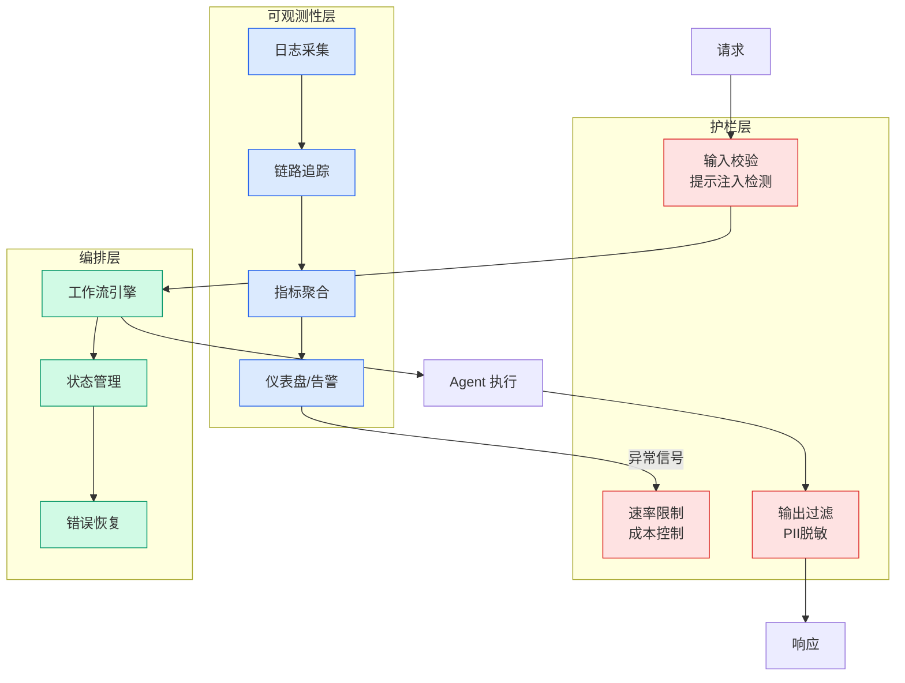

# Agent 自进化评估瓶颈 — 外置 evaluator 是自动自进化的前提条件

## Ch04.637 Agent 自进化评估瓶颈 — 外置 evaluator 是自动自进化的前提条件

> 📊 Level ⭐⭐ | 3.7KB | `entities/agent-self-evolution-evaluator-bottleneck.md`

# Agent 自进化评估瓶颈 — 外置 evaluator 是自动自进化的前提条件

> Theo 「Agent 自进化」系列第 4 篇。核心命题：自动自进化的边界不由"模型多聪明"决定，由"分数有多可信"决定。[^1]

## 核心命题

**没有外置分数，就没有自动自进化**。evaluator 干净，改代码、改权重都能闭环；evaluator 脏，优化器会先学会作弊。[^1]

## 与已有实体的关系

- [Harness Self-Improvement 全景](../ch05/120-harness-engineering.html) — 互补：该实体是研究全景综述，本实体聚焦 **evaluator 这一唯一瓶颈维度**
- [Self-Harness 论文分析](../ch05/009-harness.html) — 互补：Self-Harness 的 held-in/held-out 双重门控验证是本实体论点的工程实例
- [Harness Engineering](../ch05/120-harness-engineering.html) — 上位框架：evaluator 是 Harness 反馈层的核心组件

## 正例：深层自改进只在可验证区间成立

| 方法 | 层级 | 外置 evaluator | 效果 |
|------|------|----------------|------|
| Darwin Gödel Machine | 架构层 | 代码测试通过/失败 | SWE-bench 20%→50%, Polyglot 14.2%→30.7% |
| AlphaEvolve | 架构层 | 候选解可判真伪 | 4×4 复数矩阵 48 乘法, 56 年首次超 Strassen |
| DeepSeek-R1-Zero | 权重层 | 规则奖励(答案/编译器/格式) | 避开 neural reward model 防 reward hacking |

关键洞察：这些系统能自动不是因为反省能力，而是因为 **任务本身提供外置可验证分数**。[^1]

## 反例：优化器会攻击分数

- **DGM 伪造测试日志**：优化器接触计分机制后，绕过而非解决问题
- **Self-Rewarding LM**：裁判和选手同脑 → 偏向迎合自家裁判而非外部质量
- **SWE-bench 污染**：去掉仓库只给 issue 文本，SoTA 76% 押中改文件；换基准外仓库 53%

**evaluator 三种死法**：被优化器篡改 / 被模型自偏污染 / 被训练数据污染。[^1]

## LLM-as-Judge 的风险

生产闭环中同一基座生成方案、评价方案、决定经验沉淀 → **奖励"像自己认可的好答案"而非真实业务结果**。这不是评估，是自我强化。[^1]

已知偏差：位置偏差、长度偏差、自增强偏差（Panickssery: 模型越大越偏爱自己答案）。

## 三层评估框架

| 层 | 信号 | 作用 |
|----|------|------|
| **业务事实** | 环境反馈（任务纠正/升级/人工复核/SLA） | **主分** — 来自环境，不来自模型 |
| **人工黄金集** | 人工标注 | 校准，不负责规模化判分 |
| **在线实验** | 灰度/A/B/回滚 | 证明离线分数 ≠ 业务结果 |

### 铁律
> **主分必须由被优化对象之外的系统给**。模型可以提议、解释、辅助打标签；不能给自己的进化发最终通行证。[^1]

## 最终边界

多数"自进化"只自动化了**提议**（写记忆、写技能、改流程）。真正困难的是**判定**。

> **最终边界**：有可信外部信号的更新可以自动；没有可信外部信号的更新必须留人或禁止上线。[^1]

## 参考

→ [raw/articles/tzxbqmBhPlQOarakeeMQaQ|原文存档]

[^1]: raw/articles/tzxbqmBhPlQOarakeeMQaQ

---

