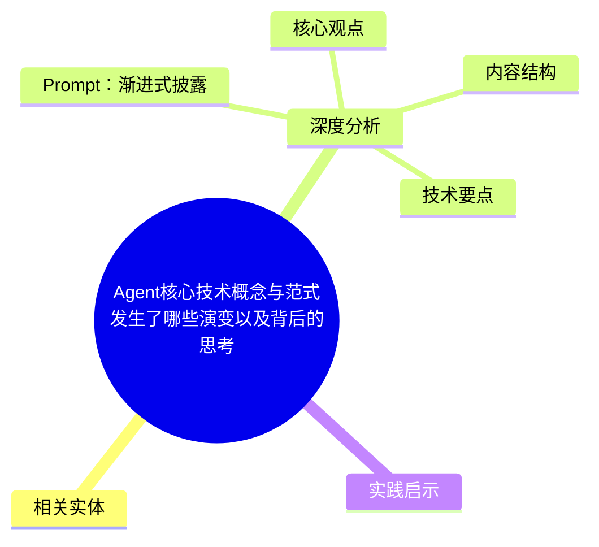
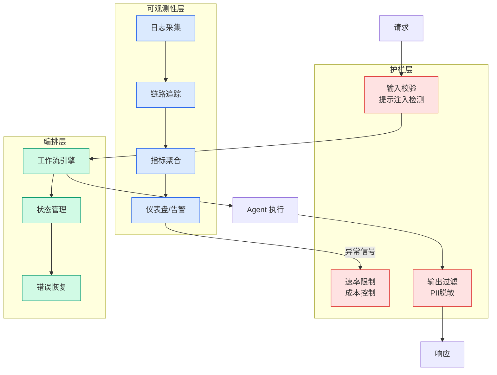

# Agent核心技术概念与范式发生了哪些演变以及背后的思考

## Ch04.639 Agent核心技术概念与范式发生了哪些演变以及背后的思考

> 📊 Level ⭐⭐ | 3.7KB | `entities/agent-paradigm-evolution-feipeng-alibaba.md`

# Agent核心技术概念与范式发生了哪些演变以及背后的思考

## 概念导图

## 相关实体

- [《从零实现 agent 系统》连载 01｜agent 系统是什么：问题空间与架构切片](../ch03/035-agent.html)
- [cola dlm：字节跳动连续潜空间扩散语言模型](../ch01/341-cola-dlm.html)
- [explicit vs. implicit in the age of intelligences — le secré](../ch05/094-ai.html)
- [review agent：后台复盘 agent 如何判断什么值得保存](../ch03/035-agent.html)
- [不用再学ai了！生成结果包稳的agent来了](../ch03/035-agent.html)
→ [原文存档](https://github.com/QianJinGuo/wiki-book/tree/main/docs/raw/articles/agent-paradigm-evolution-feipeng-alibaba.md)

- [MOC](https://github.com/QianJinGuo/wiki/blob/main/moc/mlops-training-inference.md)
## 深度分析

Agent核心技术概念与范式发生了哪些演变以及背后的思考 涉及agent领域的核心技术议题。
### 核心观点
1. # Agent核心技术概念与范式发生了哪些演变以及背后的思考
**作者：** 飞樰
**发布日期：** 2026年6月1日
梳理 Agent 技术从2023-2026年的四个阶段演进（被动ReAct→工作流→自主→自进化）及六大核心维度（Prompt/Planning/Memory/Tools/Workflow/Environment）的技术概念变化。
2. 强调四个阶段非替代关系而是并存互补。
3. 核心洞察：宏观架构"形"未变，内核已重构——从"人为适配模型"到"利用模型原生能力"，从"刚性约束"到"动态智能"。
4. （本文覆盖的4阶段+6维度Agent框架已由 entity [Agent 四阶段演化与六维度技术变化](../ch03/035-agent.html) 完整收录。
5. ）
### Prompt：渐进式披露
System Prompt 从"单体大作文"到"System Prompt + 渐进式加载上下文文件"的解耦。

### 内容结构
- Agent核心技术概念与范式发生了哪些演变以及背后的思考
- Prompt：渐进式披露
- Memory：文件系统化+向量混合
- Tools：CLI 命令行原生化
- 总结框架

### 技术要点

- **agent架构**: 本文在agent方向提出的设计理念与实现路径
- **工程挑战**: 实际落地中面临的关键问题与应对策略
- **architecture趋势**: 相关技术演进方向与新兴范式
### 关联实体

- [Openclaw 完全指南这可能是全网最新最全的系统化教程了32W字建议收藏 V2](../ch11/235-openclaw.html)
- [Karpathy 最新访谈从 Vibe Coding 到 Agentic Engineering](ch04/237-agentic.html)
- [Openclaw 完全指南这可能是全网最新最全的系统化教程了32W字建议收藏](../ch11/235-openclaw.html)
- [Ethan He Cosmos Grok Imagine Latent Space Video Agent 20260606](../ch03/035-agent.html)
- [Karpathy Vibe Coding Agentic Engineering](ch04/126-karpathy-vibe-coding-agentic-engineering.html)
- [你不知道的 Agent原理架构与工程实践 V2](../ch03/035-agent.html)

## 实践启示
1. **工程落地**: agent领域方案需关注可观测性、可维护性和成本效率
2. **技术选型**: 根据场景选择合适的技术栈，避免过度设计或盲目追新
3. **持续迭代**: 建立数据驱动的反馈闭环，持续优化系统表现
4. **风险管控**: 引入新技术需评估对现有系统稳定性的影响，做好降级预案

---

