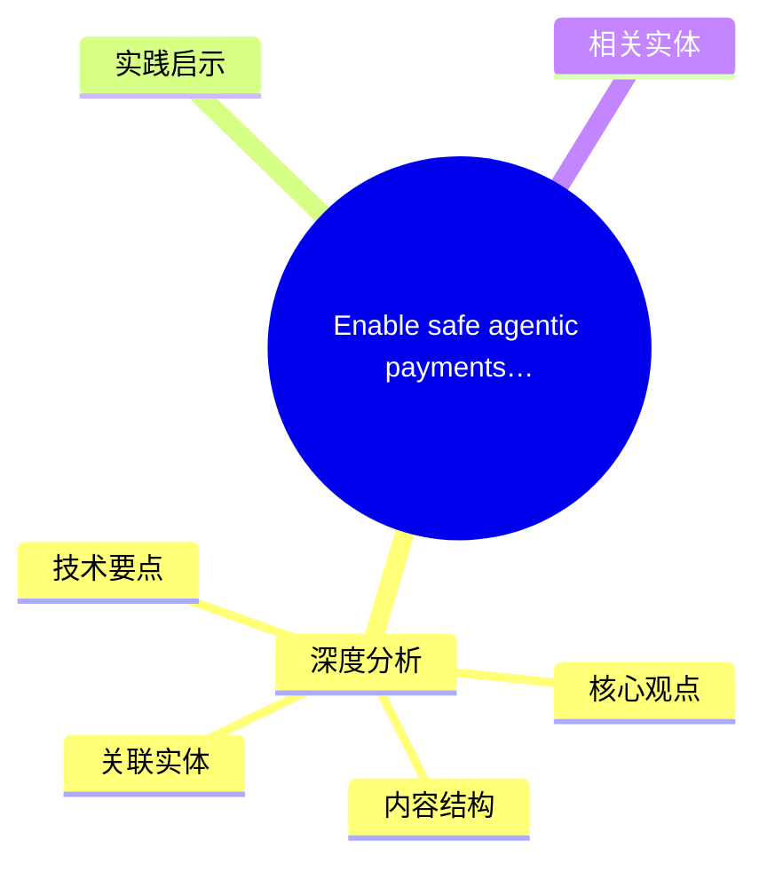
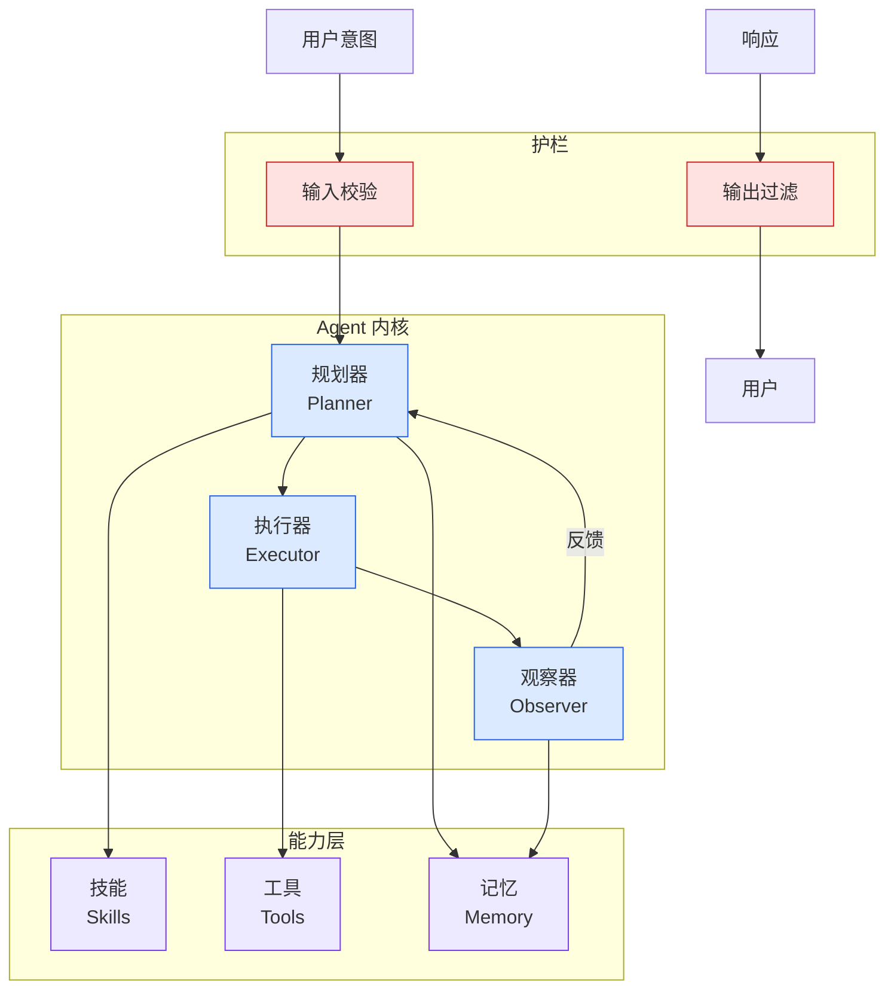

# Enable safe agentic payments with built-in guardrails using Amazon Bedrock AgentCore payments

## Ch04.646 Enable safe agentic payments with built-in guardrails using Amazon Bedrock AgentCore payments

> 📊 Level ⭐⭐ | 3.6KB | `entities/enable-safe-agentic-payments-with-built-in-guardrails-using-.md`

# Enable safe agentic payments with built-in guardrails using Amazon Bedrock AgentCore payments

→ [原文存档](https://github.com/QianJinGuo/wiki-book/tree/main/docs/raw/articles/enable-safe-agentic-payments-with-built-in-guardrails-using-.md)

## 概念导图

## 深度分析

Enable safe agentic payments with built-in guardrails using Amazon Bedrock AgentCore payments 涉及agent领域的核心技术议题。
### 核心观点
1. When the tools, MCP endpoints, or web resources an agent reaches are paid, the agent gets stuck without the ability to transact.
2. Amazon Bedrock AgentCore payments, announced in preview in partnership with Coinbase and Stripe (Privy), gives agents the ability to access paid resources on the end user’s behalf to complete the task.
3. Putting real money behind an autonomous system raises a new set of risks.
4. They come from agents acting autonomously over long sessions, model non-determinism, and a wider exposure surface between agent code and the end user’s funds.
5. In this post, we walk through those risks and the guardrails that AgentCore payments combines to address each one.

### 内容结构
- The challenge: Safety risks in agentic payments
- Runaway spend
- Lack of end user consent and delegation
- Compromise of developer keys and wallet tokens
- Exposure of the end user’s payment instrument
- Lack of auditability
- Using AgentCore services and controls to address these risks
- Payment limits and policy for tool access

### 技术要点

- **agent架构**: 本文在agent方向提出的设计理念与实现路径
- **工程挑战**: 实际落地中面临的关键问题与应对策略
- **aws趋势**: 相关技术演进方向与新兴范式
### 关联实体

- [两万字详解Claude Code源码核心机制](../ch03/078-claude-code.html)
- [Karpathy 最新访谈从 Vibe Coding 到 Agentic Engineering](ch04/237-agentic.html)
- [深入理解 Claude Code 源码中的 Agent Harness 构建之道](../ch05/058-agent-harness.html)
- [一文带你弄懂 Ai 圈爆火的新概念Harness Engineering](../ch05/120-harness-engineering.html)
- [Karpathy Vibe Coding Agentic Engineering](ch04/126-karpathy-vibe-coding-agentic-engineering.html)
- [Agentops Operationalize Agentic Ai At Scale With Amazon Bedr](ch04/299-agentops-operationalize-agentic-ai-at-scale-with-amazon-bed.html)

## 实践启示

1. **工程落地**: agent领域方案需关注可观测性、可维护性和成本效率
2. **技术选型**: 根据场景选择合适的技术栈，避免过度设计或盲目追新
3. **持续迭代**: 建立数据驱动的反馈闭环，持续优化系统表现
4. **风险管控**: 引入新技术需评估对现有系统稳定性的影响，做好降级预案

## 相关实体

- [MOC](https://github.com/QianJinGuo/wiki/blob/main/moc/observability-monitoring.md)

---

