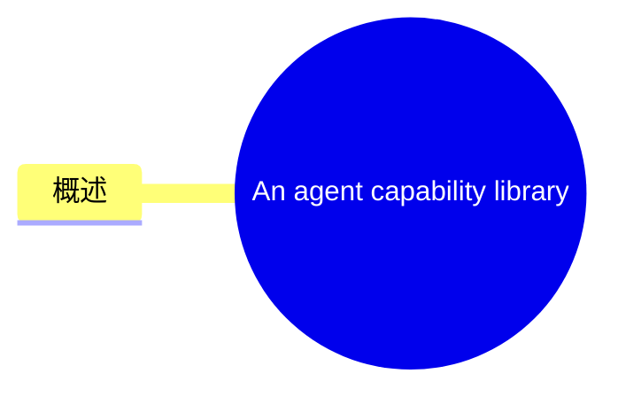
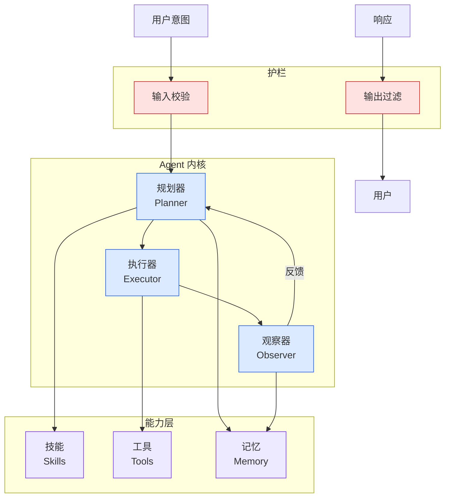

# An agent capability library

## Ch04.647 An agent capability library

> 📊 Level ⭐⭐ | 3.6KB | `entities/agent-capability-library.md`

# An agent capability library

> **来源**: [An agent capability library](https://samihonkonen.com/posts/an-agent-capability-library/)


## 概念导图



## 概述

Published Time: 2026-06-22T12:00:00+03:00

Markdown Content:
In the [last post](https://samihonkonen.com/posts/purpose-built-local-ai-agents/) I described how I set up a local LLM and how I create purpose-built agents:

> Whenever I want AI help with something specific, I make a new directory under `~/projects/` on my Air and just start working with pi. Once I’ve done what I want to do, I tell pi to record the process in an `AGENTS.md`. From that point on, every time I open pi in that directory it reads the file and is immediately ready to continue.

Continuing on that, I’ve started building a general library of capabilities for the agents. Pi reads a global `AGENTS.md` from `~/.pi/agent/AGENTS.md` on startup. Mine is a symlink to a `CAPABILITIES.md` in a repo called `agent-docs`. It’s a capability index: a list of things the agent can do, each with a short description of when to reach for it and a pointer to a doc that explains how. Here’s an excerpt:

```
- **Studio machine** — a powerful always-on Mac you can SSH into.
  Reach for it when you need more horsepower or a stable host for a
  background service. Read @/path/to/agent-docs/STUDIO.md.

- **exe.dev VMs** — on-demand Linux VMs with a public HTTPS proxy.
  Reach for it when you need a real Linux box or a public URL.
  Read @/path/to/agent-docs/EXE-DEV.md.

- **Browser automation** — drive a real Chrome from the shell.
  Reach for it when you need to scrape, fill a form, or visually
  check a deployed page. Read @/path/to/agent-docs/AGENT-BROWSER.md.
```

The agent doesn’t load all specific instructions upfront. It reads the index, decides whether the task matches a capability, and only then reads the relevant doc. The docs themselves are ordinary markdown: what the thing is, when to use it, how to use it. I write and update them almost exclusively with AI. `agent-docs` is itself a purpose-built agent for maintaining the library.

I also include a reference to `CAPABILITIES.md` in the `AGENTS.md` of individual coding projects, so project agents can reach for the same tools.

The current list has seven entries: the Studio, the local LLM, private git hosting on the Studio, [exe.dev VMs](https://samihonkonen.com/posts/a-love-letter-to-exe-dev/), browser automation, a personal MCP server, and this blog. Adding a new one is three steps: write the doc, add a line to the index, commit.

The idea is that this compounds. Every time I set something up, I write a doc for it. The agents inherit the capability. Over time the agent should become genuinely useful across a wide range of tasks, because the infrastructure behind it keeps growing.

## 原文存档




→ [原文存档](https://github.com/QianJinGuo/wiki-book/tree/main/docs/raw/articles/agent-capability-library.md)

---
## 关联
- 相关概念: [Harness Engineering](https://github.com/QianJinGuo/wiki/blob/main/concepts/harness-engineering-framework.md)
- 相关: [Agent 架构](https://github.com/QianJinGuo/wiki/blob/main/concepts/agent-architecture.md)

---

