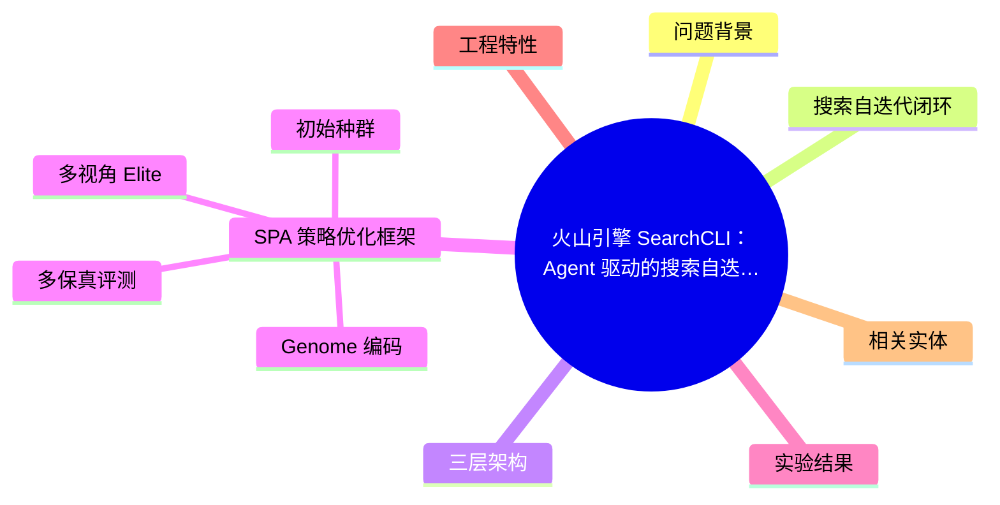
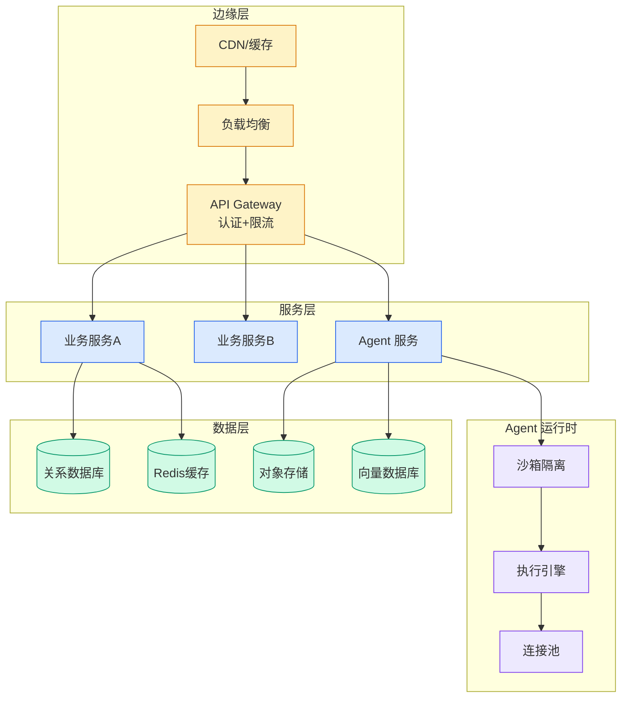

# 火山引擎 SearchCLI：Agent 驱动的搜索自迭代与 SPA 策略优化

## Ch04.648 火山引擎 SearchCLI：Agent 驱动的搜索自迭代与 SPA 策略优化

> 📊 Level ⭐⭐ | 3.6KB | `entities/volcengine-searchcli-agent-driven-search-self-iteration.md`

# 火山引擎 SearchCLI：Agent 驱动的搜索自迭代

火山引擎（ByteDance）开源的 SearchCLI，实现 Agent 驱动的搜索自迭代闭环。核心架构：Agent + Skills + CLI 三层，加上 SPA（Strategy Population Annealing）策略优化框架。

> → [原文存档](https://github.com/QianJinGuo/wiki-book/tree/main/docs/raw/articles/volcengine-searchcli-agent-driven-search-self-iteration.md)

## 概念导图

## 问题背景

搜索调优参数彼此影响（召回/排序/零结果率/延迟），传统依赖搜索专家反复试验，难以低成本可复现持续迭代。

## 搜索自迭代闭环

Agent 驱动：将"发现问题→提出假设→分配评测预算→筛选候选→验证收益→输出候选配置"变成可重复运行、结果可审阅的闭环。生产变更保留 dry-run + 手动确认。

## 三层架构

- **Agent**：上下文判断，决定做什么
- **Skills**：沉淀搜索专家知识
- **CLI**：确定性长任务执行（vs search tune 子命令链：validate→plan→run→report→compare→apply）

## SPA 策略优化框架

### Genome 编码
搜索参数（召回模式/关键词语义权重/匹配门槛/候选数）编码为带领域语义的 Genome，交叉变异需理解语义后执行裁剪归一化和合法性校验。

### 初始种群
由当前策略、Baseline、边界策略、Matrix 和行业 Prior 组成，从有意义行为区域出发而非随机点。

### 多保真评测
三层过滤：先淘汰连源 Item 都召不回的；有限 Query 上 LLM Judge；全量评测。Fast Pass 高分还需证明收益不集中在少数 Query 类型。

### 多视角 Elite
保留 Global Best、Query-Type Best、Stable Best、Low-Latency Best、Low-Zero-Result Best、Baseline-Improver 和 Diverse Candidate，防止种群过早塌缩。

### 鲁棒目标
RobustScore = NDCG@20 + α×MRR@10 - β×zero_result_rate - γ×latency_penalty - δ×query_type_variance - ε×confidence_interval_width。Bootstrap 重采样检测置信区间。

## 实验结果

| 指标 | 提升范围 |
|------|---------|
| NDCG@20 | +11.66%~13.50% |
| NDCG@10 | +9.56%~15.08% |
| MRR@10 | +7.74%~14.95% |
| Precision@10 | +7.36%~21.17% |

## 工程特性

- Plan 编译实验成本（不调用搜索/LLM）
- 受控并发 + 标签缓存 + Checkpoint/Resume
- Apache-2.0，GitHub: [volcengine/SearchCLI](https://github.com/volcengine/SearchCLI)

## 相关实体

- [火山引擎 AI 搜索千万级 Agent 架构](../ch03/035-agent.html)

---

