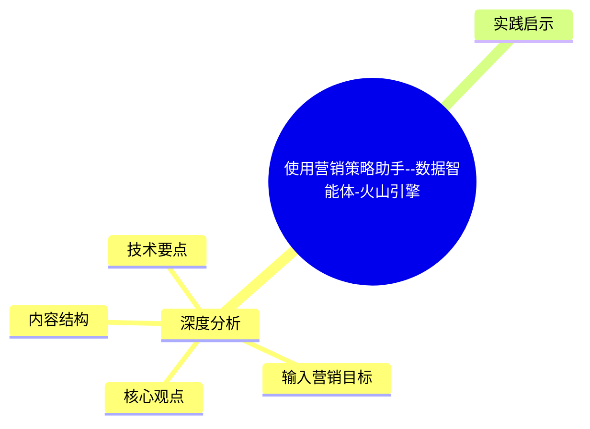
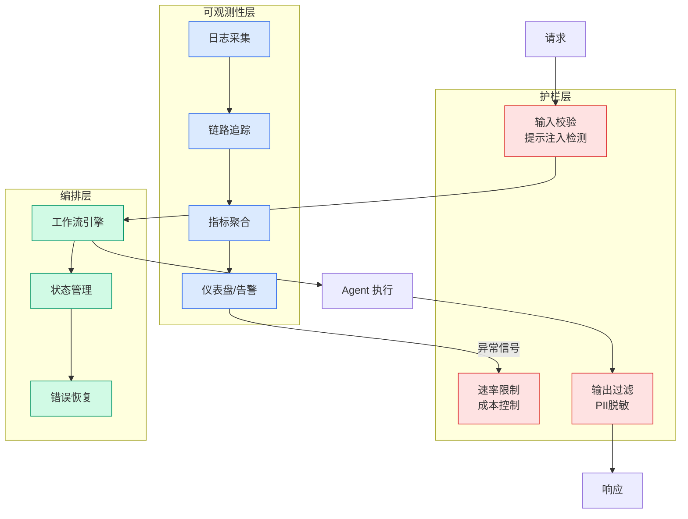

# 使用营销策略助手--数据智能体-火山引擎

## Ch04.649 使用营销策略助手--数据智能体-火山引擎

> 📊 Level ⭐⭐ | 3.6KB | `entities/volcengine-data-agent-marketing-strategy-agent.md`

# 使用营销策略助手--数据智能体-火山引擎

→ [原文存档](https://github.com/QianJinGuo/wiki-book/tree/main/docs/raw/articles/volcengine-data-agent-marketing-strategy-agent.md)

## 概念导图

## 深度分析

使用营销策略助手--数据智能体-火山引擎 涉及agent领域的核心技术议题。
### 核心观点
1. # 使用营销策略助手--数据智能体-火山引擎
营销策略助手是一款基于 AI 深度思考与大数据分析的数字营销中枢，通过 "目标输入 - 策略生成 - 任务配置 - 动态优化" 的智能闭环，实现从营销要素解析、智能圈群匹配到全渠道策略输出的全流程自动化，为企业打造具备持续进化能力的 "AI 总参谋" 系统。
2. ## 智能生成营销策略
### 输入营销目标
**触达活动描述**：根据实际需求输入活动背景、主题、内容、面向人群以及活动目标等描述信息。
3. 点击「换一换」将自动生成营销目标描述。
4. **触达时机**：如果在实际触达活动里需要指定触达时机则可以设置该字段。
5. 设置「触达时段」后，每个用户在实际下发时，系统将会在该触达时段范围内寻找一个最佳触达时机；如果未设置「触达时段」，系统将默认筛选最近 7 天的时间范围。

### 内容结构
- 使用营销策略助手--数据智能体-火山引擎
- 智能生成营销策略
- 输入营销目标
- 智能圈选目标人群
- 智能生成策略
- 方案推荐
- 策略生成
- 触达任务配置

### 技术要点

- **agent架构**: 本文在agent方向提出的设计理念与实现路径
- **工程挑战**: 实际落地中面临的关键问题与应对策略
- **data趋势**: 相关技术演进方向与新兴范式
### 关联实体

- [Scale Robot Reinforcement Learning With Nvidia Isaac Lab On ](../ch01/1170-scale-robot-reinforcement-learning-with-nvidia-isaac-lab-on.html)
- [你不知道的 Agent原理架构与工程实践 V2](../ch03/035-agent.html)
- [Nvidia Isaac Lab Sagemaker Robot Rl Humanoid](https://github.com/QianJinGuo/wiki/blob/main/entities/nvidia-isaac-lab-sagemaker-robot-rl-humanoid.md)
- [龙虾装上了可以用来干啥分享下我的 Openclaw 多智能体团队搭建经验 V2](../ch11/235-openclaw.html)
- [Openclaw 完全指南这可能是全网最新最全的系统化教程了32W字建议收藏 V2](../ch11/235-openclaw.html)
- [Karpathy 最新访谈从 Vibe Coding 到 Agentic Engineering](ch04/237-agentic.html)

## 实践启示

1. **工程落地**: agent领域方案需关注可观测性、可维护性和成本效率
2. **技术选型**: 根据场景选择合适的技术栈，避免过度设计或盲目追新
3. **持续迭代**: 建立数据驱动的反馈闭环，持续优化系统表现
4. **风险管控**: 引入新技术需评估对现有系统稳定性的影响，做好降级预案

---

