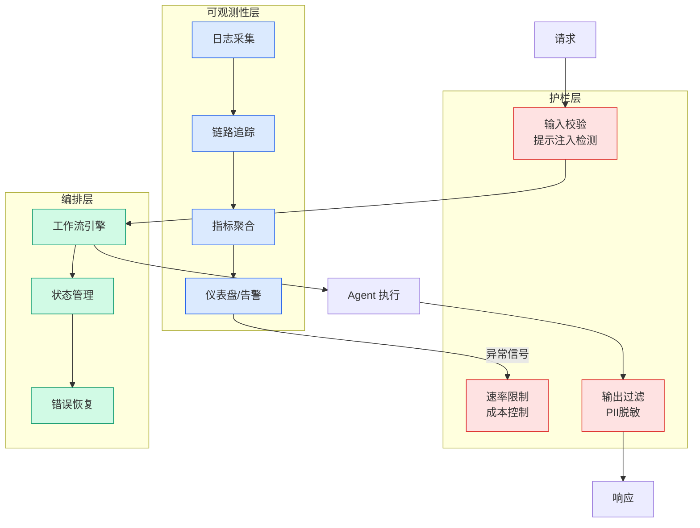

# Stripe 高管 Emily Sands：agent 是互联网的新经济主体 — 5 套基础设施全面上线

## Ch04.655 Stripe 高管 Emily Sands：agent 是互联网的新经济主体 — 5 套基础设施全面上线

> 📊 Level ⭐⭐ | 3.5KB | `entities/stripe-agent-economic-infrastructure-emily-sands.md`

# Stripe 高管 Emily Sands：agent 是互联网的新经济主体 — 5 套基础设施全面上线

→ [原文存档](https://github.com/QianJinGuo/wiki-book/tree/main/docs/raw/articles/stripe-agent-economic-infrastructure-emily-sands.md)

## 深度分析

Stripe 高管 Emily Sands：agent 是互联网的新经济主体 — 5 套基础设施全面上线 涉及agent领域的核心技术议题。
### 核心观点
1. # Stripe 高管 Emily Sands：agent 是互联网的新经济主体 — 5 套基础设施全面上线
> 整理：深思圈 · 2026-06-05
> 原文：Emily Sands（Stripe 高管）· 发布于 2026-06-04 · 来源：@emilygsands
> 原文链接：https://x.
2. com/emilygsands/status/2062540400108417244（45.
3. 8K 次浏览）
> 核心断言：**互联网上出现了新的经济主体。
4. **
## 01 互联网上出现了新主体

Emily Sands 是 Stripe 的高管。
5. 开头一句话很干脆：**互联网上出现了新的经济主体。

### 内容结构
- Stripe 高管 Emily Sands：agent 是互联网的新经济主体 — 5 套基础设施全面上线
- 01 互联网上出现了新主体
- 02 Agent 作为买家：机器支付协议（MPP）
- 03 Link Agent 钱包：把人放回控制链
- 04 Agent 作为建造者：Vibe-deploying
- 05 Token 计费：SaaS 经济学失效了
- 5.1 两个具体案例
- 06 Token 盗窃：最被低估的 AI 风险

### 技术要点

- **agent架构**: 本文在agent方向提出的设计理念与实现路径
- **工程挑战**: 实际落地中面临的关键问题与应对策略
- **code趋势**: 相关技术演进方向与新兴范式
### 关联实体

- [Karpathy 最新访谈从 Vibe Coding 到 Agentic Engineering](ch04/237-agentic.html)
- [Karpathy Vibe Coding Agentic Engineering](ch04/126-karpathy-vibe-coding-agentic-engineering.html)
- [你不知道的 Agent原理架构与工程实践 V2](../ch03/035-agent.html)
- [Openclaw 完全指南这可能是全网最新最全的系统化教程了32W字建议收藏 V2](../ch11/235-openclaw.html)
- [Openclaw 完全指南这可能是全网最新最全的系统化教程了32W字建议收藏](../ch11/235-openclaw.html)
- [龙虾装上了可以用来干啥分享下我的 Openclaw 多智能体团队搭建经验 V2](../ch11/235-openclaw.html)

## 实践启示
1. **工程落地**: agent领域方案需关注可观测性、可维护性和成本效率
2. **技术选型**: 根据场景选择合适的技术栈，避免过度设计或盲目追新
3. **持续迭代**: 建立数据驱动的反馈闭环，持续优化系统表现
4. **风险管控**: 引入新技术需评估对现有系统稳定性的影响，做好降级预案

---

