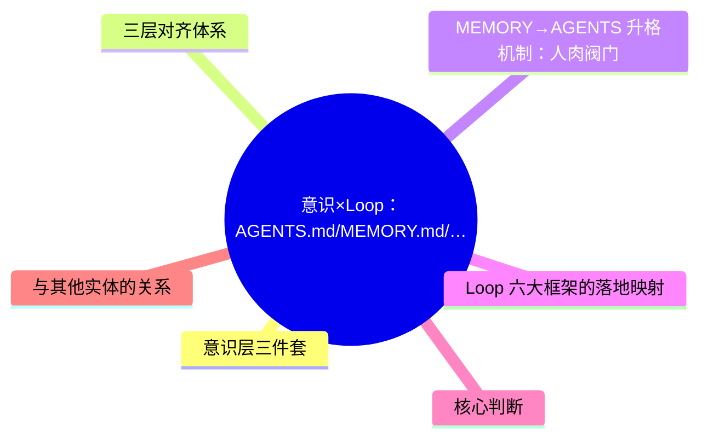
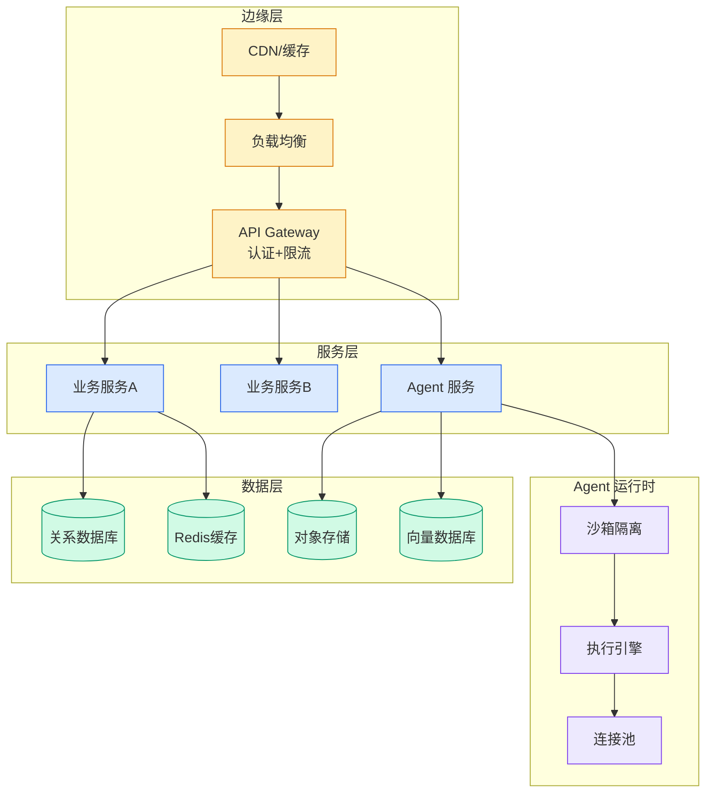

# 意识×Loop：AGENTS.md/MEMORY.md/USER.md 三层文件驱动的跨 Session Loop 自进化

## Ch04.658 意识×Loop：AGENTS.md/MEMORY.md/USER.md 三层文件驱动的跨 Session Loop 自进化

> 📊 Level ⭐⭐ | 3.5KB | `entities/意识-loop跨session自进化最佳实践.md`

# 意识×Loop：AGENTS.md/MEMORY.md/USER.md 三层文件驱动的跨 Session Loop 自进化

Loop Engineering 的一个致命问题：一次会话结束，Loop 就"死了"。张心翮（阿里技术）提出了"**意识×Loop**"框架，用三个意识文件（AGENTS.md / MEMORY.md / USER.md）实现跨 Session 自进化。

## 概念导图

## 意识层三件套

| 文件 | 定位 | 核心机制 |
|------|------|----------|
| **AGENTS.md** | Proactive rules / evals | Agent 每次输出前自查的硬约束清单。约 15 条，超过 20 条遵从率下降 |
| **MEMORY.md** | Passive lessons / state | 本次会话踩过的坑、被纠正的判断。跨 Session 自动加载 |
| **USER.md** | Judge preferences | 个人的判断标准、输出味道偏好 |

每次会话开启时自动加载，每次会话中自动沉淀更新。

## 三层对齐体系

| 层次 | 核心问题 | 承载 | 约束强度 |
|------|----------|------|----------|
| evals 对齐 | Agent 该主动做什么 | AGENTS.md | **硬约束**（客观正确性） |
| 场景对齐 | 给谁看、怎么被消费、读完做什么决策 | Session prompt | 中等 |
| judge 偏好 | 我的味道 | USER.md | **软偏好**（表达方式） |

分层承载，各归各的文件，绝不能混在一起。硬约束永远优先于软偏好。

## MEMORY→AGENTS 升格机制：人肉阀门

MEMORY 允许试探性表达（"这次学到"），AGENTS 是硬约束（"以后都要"）。从 MEMORY 升格到 AGENTS 必须人肉做——自动升格一旦把偶发当成通用规律，错误规则会污染后续所有 Loop。样本量不够时概括出的"规律"是噪声不是信号。

## Loop 六大框架的落地映射

| 框架 | 调研场景映射 |
|------|-------------|
| Automations | 会话结束时自动触发总结、追加 MEMORY |
| Worktrees | 上下文隔离——并行分析强制从原点起步，防偏见传染 |
| Sub-agents | 正反对抗——专门找支持/反例证据，审校独立子 Agent 避确认偏差 |
| State | 从"记进度"扩展到"行为塑造"——AGENTS+MEMORY+USER |

## 核心判断

- **taste 是 Loop 的准备动作，不是产出**：如果对 topic 没有阅读积累，连 evals 都写不出来。"Loop 让工作变轻松"是真的，"Loop 让新手变专家"是幻觉。
- Loop Engineering 90% 讨论在 AI Coding，但 eval 越难写的场景，搭 Loop 的边际收益越大
- 不能自动化的位置：MEMORY 升格 AGENTS（松变紧可能带偏）、最终硬结论下判（个人信用）

## 与其他实体的关系

- → [Loop Engineering：Addy Osmani 的六个框架](../ch05/004-loop-engineering.html) — 本文的 Loop 六大框架理论基础
- → [Agentic Loop Engineering 工程手册](../ch05/004-loop-engineering.html) — 17 种 Loop 工程化技术
- → [原文存档](https://github.com/QianJinGuo/wiki-book/tree/main/docs/raw/articles/意识-loop跨session自进化最佳实践.md)

---

