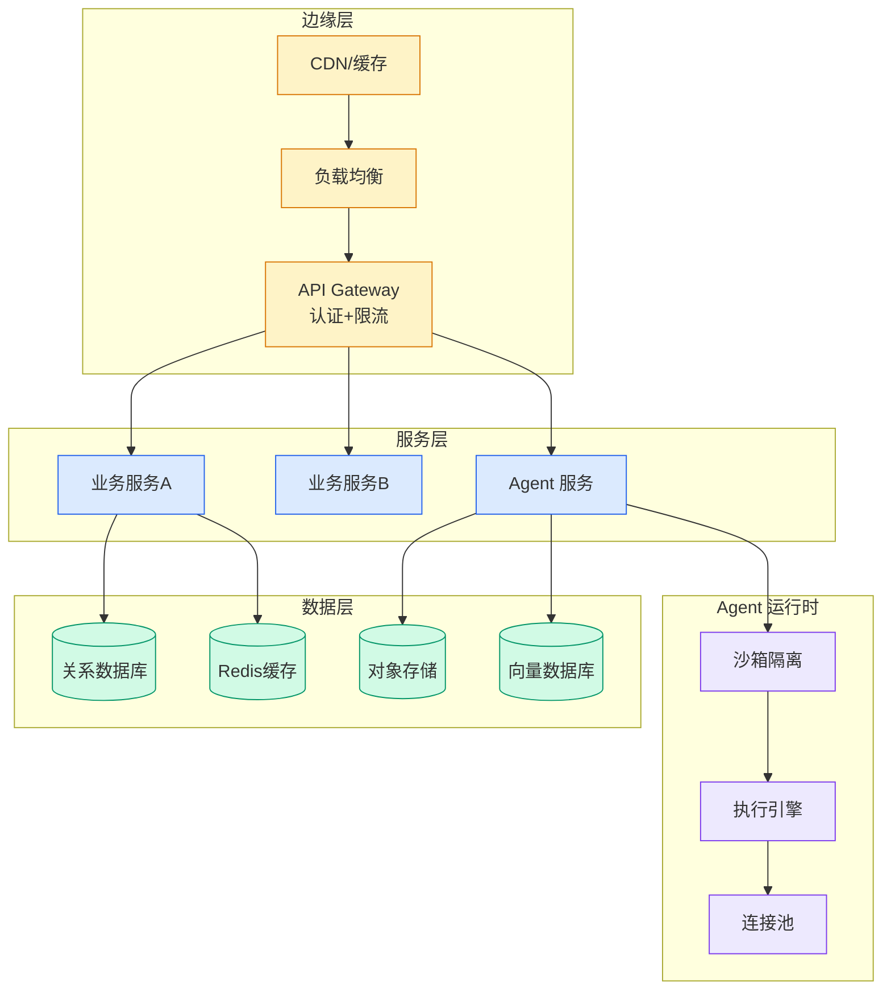

# MattPocock Skills

## Ch04.659 MattPocock Skills

> 📊 Level ⭐⭐ | 3.5KB | `entities/mattpocock-skills.md`

# MattPocock Skills

MattPocock Skills 是 Total TypeScript 创始人 Matt Pocock 开源的 AI Agent 技能库，包含 21 个正式 Skill，将需求澄清、TDD、调试、架构治理等工程纪律翻译为 Agent 可执行的形式。

> 项目地址：mattpocock/skills (GitHub)
> 版本：v1.1.0
> 定位：小、可改、可组合，不接管流程，跨 Agent（Claude Code、Codex 等）

## 核心架构

### 两层调用分层

通过 `disable-model-invocation` 字段区分两种调用方式：
- **User-invoked**（`true`）：用户手动输入 `/skill-name`，零上下文成本
- **Model-invoked**（省略）：用户或模型自动触发，description 占每轮上下文

铁律：user-invoked skill 不能调用另一个 user-invoked skill。`ask-matt` 作为 user-invoked skills 之间的索引路由器。

### 主线流程：idea → ship

1. **需求澄清**：`grill-with-docs`（有 codebase）/ `grill-me`（无 codebase）→ `grilling`
   - Facts & Decisions 分离（v1.1.0）：Facts 由 Agent 自查，Decisions 必须问用户
   - Confirmation gate：未经用户确认不许 enact the plan
2. **规划拆票**：`to-spec` → `to-tickets`（Tracer bullet + Blocking edges + Frontier）
3. **实现评审**：`implement` → `tdd` → `code-review`（Standards/Spec 两轴并行）

## 关键技能




### wayfinder（v1.1.0）
绿地项目/巨型功能的规划 skill，借鉴战争迷雾概念。铁律：never resolve more than one ticket per session。定位：plan, don't do。

### diagnosing-bugs
6 阶段调试纪律，Phase 1 核心是构造 tight + red-capable 反馈循环。对抗单一假设锚定效应，Phase 6 架构问题交接给 improve-codebase-architecture。

### writing-great-skills
Skill 元设计框架，核心概念包括 Leading word（用预训练锚定词触发行为）、Context load、Cognitive load、Progressive disclosure、Negation 和 Negative Space 等失败模式。

### CONTEXT.md
严格 glossary，不放实现细节、临时笔记、架构决策。架构决策走 ADR（Hard to reverse + Surprising + Real trade-off 三条件同时满足才写）。

## 与同类比较

| 维度 | MattPocock Skills | GSD / BMAD / Spec-Kit |
|------|------------------|----------------------|
| 流程接管 | 不接管 | 接管完整流程 |
| 可改性 | 小、可改、可组合 | 框架较重，定制成本高 |
| 工具绑定 | 跨 Agent | 通常绑定特定平台 |
| 理论基础 | 软件工程经典 | 各自方法论 |

## 安装

```bash
npx skills@latest add mattpocock/skills
```

必须选中 `setup-matt-pocock-skills`，初始化时探测 repo 状态、配置 issue tracker、写入 `docs/agents/*.md`。
## 相关链接

- [Skill 工程原则](https://github.com/QianJinGuo/wiki/blob/main/concepts/skill-engineering-principles.md)
- [Skill 编写模式](https://github.com/QianJinGuo/wiki/blob/main/concepts/skill-framework-writing-patterns.md)

---

