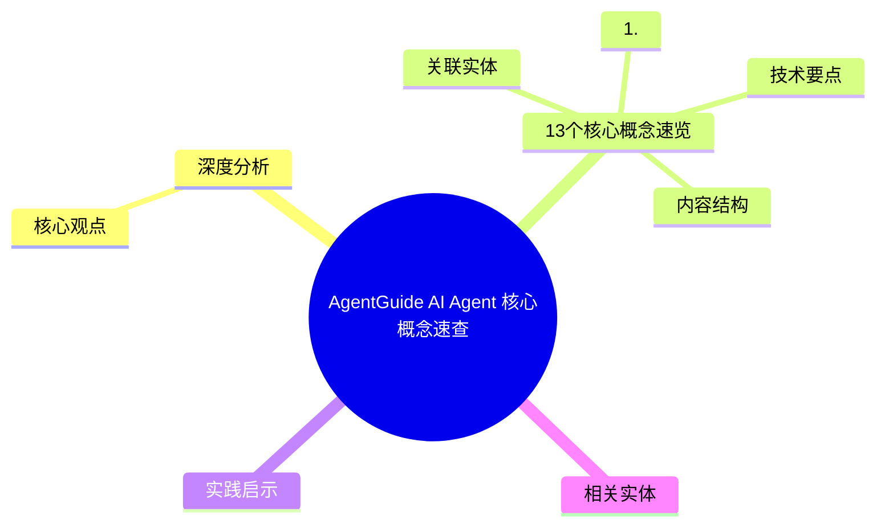
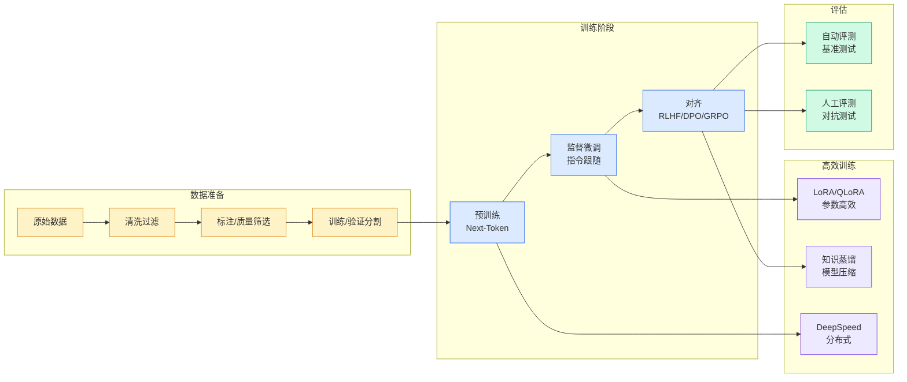

# AgentGuide AI Agent 核心概念速查

## Ch04.660 AgentGuide AI Agent 核心概念速查

> 📊 Level ⭐⭐ | 3.5KB | `entities/agent-guide-core-concepts-overview.md`

# AgentGuide AI Agent 核心概念速查

→ [原文存档](https://github.com/QianJinGuo/wiki-book/tree/main/docs/raw/articles/agent-guide-core-concepts-overview.md)

## 概念导图

## 深度分析

AgentGuide AI Agent 核心概念速查 涉及agent领域的核心技术议题。
### 核心观点
1. # AgentGuide AI Agent 核心概念速查
**来源：** AgentGuide | 2026年5月18日
**类型：** 面试速查材料
## 13个核心概念速览

### 1.
2. Agent
以LLM为核心，具备规划（Planning）、记忆（Memory）和工具调用（Tool Use）能力，能够自主拆解复杂任务、循环执行、感知反馈并持续推进任务直到完成。
3. 大模型预训练
在海量通用数据上训练模型，训练方式是自监督学习，最常见做法是不断预测下一个token。
4. 大模型微调
在预训练基座模型之上，用更小规模、更贴近任务的数据继续训练，训练方式通常是监督微调或指令微调。
5. 大模型幻觉
大模型生成看似合理但实际是错误的回答，把虚假信息当做事实来回答。

### 内容结构
- AgentGuide AI Agent 核心概念速查
- 13个核心概念速览
- 1. Agent
- 2. 大模型预训练
- 3. 大模型微调
- 4. 大模型幻觉
- 5. MCP协议
- 6. Token

### 技术要点

- **agent架构**: 本文在agent方向提出的设计理念与实现路径
- **工程挑战**: 实际落地中面临的关键问题与应对策略
- **code趋势**: 相关技术演进方向与新兴范式
### 关联实体

- [Karpathy 最新访谈从 Vibe Coding 到 Agentic Engineering](ch04/237-agentic.html)
- [Ethan He Cosmos Grok Imagine Latent Space Video Agent 20260606](../ch03/035-agent.html)
- [Karpathy Vibe Coding Agentic Engineering](ch04/126-karpathy-vibe-coding-agentic-engineering.html)
- [你不知道的 Agent原理架构与工程实践 V2](../ch03/035-agent.html)
- [Openclaw 完全指南这可能是全网最新最全的系统化教程了32W字建议收藏 V2](../ch11/235-openclaw.html)
- [Openclaw 完全指南这可能是全网最新最全的系统化教程了32W字建议收藏](../ch11/235-openclaw.html)

## 实践启示
1. **工程落地**: agent领域方案需关注可观测性、可维护性和成本效率
2. **技术选型**: 根据场景选择合适的技术栈，避免过度设计或盲目追新
3. **持续迭代**: 建立数据驱动的反馈闭环，持续优化系统表现
4. **风险管控**: 引入新技术需评估对现有系统稳定性的影响，做好降级预案

## 相关实体

- [MOC](https://github.com/QianJinGuo/wiki/blob/main/moc/mlops-training-inference.md)

---

