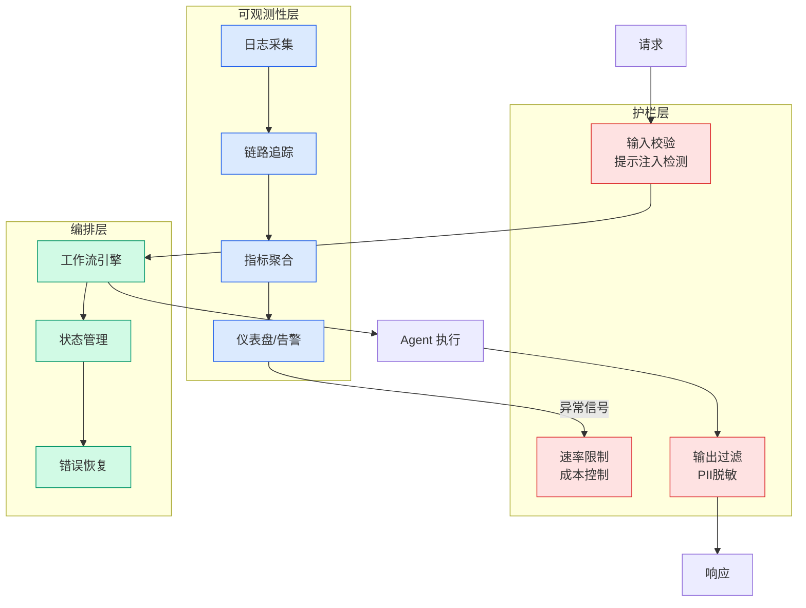

# Agentic RL: Token-In, Token-Out Done Right

## Ch04.662 Agentic RL: Token-In, Token-Out Done Right

> 📊 Level ⭐⭐ | 3.4KB | `entities/agentic-rl-token-in-token-out-done-right-c6aaa4.md`

# Agentic RL: Token-In, Token-Out Done Right

→ [原文存档](https://github.com/QianJinGuo/wiki-book/tree/main/docs/raw/articles/agentic-rl-token-in-token-out-done-right-c6aaa4.md)

## 深度分析

Agentic RL: Token-In, Token-Out Done Right 涉及agent领域的核心技术议题。
### 核心观点
1. # Agentic RL: Token-In, Token-Out Done Right
Published Time: May 28, 2026
Markdown Content:
You’re training an LLM with RL.
2. Single-turn looks great: clean curves, sane rewards, things converge.
3. But modern models are enhanced with tools, and that’s exactly what you want: to train an _agent_.
4. So you upgrade your training loop to allow the model to call a tool mid-rollout.
5. You start with an easy task, and the curves get weird.

### 内容结构
- Agentic RL: Token-In, Token-Out Done Right
- [TITO Done Right](https://qgallouedec-tito.hf.space/#tito-done-right)
- [Prefix preservation](https://qgallouedec-tito.hf.space/#prefix-preservation)
- [The honest edges](https://qgallouedec-tito.hf.space/#the-honest-edges)
- [History rewriting](https://qgallouedec-tito.hf.space/#history-rewriting)
- [Truncation](https://qgallouedec-tito.hf.space/#truncation)
- [The right primitive](https://qgallouedec-tito.hf.space/#the-right-primitive)

### 技术要点

- **agent架构**: 本文在agent方向提出的设计理念与实现路径
- **工程挑战**: 实际落地中面临的关键问题与应对策略
- **code趋势**: 相关技术演进方向与新兴范式
### 关联实体

- [Karpathy 最新访谈从 Vibe Coding 到 Agentic Engineering](ch04/237-agentic.html)
- [Karpathy Vibe Coding Agentic Engineering](ch04/126-karpathy-vibe-coding-agentic-engineering.html)
- [Openclaw 完全指南这可能是全网最新最全的系统化教程了32W字建议收藏](../ch11/235-openclaw.html)
- [Ethan He Cosmos Grok Imagine Latent Space Video Agent 20260606](../ch03/035-agent.html)
- [两万字详解Claude Code源码核心机制](../ch03/078-claude-code.html)
- [你不知道的 Agent原理架构与工程实践 V2](../ch03/035-agent.html)

## 实践启示

1. **工程落地**: agent领域方案需关注可观测性、可维护性和成本效率
2. **技术选型**: 根据场景选择合适的技术栈，避免过度设计或盲目追新
3. **持续迭代**: 建立数据驱动的反馈闭环，持续优化系统表现
4. **风险管控**: 引入新技术需评估对现有系统稳定性的影响，做好降级预案

## 相关实体

- [MOC](https://github.com/QianJinGuo/wiki/blob/main/moc/mlops-training-inference.md)

---

