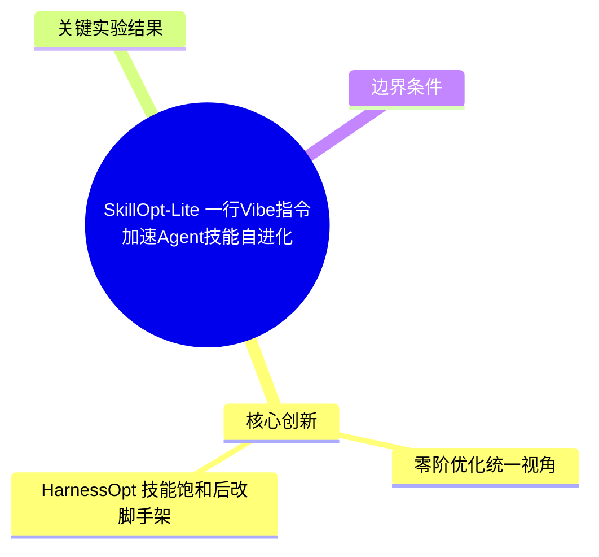
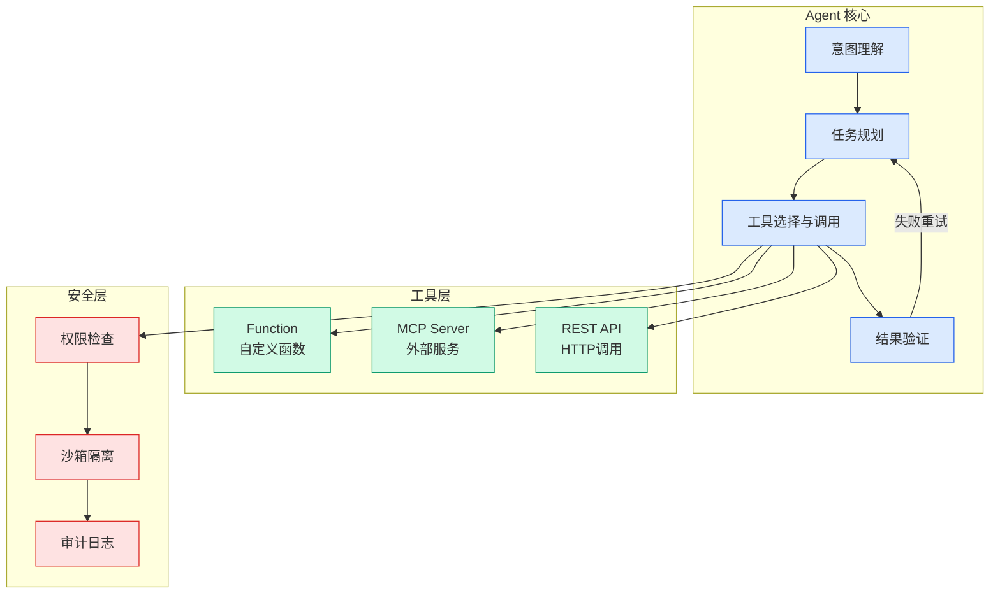

# SkillOpt-Lite：一行Vibe指令加速Agent技能自进化

## Ch04.664 SkillOpt-Lite：一行Vibe指令加速Agent技能自进化

> 📊 Level ⭐⭐ | 3.4KB | `entities/skillopt-lite-zero-order-agent-skill-optimization.md`

# SkillOpt-Lite：一行Vibe指令加速Agent技能自进化

> **论文**：SkillOpt-Lite: Better and Faster Agent Self-evolution via One Line of Vibe (arXiv:2607.03451)
> **来源**：Hyman的杂货铺 | [原文存档](https://github.com/QianJinGuo/wiki-book/tree/main/docs/raw/articles/skillopt-lite-一行vibe指令进化agent技能.md)
> **GitHub**：https://github.com/EvolvingLMMs-Lab/SkillOpt-Lite

## 概念导图

## 核心创新

SkillOpt-Lite 将 Agent 技能优化重构为**零阶优化 + 文件系统调试**范式，删掉了 SkillOpt 管线中层层叠叠的组件（mini-batch合并、慢更新阻尼、拒绝缓冲），仅保留四个核心步骤：

> **轨迹落盘 → 文件系统探索 → 最小补丁 → 验证门控**

### 零阶优化统一视角

将已有 Agent 反思范式映射到经典零阶优化工具箱：

| 范式 | ZO 对应 | 来源 |
|------|---------|------|
| 单轨迹反思（Reflexion/Voyager） | 单点梯度估计 | 已有 |
| 批量 rollout（Trace2Skill/SkillOpt/SkillForge） | mini-batch 随机梯度 | 已有 |
| 成败对比（SkillCat） | 中心差分 | 已有 |
| 逐步原子修改（SkillAdapter） | 坐标下降 | 已有 |
| 编辑预算衰减/拒绝缓冲（SkillOpt） | 信赖域+控制变元 | 已有 |
| **轨迹落盘+文件系统探索（SkillOpt-Lite）** | **语言介导程序编译** | **本文** |

**关键洞见**：轨迹不是黑盒标量——每次 rollout 吐出一整段可读轨迹（计划、工具调用、报错栈、中间文件）。因此技能优化不是黑盒优化，而是"语言介导的程序编译"：技能文档是源码，LLM 是编译器+运行时，轨迹是调试日志。

### HarnessOpt：技能饱和后改脚手架

当技能文本调到头，瓶颈转到 Harness（工具循环、观测格式、重试策略）。HarnessOpt 把 Harness 也当成可编辑代码，配合白名单+烟测+可回滚的安全约束。

## 关键实验结果

| 任务 | 最好成绩 | 提升幅度 |
|------|---------|---------|
| SpreadsheetBench | GPT-5.4-nano 66.2（+36.3） | 联合优化超越 GPT-5.5+完整 SkillOpt |
| ALFWorld | GPT-5.4-nano 81.3%（+9.5） | 小型提升 |
| LiveMath | GPT-5.5 73.6（+37.0） | 大幅提升 |
| DocVQA | GPT-5.5 94.2（+5.2） | 显著提升 |

## 边界条件

1. 验证集太小仍抖
2. 语义任务增益有限
3. HarnessOpt 依赖 Round-0 质量
4. 计算成本：每轮 batch rollout + 验证不便宜

## 实践启示

- **最小闭环思维**：Agent 自我进化不需要复杂组件堆叠，文件系统 + 共识挖掘 + 独立验证构成够用的最小闭环
- **降低复杂度**：去掉 mini-batch 合并、慢更新阻尼等组件后，反而更快更强——应审慎评估每层抽象的实际贡献
- **Harness 是瓶颈**：当技能优化饱和后，Harness（执行脚手架）成为下一个可优化的维度
- **一行命令部署**：`/skillopt-loop rounds=10 batchsize=40 target=gpt5.4-nano` 的低门槛入口降低了 Agent 自进化的使用成本

---
## 关联
- 相关概念: [Harness Engineering](https://github.com/QianJinGuo/wiki/blob/main/concepts/harness-engineering-framework.md)
- 相关: [Agent 架构](https://github.com/QianJinGuo/wiki/blob/main/concepts/agent-architecture.md)

---

