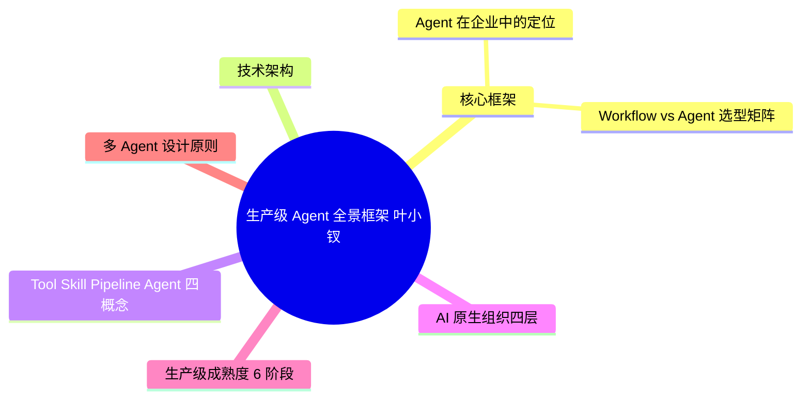
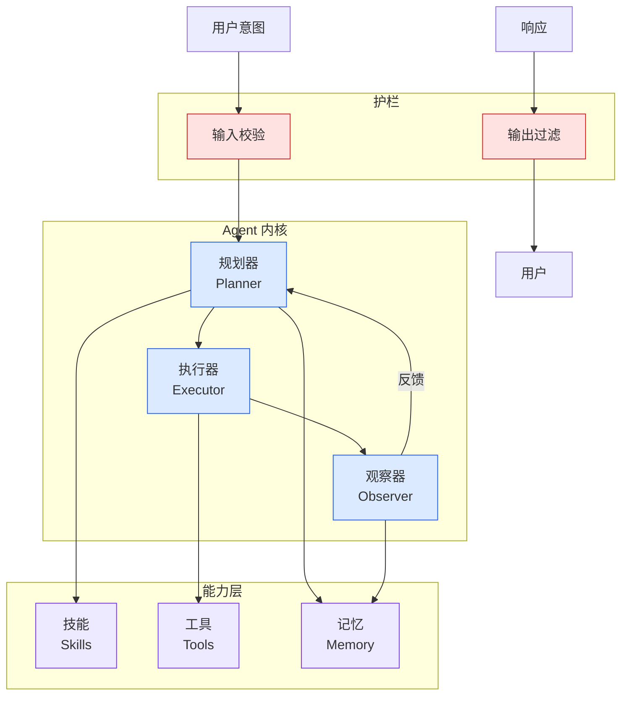

# 生产级 Agent 全景框架 (叶小钗)

## Ch04.665 生产级 Agent 全景框架 (叶小钗)

> 📊 Level ⭐⭐ | 3.4KB | `entities/production-grade-agent-framework-yexiaochai.md`

# 生产级 Agent 全景框架 (叶小钗)

叶小钗基于 6 场企业培训总结的生产级 Agent 系统性框架，覆盖**架构、Harness 工程、组织与人才**三大维度，回答 "Agent 进入企业后应该做什么、怎样做成可长期运行的生产系统" 这一核心问题。

## 概念导图

## 核心框架

### Agent 在企业中的定位
传统企业软件 = System of Record。Agent 增加 **认知与行动层**，形成三层结构：用户入口与交互层 + 认知与行动层 + 业务记录层。

### Workflow vs Agent 选型矩阵
以业务知识专业程度（横轴）× 行动复杂度（纵轴）二维判断：
- **Workflow**：固定流程、规则稳定
- **知识工程**：专业知识重（知识库 + Skill + 本体）
- **通用 Agent**：Deep Research / Coding / 办公助手
- **业务型 Agent**：金融/法律/医疗（专业知识+多轮行动）

## 技术架构

8 层架构：Agent Loop → Tool 层 → Context 层 → 编排与会话管理 → Skill 与插件层 → 观测与评估 → 任务与调度 → 治理层。

其中 **Harness** 是核心概念：模型外围的整套运行机制，负责每次模型调用前组装合适 Context，返回后推动任务继续。大量 Agent 问题出在 Harness 而非模型本身。

## Tool / Skill / Pipeline / Agent 四概念

| 概念 | 解决的问题 |
|------|-----------|
| Tool | Agent 可以执行什么动作 |
| Skill | 某类任务应该怎样完成 |
| Pipeline | 谁在什么阶段使用什么能力交付 |
| Agent | 谁长期承担这类任务 |

## AI 原生组织四层

1. **Context Layer**：汇聚跨系统信息，动态装配
2. **Pipeline Layer**：定义角色/阶段/输入/输出/交付标准
3. **Skill Layer**：保存组织做事方法
4. **Agent Governance Layer**：Agent 作为执行单元管理

## 生产级成熟度 6 阶段

聊天 → 调用工具 → 规划产出成果 → 长时间运行（队列/Heartbeat/断点恢复）→ 被治理（身份/权限/审计）→ 沉淀能力（Skill/评测集）

Demo 通常只覆盖前两个阶段。生产系统的大部分工程集中在后四个阶段。

## 多 Agent 设计原则

先回答两个问题：用户是否需要长期认识多个角色（产品形态）？当前任务是否需要多个执行单元协作（运行架构）？

> → [原文存档](https://github.com/QianJinGuo/wiki-book/tree/main/docs/raw/articles/生产级-agent-全景架构harness-工程组织与人才.md)

---
## 关联
- 相关概念: [Harness Engineering](https://github.com/QianJinGuo/wiki/blob/main/concepts/harness-engineering-framework.md)
- 相关: [Agent 架构](https://github.com/QianJinGuo/wiki/blob/main/concepts/agent-architecture.md)

---

