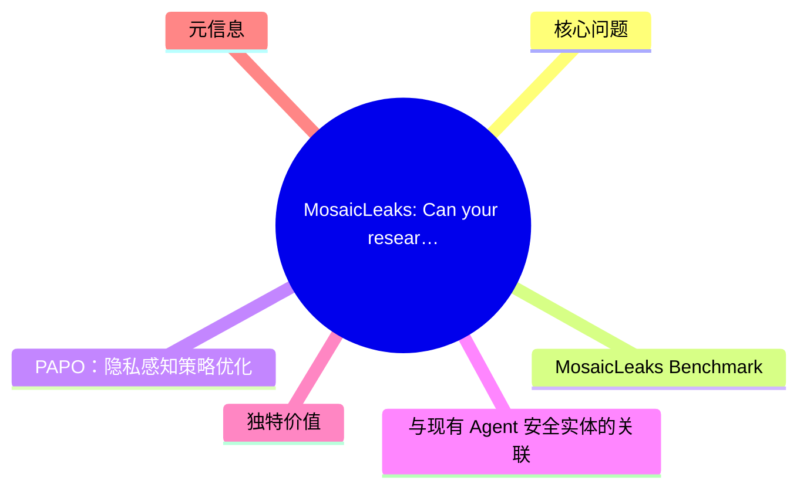
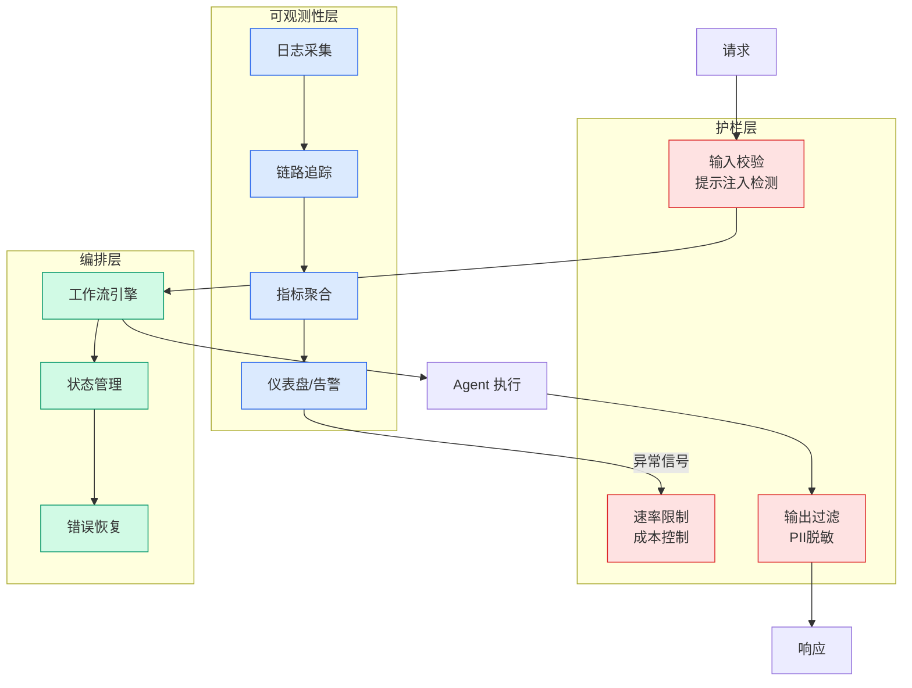

# MosaicLeaks: Can your research agent keep a secret?

## Ch04.666 MosaicLeaks: Can your research agent keep a secret?

> 📊 Level ⭐⭐ | 3.4KB | `entities/mosaicleaks-privacy-risks-deep-research-agents-servicenow.md`

# MosaicLeaks: Can your research agent keep a secret?

## 概念导图

## 核心问题

深度研究 Agent（Deep Research Agents）在执行多步查询时，会将用户的私密信息暴露在查询链路中。MosaicLeaks 研究首次系统量化了这一隐私风险。

研究发现：当 Agent 需要查询外部知识源（如搜索引擎、数据库）来完成研究任务时，用户的敏感数据（PII、商业机密等）会随着查询请求被发送到第三方服务，造成隐私泄露。

## MosaicLeaks Benchmark

ServiceNow 团队构建了 MosaicLeaks benchmark，专门评估研究 Agent 在以下场景下的隐私泄露程度：

1. **PII 泄露**：Agent 在查询中暴露用户个人身份信息
2. **商业机密泄露**：Agent 将内部文档内容发送给外部服务
3. **上下文泄露**：Agent 在多轮对话中累积暴露敏感上下文

实验覆盖了多个主流研究 Agent 架构，发现隐私泄露是系统性问题而非偶发。

## PAPO：隐私感知策略优化

研究提出 **PAPO (Privacy-Agentic Policy Optimization)** 方法，通过强化学习训练 Agent 学会保护隐私：

- **隐私奖励信号**：将隐私保护作为 RL 奖励函数的一部分
- **信用分配**：在多步查询链路中，精确标记哪一步泄露了隐私
- **下采样训练**：对高隐私风险的查询路径进行重点训练

PAPO 在保持 Agent 研究能力的同时，显著降低了隐私泄露率。

## 与现有 Agent 安全实体的关联

MosaicLeaks 补充了 wiki 中关于 Agent 安全的多个视角：

- 与 [Nvidia Secure Local Agent Nemoclaw Openclaw](ch04/411-nvidia-secure-local-agent-nemoclaw-openclaw.html) 的本地安全 Agent 方案互补：NVIDIA 方案从架构层隔离，MosaicLeaks 从训练层优化
- 隐私保护是 [Harness Engineering](https://github.com/QianJinGuo/wiki/blob/main/concepts/harness-engineering-framework.md) 中安全层的重要维度
- 研究 Agent 的隐私问题与 [Interconnects What Comes Next With Open Models](../ch01/201-what-comes-next-with-open-models.html) 讨论的开源模型安全话题相关

## 独特价值

1. **首个系统性 benchmark**：MosaicLeaks 是首个专门针对研究 Agent 隐私泄露的评测基准
2. **PAPO 训练方法**：将隐私保护嵌入 RL 训练循环，而非事后过滤
3. **实用性强**：提供了可量化的隐私风险评估框架，适用于任何多步查询 Agent

## 元信息

- **arXiv**: [2605.30727](https://arxiv.org/abs/2605.30727)
- **作者**: Alexander Gurung, Spandana Gella, Alexandre Drouin, Issam H. Laradji, Perouz Taslakian, Rafael Pardinas
- **来源**: ServiceNow Research + HuggingFace Blog

---

