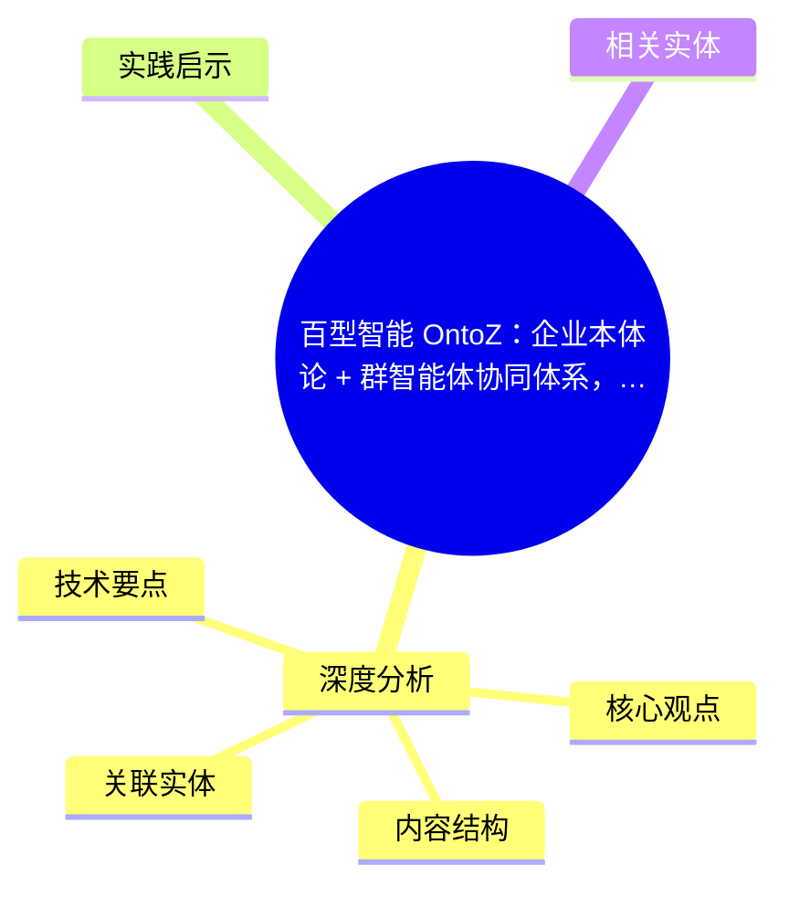
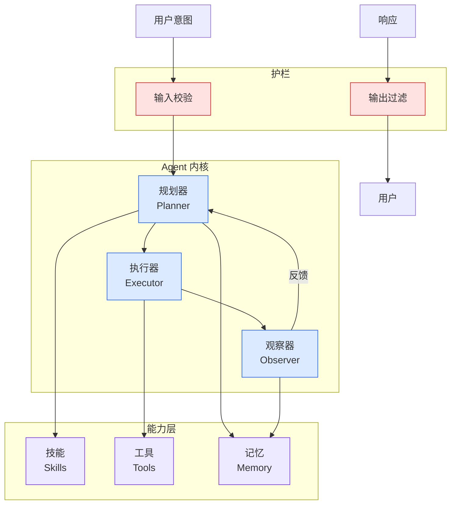

# 百型智能 OntoZ：企业本体论 + 群智能体协同体系，新一代企业级 AI 基础设施

## Ch04.669 百型智能 OntoZ：企业本体论 + 群智能体协同体系，新一代企业级 AI 基础设施

> 📊 Level ⭐⭐ | 3.3KB | `entities/baixing-ontoz-enterprise-ontology-xinzhiyuan.md`

# 百型智能 OntoZ：企业本体论 + 群智能体协同体系，新一代企业级 AI 基础设施

→ [原文存档](https://github.com/QianJinGuo/wiki-book/tree/main/docs/raw/articles/baixing-ontoz-enterprise-ontology-xinzhiyuan.md)

## 概念导图

## 深度分析

百型智能 OntoZ：企业本体论 + 群智能体协同体系，新一代企业级 AI 基础设施 涉及agent领域的核心技术议题。
### 核心观点
1. # 百型智能 OntoZ：企业本体论 + 群智能体协同体系，新一代企业级 AI 基础设施
> 来源：新智元（秒追ASI）· 2026-06-05
> 【新智元导读】单点 Agent 已不能满足企业出海的需求，百型智能 OntoZ 押注的是企业「本体竞争」时代——一个每家企业都拥有自己的数字生命体的未来。
2. ## 一、背景：AI 应用进入下半场
当大模型厂商把基座能力推到极致，当单点智能体工具已经填满获客、客服、文案生成的每一个缝隙，**企业真正需要的究竟是什么**？
3. 百型智能今天给出的答案，是一个名为 **OntoZ** 的「企业本体」。
4. **6 月 5 日，百型智能正式发布第三代企业级 AI 基础设施——OntoZ**。
5. 这款新产品跳出了传统单点 SaaS 与孤立智能体的产品逻辑，以**企业本体为底层基座**，搭建**可动态自迭代的群智能体协同体系**，为企业打造具备自主进化能力的**数字生产力底座**。

### 内容结构
- 百型智能 OntoZ：企业本体论 + 群智能体协同体系，新一代企业级 AI 基础设施
- 一、背景：AI 应用进入下半场
- 二、创始人背景
- 三、从交付服务到交付「生产力本体」
- 3.1 过去两年的现状
- 3.2 OntoZ 第三代迭代的回答
- 3.3 群智能体生态
- 四、核心技术：二阶控制论架构

### 技术要点

- **agent架构**: 本文在agent方向提出的设计理念与实现路径
- **工程挑战**: 实际落地中面临的关键问题与应对策略
- **architecture趋势**: 相关技术演进方向与新兴范式
### 关联实体

- [Karpathy 最新访谈从 Vibe Coding 到 Agentic Engineering](ch04/237-agentic.html)
- [Openclaw 完全指南这可能是全网最新最全的系统化教程了32W字建议收藏](../ch11/235-openclaw.html)
- [Ethan He Cosmos Grok Imagine Latent Space Video Agent 20260606](../ch03/035-agent.html)
- [Karpathy Vibe Coding Agentic Engineering](ch04/126-karpathy-vibe-coding-agentic-engineering.html)
- [Scale Robot Reinforcement Learning With Nvidia Isaac Lab On ](../ch01/1170-scale-robot-reinforcement-learning-with-nvidia-isaac-lab-on.html)
- [Nvidia Isaac Lab Sagemaker Robot Rl Humanoid](https://github.com/QianJinGuo/wiki/blob/main/entities/nvidia-isaac-lab-sagemaker-robot-rl-humanoid.md)

## 实践启示

1. **工程落地**: agent领域方案需关注可观测性、可维护性和成本效率
2. **技术选型**: 根据场景选择合适的技术栈，避免过度设计或盲目追新
3. **持续迭代**: 建立数据驱动的反馈闭环，持续优化系统表现
4. **风险管控**: 引入新技术需评估对现有系统稳定性的影响，做好降级预案

## 相关实体

- [MOC](https://github.com/QianJinGuo/wiki/blob/main/moc/memory-context-systems.md)

---

