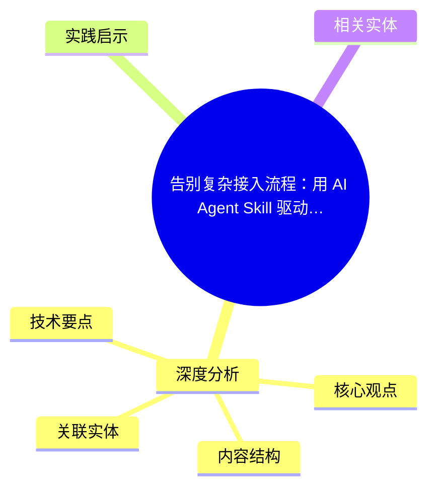
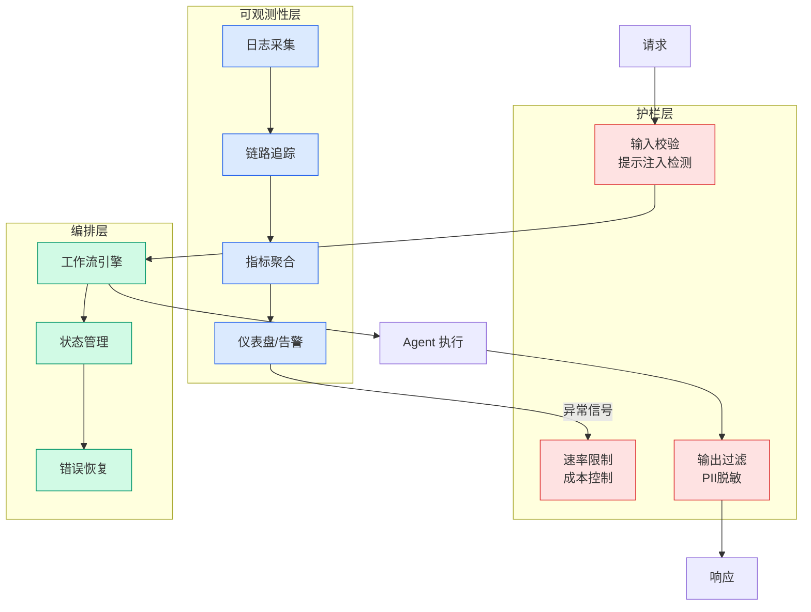

# 告别复杂接入流程：用 AI Agent Skill 驱动云监控可观测接入

## Ch04.670 告别复杂接入流程：用 AI Agent Skill 驱动云监控可观测接入

> 📊 Level ⭐⭐ | 3.3KB | `entities/aliyun-cms2-cli-skill-natural-language-observability.md`

# 告别复杂接入流程：用 AI Agent Skill 驱动云监控可观测接入

→ [原文存档](https://github.com/QianJinGuo/wiki-book/tree/main/docs/raw/articles/aliyun-cms2-cli-skill-natural-language-observability.md)

## 概念导图

## 深度分析

告别复杂接入流程：用 AI Agent Skill 驱动云监控可观测接入 涉及agent领域的核心技术议题。
### 核心观点
1. # 告别复杂接入流程：用 AI Agent Skill 驱动云监控可观测接入
> 作者：铖朴、珂帆（阿里云云原生） · 发布：2026-06-07
随着云原生架构的普及和 AI 应用的快速增长，企业需要管理的应用类型日益丰富——从传统 Java 微服务到 AI Agent，从 Golang 后端到各类 AI 网关组件。
2. 可观测平台的接入配置涉及一系列参数和步骤，对运维效率提出了更高要求。
3. **阿里云云监控 CMS（CloudMonitor Service）2.
4. 0** 作为阿里云统一的可观测管理平台，整合了：
- 应用监控（**APM**）
- 前端监控（**RUM**）
- Prometheus 服务
- 告警管理
为了让用户在终端环境下也能高效完成可观测接入，CMS 团队推出了 **`aliyun cms2` CLI 工具**。
5. 更进一步，通过将 CLI 能力封装为 **`alibabacloud-cms-manage` Skill**，实现了**基于 AI Agent 的智能化可观测接入**——用户只需用自然语言描述需求，AI Agent 即可自动编排 CLI 命令完成全流程。

### 内容结构
- 告别复杂接入流程：用 AI Agent Skill 驱动云监控可观测接入
- CMS CLI 概览
- 确认 CLI 已安装且版本 >= 3.3.15
- 验证 cms2 插件可用
- 配置凭证（如尚未配置）
- 应用接入能力
- APM 与 AI 可观测
- CLI 6 步接入流程

### 技术要点

- **agent架构**: 本文在agent方向提出的设计理念与实现路径
- **工程挑战**: 实际落地中面临的关键问题与应对策略
- **architecture趋势**: 相关技术演进方向与新兴范式
### 关联实体

- [Karpathy 最新访谈从 Vibe Coding 到 Agentic Engineering](ch04/237-agentic.html)
- [Karpathy Vibe Coding Agentic Engineering](ch04/126-karpathy-vibe-coding-agentic-engineering.html)
- [两万字详解Claude Code源码核心机制](../ch03/078-claude-code.html)
- [你不知道的 Agent原理架构与工程实践 V2](../ch03/035-agent.html)
- [龙虾装上了可以用来干啥分享下我的 Openclaw 多智能体团队搭建经验 V2](../ch11/235-openclaw.html)
- [构建基于多智能体架构的深度思考交易系统 V2](https://github.com/QianJinGuo/wiki/blob/main/entities/构建基于多智能体架构的深度思考交易系统-v2.md)

## 实践启示

1. **工程落地**: agent领域方案需关注可观测性、可维护性和成本效率
2. **技术选型**: 根据场景选择合适的技术栈，避免过度设计或盲目追新
3. **持续迭代**: 建立数据驱动的反馈闭环，持续优化系统表现
4. **风险管控**: 引入新技术需评估对现有系统稳定性的影响，做好降级预案

## 相关实体

- [MOC](https://github.com/QianJinGuo/wiki/blob/main/moc/mlops-training-inference.md)

---

