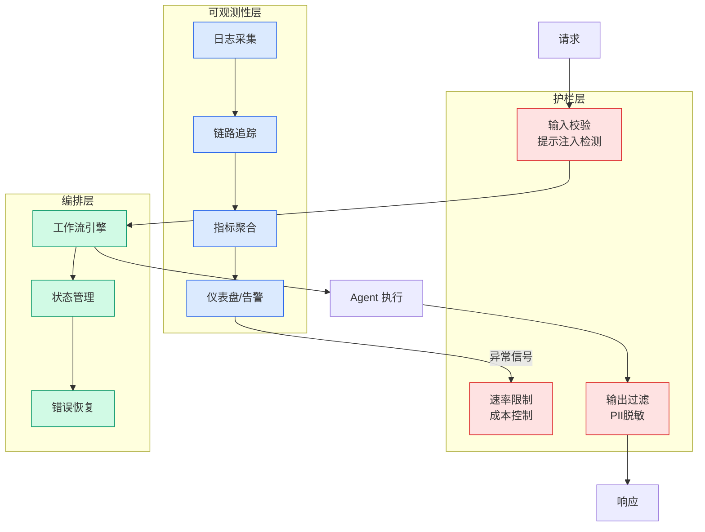

# Kimi 决定，要用 300 个 Agent 解救非程序员们

## Ch04.672 Kimi 决定，要用 300 个 Agent 解救非程序员们

> 📊 Level ⭐⭐ | 3.3KB | `entities/kimi-work-300-agent-cluster-yin-john-agi-hunt.md`

# Kimi 决定，要用 300 个 Agent 解救非程序员们

→ [原文存档](https://github.com/QianJinGuo/wiki-book/tree/main/docs/raw/articles/kimi-work-300-agent-cluster-yin-john-agi-hunt.md)

## 深度分析

Kimi 决定，要用 300 个 Agent 解救非程序员们 涉及agent领域的核心技术议题。
### 核心观点
1. # Kimi 决定，要用 300 个 Agent 解救非程序员们
> 作者：尹John（AGI Hunt） · 发布：2026-06-05
> AGI Hunt 标语：关注AGI 的沿途风景！
2. 前网易资深技术专家；AI 初创公司 CTO；佛系分享
## 核心断言

> "2026 年的 AI，已经忽略程序员了。
3. "
OpenAI Codex 增速最快的用户群体不是程序员（知识工作者增速 = 程序员 3 倍）。
4. Anthropic 基于 Claude Code 衍生出 Claude Cowork（专门服务知识工作者的桌面 Agent）。
5. Coding Agent 的能力**正在往非程序员群体溢出**。

### 内容结构
- Kimi 决定，要用 300 个 Agent 解救非程序员们
- 核心断言
- 全球 0.3% 数字
- 核心功能：Agent 集群（一键启用）
- 4 大核心实战案例
- ① 炒股分析（126 家 A 股低空经济公司）
- ② 邮件 + PPT（Q2 业务总结会）
- ③ 商机挖掘（独家 1224 个项目案例）

### 技术要点

- **agent架构**: 本文在agent方向提出的设计理念与实现路径
- **工程挑战**: 实际落地中面临的关键问题与应对策略
- **code趋势**: 相关技术演进方向与新兴范式
### 关联实体

- [你不知道的 Agent原理架构与工程实践 V2](../ch03/035-agent.html)
- [Karpathy 最新访谈从 Vibe Coding 到 Agentic Engineering](ch04/237-agentic.html)
- [Karpathy Vibe Coding Agentic Engineering](ch04/126-karpathy-vibe-coding-agentic-engineering.html)
- [龙虾装上了可以用来干啥分享下我的 Openclaw 多智能体团队搭建经验 V2](../ch11/235-openclaw.html)
- [Openclaw 完全指南这可能是全网最新最全的系统化教程了32W字建议收藏 V2](../ch11/235-openclaw.html)
- [Openclaw 完全指南这可能是全网最新最全的系统化教程了32W字建议收藏](../ch11/235-openclaw.html)

## 实践启示
1. **工程落地**: agent领域方案需关注可观测性、可维护性和成本效率
2. **技术选型**: 根据场景选择合适的技术栈，避免过度设计或盲目追新
3. **持续迭代**: 建立数据驱动的反馈闭环，持续优化系统表现
4. **风险管控**: 引入新技术需评估对现有系统稳定性的影响，做好降级预案

---

