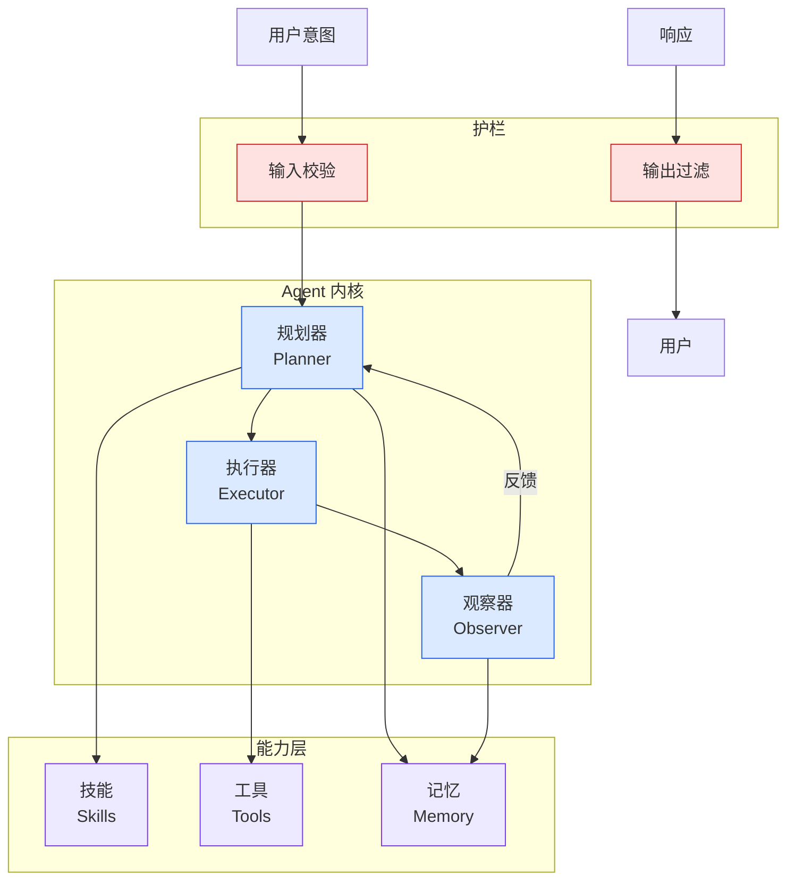

# Build Specialized Agent Workflows for Your Business with Amazon Bedrock

## Ch04.677 Build Specialized Agent Workflows for Your Business with Amazon Bedrock

> 📊 Level ⭐⭐ | 3.2KB | `entities/build-specialized-agent-workflows-for-your-business-with-ama.md`

# Build Specialized Agent Workflows for Your Business with Amazon Bedrock

> Fast-growing companies and enterprise supply-chain teams often have enough data to see that something is wrong, but not enough time to manually investigate every disruption. A supplier delay can require a planner to check purchase orders, inventory, customer commitments, contract rules, logistics op

## 摘要

# Build specialized agent workflows for your business with Amazon Quick and NVIDIA NeMo Relay

Fast-growing companies and enterprise supply-chain teams often have enough data to see that something is wrong, but not enough time to manually investigate every disruption. A supplier delay can require a planner to check purchase orders, inventory, customer commitments, contract rules, logistics options, and approval policies before deciding what to do next.

Dashboards help teams see what’s happening. The harder part is turning that signal into a reliable decision workflow that recommends what to do next and shows the evidence behind the recommendation.

In this post, we show how [Amazon Quick](<https://aws.amazon.com/quick>) can serve as the business-user front door for specialized agent workflows. We use the [NVIDIA NeMo Relay](<https://docs.nvidia.com/nemo/agent-toolkit/latest/index.html>) to build a supply-chain risk example that helps a planner move from an Amazon Quick dashboard and knowledge context to a guided mitigation recommendation.

## Solution overview

To address this challenge, we combine Amazon Quick and NVIDIA NeMo Relay. Amazon Quick gives business users a single conversational workspace for [structured data](<https://docs.aws.amazon.com/quick/latest/userguide/supported-data-sources.html>) and [unstructured enterprise knowledge](<https://docs.aws.amazon.com/quick/latest/userguide/knowledge-base-integrations.html>). Knowledge sources can include Amazon Simple Storage Service (Amazon S3), Google Drive, Microsoft SharePoint, Atlassian Confluence, and internal web content. In that workspace, users can connect to [over 100 pre-built action connectors](<https://docs.aws.amazon.com/quick/latest/userguide/supported-integrations.html>) to perform actions in [third-party systems](<https://docs.aws.amazon.com/quick/latest/userguide/action-connector-apis-supported-types.html>) such as Microsoft Outlook, Slack, Jira, and Asana. They can also invoke agentic workflow

→ [原文存档](https://github.com/QianJinGuo/wiki-book/tree/main/docs/raw/articles/build-specialized-agent-workflows-for-your-business-with-ama.md)

---
## 关联
- 相关概念: [Harness Engineering](https://github.com/QianJinGuo/wiki/blob/main/concepts/harness-engineering-framework.md)
- 相关: [Agent 架构](https://github.com/QianJinGuo/wiki/blob/main/concepts/agent-architecture.md)

---

