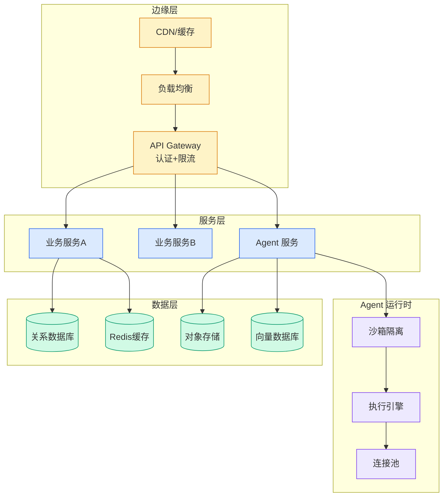

# Build Enterprise Search for Agents with Amazon Bedrock Managed Ingestion

## Ch04.680 Build Enterprise Search for Agents with Amazon Bedrock Managed Ingestion

> 📊 Level ⭐⭐ | 3.2KB | `entities/build-enterprise-search-for-agents-with-amazon-bedrock-manag.md`

# Build Enterprise Search for Agents with Amazon Bedrock Managed Ingestion

> Knowledge bases that ground agents and generative AI applications over your enterprise data are hard to build at scale. Teams typically stitch together connectors, parsers, vector stores, knowledge graphs, and retrieval logic, then operationalize all of it for production. Each piece brings its own c

## 摘要

# Build enterprise search for agents with Amazon Bedrock Managed Knowledge Base

Knowledge bases that ground agents and generative AI applications over your enterprise data are hard to build at scale. Teams typically stitch together connectors, parsers, vector stores, knowledge graphs, and retrieval logic, then operationalize all of it for production. Each piece brings its own challenges. You must decide which data sources to connect and how to parse multimodal document types. You must choose between graph and vector databases, then provision and scale them. You must also handle complex queries that reason across diverse content, and layer on the document-level access control, observability, and security that production demands.

[Amazon Bedrock](<https://aws.amazon.com/bedrock/>) now offers [Managed Knowledge Base](<https://aws.amazon.com/bedrock/knowledge-bases/>) in general availability, a fully managed agentic retrieval solution that handles scaling, high-accuracy retrieval, and document access control on your behalf. You can connect your enterprise data sources or crawl the web and start ingesting. Getting started through the [AWS Management Console](<https://console.aws.amazon.com/>) requires no model selection. Sensible defaults take you from zero to your first retrieval in minutes, compared to the days or weeks typically needed to assemble a comparable pipeline from scratch. When you’re ready to customize, you have control over embedding models, rerankers, chunking strategies, and more.

In this post, we walk through the three pillars that make this possible: simplified setup, smarter retrieval, and production readiness. We also show you [code examples](<https://github.com/aws-samples/amazon-bedrock-samples/blob/main/rag/managed-knowledge-bases/03-use-case-example/01-end-to-end-example-with-ac-gateway/01-bmkb-with-agentcore-gateway.ipynb>) for setting up a knowledge base and retrieving from it.

## Simplified setup

Developers today typically procure and bui

→ [原文存档](https://github.com/QianJinGuo/wiki-book/tree/main/docs/raw/articles/build-enterprise-search-for-agents-with-amazon-bedrock-manag.md)

---
## 关联
- 相关概念: [Harness Engineering](https://github.com/QianJinGuo/wiki/blob/main/concepts/harness-engineering-framework.md)
- 相关: [Agent 架构](https://github.com/QianJinGuo/wiki/blob/main/concepts/agent-architecture.md)

---

