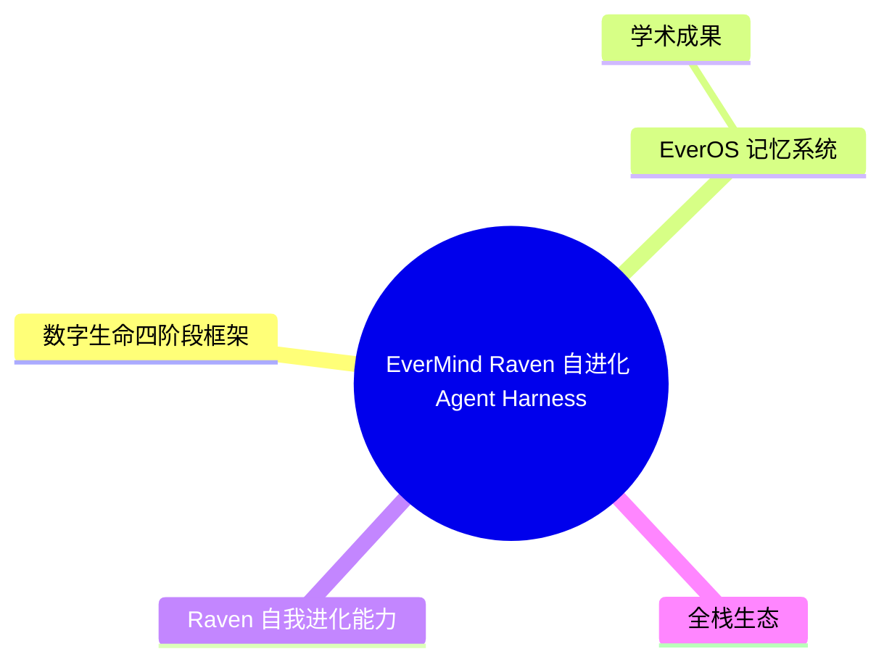
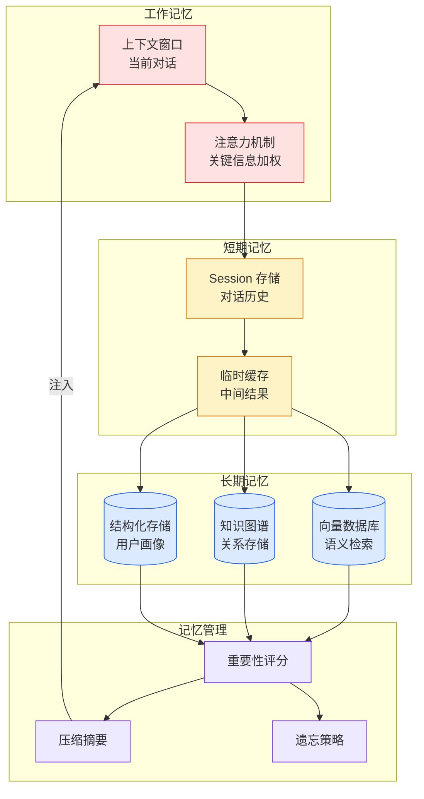

# EverMind Raven：自进化 Agent Harness 与数字生命框架

## Ch04.684 EverMind Raven：自进化 Agent Harness 与数字生命框架

> 📊 Level ⭐⭐ | 3.1KB | `entities/evermind-raven-self-evolving-agent-harness.md`

# EverMind Raven：自进化 Agent Harness 与数字生命框架

> EverMind 推出的 Raven 是一个基于自研记忆系统 EverOS 的自进化 Agent Harness，核心主张：主动（Proactive）、进化（Improving）、个性化（Personalized）。

→ [原文存档](https://github.com/QianJinGuo/wiki-book/tree/main/docs/raw/articles/evermind-raven-self-evolving-agent-harness.md)

## 概念导图

## 数字生命四阶段框架

EverMind 提出的 AI 智能体发展四阶段划分：

- **L1：角色化指令体** — 当前 90% AI 应用，固定 Prompt 预设，每次见面像初次相识
- **L2：记忆增强体** — 跨会话记忆，长时任务规划，EverOS 基础能力覆盖
- **L3：自我进化体** — 强化学习、反思与自我改进，从交互中提炼通用知识（Raven 目标）
- **L4：全自主数字生命** — 主动探索，独立数据主权，端到端自我演化

## EverOS 记忆系统

四层仿生架构：代理层 → 记忆层 → 索引层 → 接口层。核心技术：

- 以传统方案 **1/10 Token 消耗**实现超越全量上下文的准确率
- Reflection 机制：取自人类"沉思"，在闲暇时整理思绪沉淀智能
- 三种记忆范畴：User Memory / Agent Memory / Knowledge Wiki

### 学术成果

| 成果 | 指标 | 顶会 |
|------|------|------|
| MSA 稀疏注意力 | 1 亿 Tokens 上下文，衰减 < 9% | HuggingFace Daily Papers #1 |
| HyperMem 超图记忆 | LoCoMo SOTA 92.73% | ACL 2026 Oral |
| EverMemOS 记忆 OS | 结构化长时推理 | ACL 2026 主会 |
| 多方协作测评 | 行业空白填补 | KDD 2026 Oral |

## Raven 自我进化能力

- **100,000 项**预置技能，基于真实用户需求系统验证
- **自修改代码**：实时进化技能，闲时修改逻辑和策略代码
- 可通过 EverBrain 用户侧记忆模型动态微调模型权重
- 支持微信/WhatsApp/Telegram 作为任务指挥台

## 全栈生态

底层 EverOS（开源 Memory OS）→ 模型层 EverBrain（用户侧记忆模型）→ Agent 层 Raven（Agent Harness）→ 用户层 EverMe（数字分身管理平台）→ EverX 生态计划

## 关联

- [MemOS Hermes 记忆插件](https://github.com/QianJinGuo/wiki/blob/main/entities/memos-hermes-plugin.md) — Hermes 的记忆插件系统，与 EverOS 记忆架构互补
- [Mem0 vs WorkBuddy：Agent 记忆层对比](ch04/303-mem0-vs-workbuddy-agent.html) — 与 EverOS 的对比参考
- [Agent 进化四阶段](../ch03/035-agent.html) — 阿里云的 Agent 进化框架，与 EverMind 的 L1-L4 可对照

---

