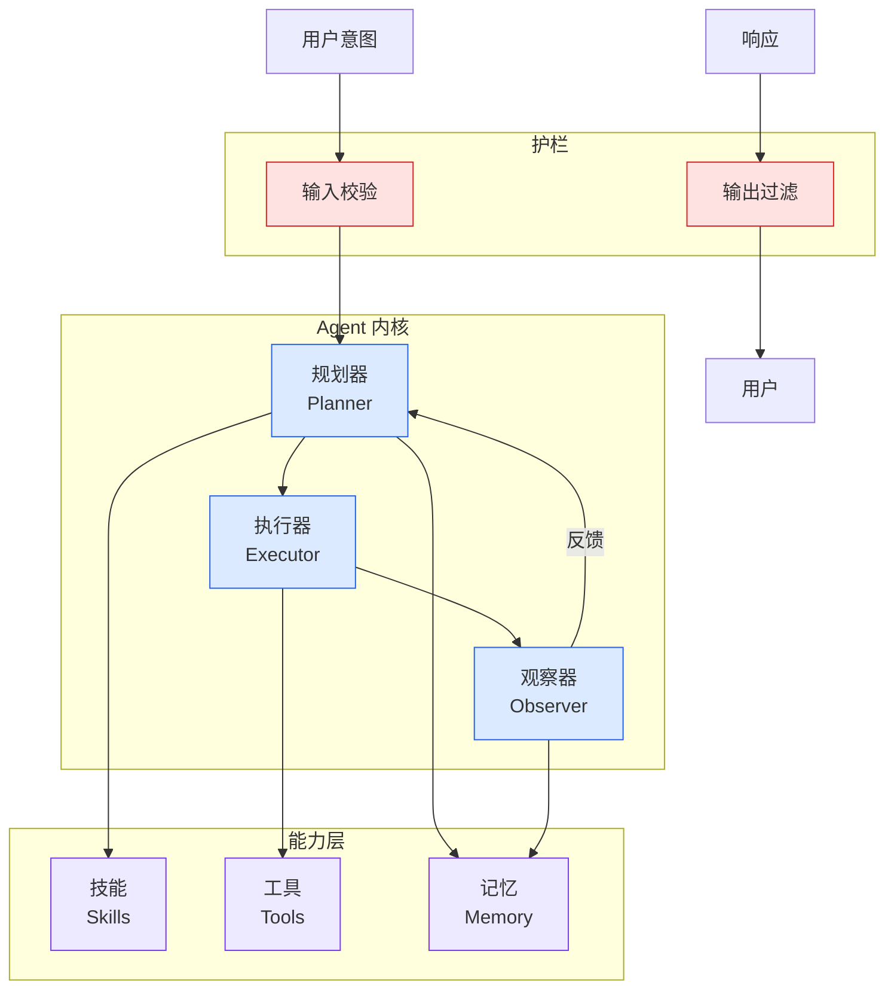

# 下一代企业数字化架构：系统CLI化、流程Skill化、员工Agent化

## Ch04.686 下一代企业数字化架构：系统CLI化、流程Skill化、员工Agent化

> 📊 Level ⭐⭐ | 3.0KB | `entities/enterprise-next-gen-architecture-system-cli-process-skill-employee-agent-zhan.md`

# 下一代企业数字化架构：系统CLI化、流程Skill化、员工Agent化

→ [原文存档](https://github.com/QianJinGuo/wiki-book/tree/main/docs/raw/articles/enterprise-next-gen-architecture-system-cli-process-skill-employee-agent-zhan.md)

## 深度分析

下一代企业数字化架构：系统CLI化、流程Skill化、员工Agent化 涉及agent领域的核心技术议题。
### 核心观点
1. # 下一代企业数字化架构：系统CLI化、流程Skill化、员工Agent化
作者：詹老师（AI产品专家 / 流程管理专家）
## 核心命题

很多企业谈 Agent 落地，第一句话就讲虚了——"系统要智能化，Skill 要能力化，Agent 要智能化"。
2. 真正的问题是：一封合同进来，谁下载附件？
3. 如果答案还是员工本人，那企业只是多了一个聊天框，工作方式没有变。
4. **真正有变化量的是三句话：系统CLI化，流程Skill化，员工Agent化。
5. **
## 一、三层架构
### 第一层：业务系统CLI化
传统 GUI 系统默认"操作者是人"。

### 内容结构
- 下一代企业数字化架构：系统CLI化、流程Skill化、员工Agent化
- 核心命题
- 一、三层架构
- 第一层：业务系统CLI化
- 第二层：流程Skill化
- 第三层：员工Agent化
- 二、三层闭环
- 三、落地路径

### 技术要点

- **agent架构**: 本文在agent方向提出的设计理念与实现路径
- **工程挑战**: 实际落地中面临的关键问题与应对策略
- **architecture趋势**: 相关技术演进方向与新兴范式
### 关联实体

- [Karpathy 最新访谈从 Vibe Coding 到 Agentic Engineering](ch04/237-agentic.html)
- [Karpathy Vibe Coding Agentic Engineering](ch04/126-karpathy-vibe-coding-agentic-engineering.html)
- [你不知道的 Agent原理架构与工程实践 V2](../ch03/035-agent.html)
- [Openclaw 完全指南这可能是全网最新最全的系统化教程了32W字建议收藏 V2](../ch11/235-openclaw.html)
- [Openclaw 完全指南这可能是全网最新最全的系统化教程了32W字建议收藏](../ch11/235-openclaw.html)
- [一文带你弄懂 Ai 圈爆火的新概念Harness Engineering](../ch05/120-harness-engineering.html)

## 实践启示
1. **工程落地**: agent领域方案需关注可观测性、可维护性和成本效率
2. **技术选型**: 根据场景选择合适的技术栈，避免过度设计或盲目追新
3. **持续迭代**: 建立数据驱动的反馈闭环，持续优化系统表现
4. **风险管控**: 引入新技术需评估对现有系统稳定性的影响，做好降级预案

## 相关实体

- [MOC](https://github.com/QianJinGuo/wiki/blob/main/moc/data-infrastructure.md)

---

