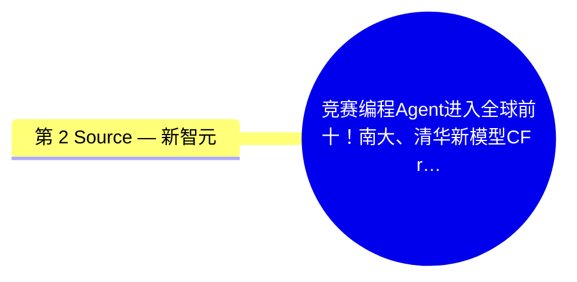
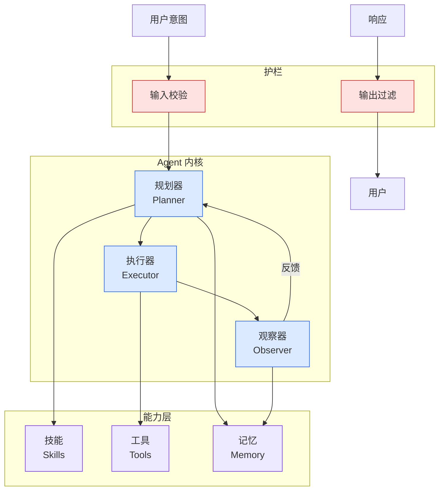

# 竞赛编程Agent进入全球前十！南大、清华新模型CF rating超3500

## Ch04.687 竞赛编程Agent进入全球前十！南大、清华新模型CF rating超3500

> 📊 Level ⭐⭐ | 3.0KB | `entities/竞赛编程agent进入全球前十南大清华新模型cf-rating超3500.md`

# 竞赛编程Agent进入全球前十！南大、清华新模型CF rating超3500

# 竞赛编程Agent进入全球前十！南大、清华新模型CF rating超3500
---
source: wechat
source_url: https://mp.weixin.qq.com/s/_VaYlATQ9Ootfj2Q03sU7Q
ingested: 2026-07-08
source_published: 2026年7月8日 11:45
---
# 竞赛编程Agent进入全球前十！南大、清华新模型CF rating超3500
### 
### 
**   ****新智元报道  **
##### **【新智元导读】 大语言模型在代码生成上的能力不断增强，但在复杂算法题，尤其是竞赛编程场景中，仍然容易因为算法选择错误、边界条件遗漏、复杂度判断失误或隐藏测试覆盖不足而失败。Solvita是一款面向竞赛编程的智能体框架，通过四个角色（Planner、Solver、Oracle、Hacker）形成闭环系统，并利用可训练的图结构知识网络积累经验。**
  
竞赛编程并不只是「把题面翻译成代码」。一个正确解法往往需要经历多个复杂环节：理解自然语言题面、抽象出数学结构、选择合适算法范式、估计复杂度、实现代码、构造测试、处理多解输出、排查隐藏边界条件等。
对于LLM来说，这类任务有几个典型困难：
#### 1\. 算法选择高度依赖题目结构
#### 同样是图论、动态规划或字符串问题，不同约束下可能对应完全不同的算法。如果模型只根据表面相似度检索样例，很容易选到「看起来像但本质不对」的套路。
#### 2\. 样例测试远远不够
很多错误解法可以通过样例，却会在隐藏测试中失败。尤其是边界条件、复杂度极限、多答案checker、精度问题等，都很难靠普通自测覆盖。
#### 3\. 失败经验难以复用
现有很多coding agent失败后会重新尝试、重新生成、重新调试，但一次任务结束后

→ [原文存档](https://github.com/QianJinGuo/wiki-book/tree/main/docs/raw/articles/竞赛编程agent进入全球前十南大清华新模型cf-rating超3500.md)

## 概念导图

## 第 2 Source — 新智元

> From WeChat MP 新智元, supplemental coverage of the same topic.

-> [原文存档](https://github.com/QianJinGuo/wiki-book/tree/main/docs/raw/articles/竞赛编程agent进入全球前十南大清华新模型cf-rating超3500-2026-07-08.md)

---
## 关联

- 相关概念: [Harness Engineering](https://github.com/QianJinGuo/wiki/blob/main/concepts/harness-engineering-framework.md)
- 相关: [Agent 架构](https://github.com/QianJinGuo/wiki/blob/main/concepts/agent-architecture.md)

---

