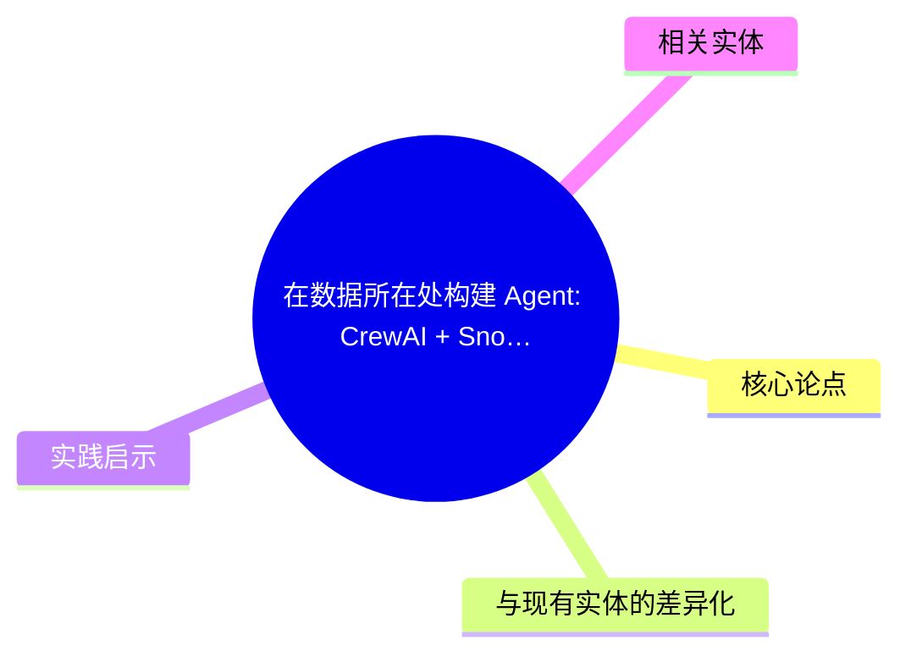
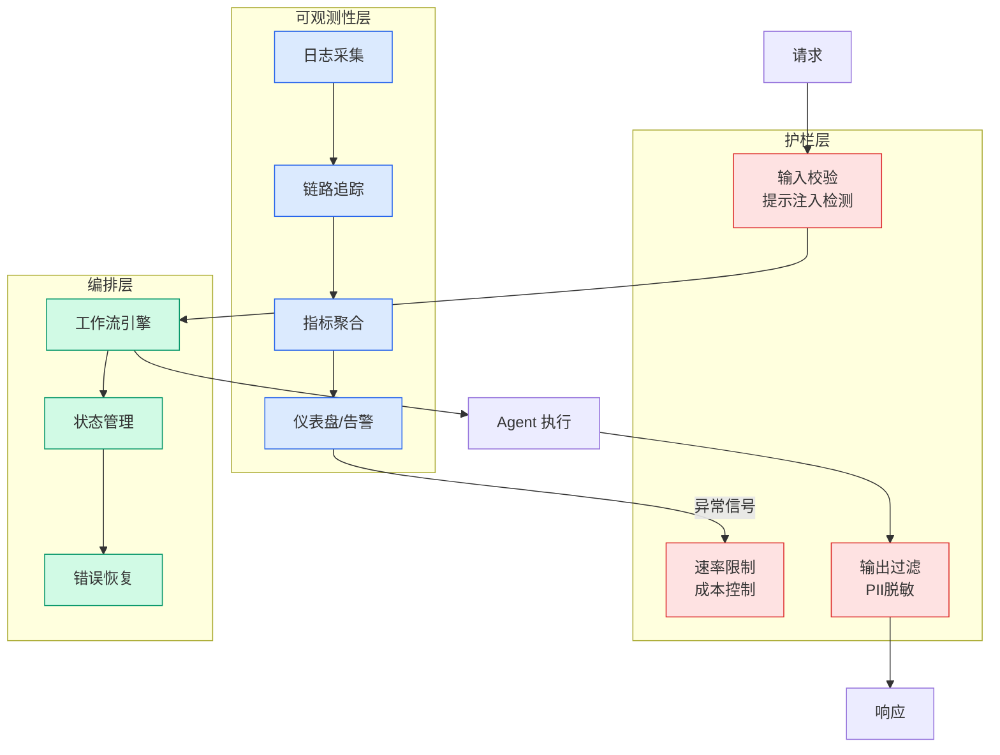

# 在数据所在处构建 Agent: CrewAI + Snowflake 企业级 Agent 部署

## Ch04.688 在数据所在处构建 Agent: CrewAI + Snowflake 企业级 Agent 部署

> 📊 Level ⭐⭐ | 3.0KB | `entities/crewai-snowflake-enterprise-agent-deployment.md`

# 在数据所在处构建 Agent: CrewAI + Snowflake 企业级 Agent 部署

> CrewAI 提出企业 Agent 的瓶颈已从用例和模型转向"治理下的构建吞吐量"——如何在权限、数据边界、审批路径、审计日志等现有业务系统内高效构建和部署 Agent。与 Snowflake 的深度集成是解决这一问题的关键路径。

## 概念导图

## 摘要

企业拥有 20-100-800 个已识别的 Agent 用例，但 AI 团队每年只能交付约 10 个。瓶颈不是想法或模型智能，而是吞吐量——在复杂运营中构建、部署和扩展 Agent，而不让十名工程师成为每个工作流的永久所有者。核心矛盾："自治需要信任，信任需要控制，控制扼杀自治"——当控制施加在错误层级时。

## 核心论点

- **数据有重力**：企业数据不愿移动，存在于数据湖、SaaS 应用、Snowflake、Salesforce 和内部系统中
- **治理困境**：Agent 跨边界拉取上下文时治理崩溃；Agent 困在单一系统时无法触及足够远以完成有用工作
- **DocuSign 案例**：在 CrewAI、Snowflake、Salesforce 和内部系统之间构建运营循环，Agent 工作嵌入业务流程而非假装流程不存在
- **构建吞吐量**：需要让 Agent 的构建速度不破坏业务规则

## 与现有实体的差异化

- [Agent 数据治理模式](../ch03/035-agent.html) 聚焦数据库凭证安全，本文聚焦企业级构建吞吐量和 Snowflake 集成
- [CrewAI 小步快跑](../ch03/035-agent.html) 聚焦开发方法论，本文聚焦数据治理和平台集成
- [Agent 安全三步序列](../ch05/009-harness.html) 聚焦安全，本文聚焦数据所在处的 Agent 构建

## 实践启示

- 企业 Agent 平台需要与现有数据基础设施深度集成
- Snowflake 作为企业数据中枢，是 Agent 数据访问的自然入口
- "自治需要信任，信任需要控制"框架适用于 Agent 系统架构设计

## 相关实体

- [Agent 数据治理模式](../ch03/035-agent.html)
- [CrewAI 小步快跑](../ch03/035-agent.html)
- [Agent 安全三步序列](../ch05/009-harness.html)
- [Agentium Agent 框架](../ch01/1242-agentium-agent.html)
- [Snowflake Agentic Enterprise Summit](ch04/237-agentic.html)

→ [原文存档](https://github.com/QianJinGuo/wiki-book/tree/main/docs/raw/articles/how-to-build-agents-where-data-already-lives.md)

---

