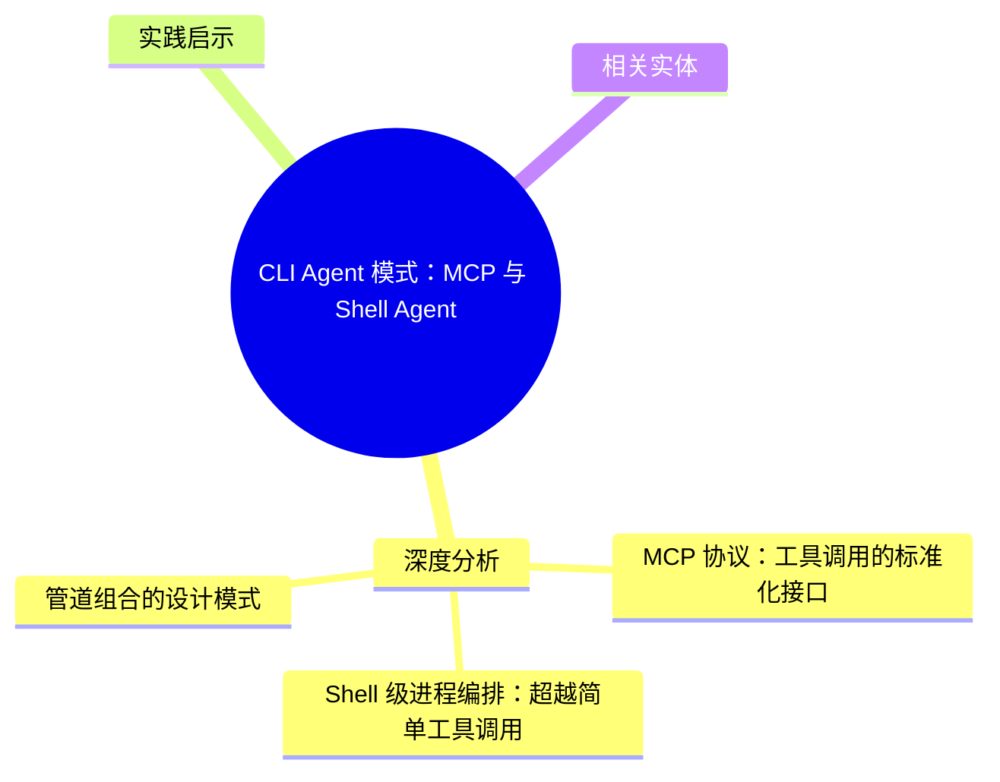
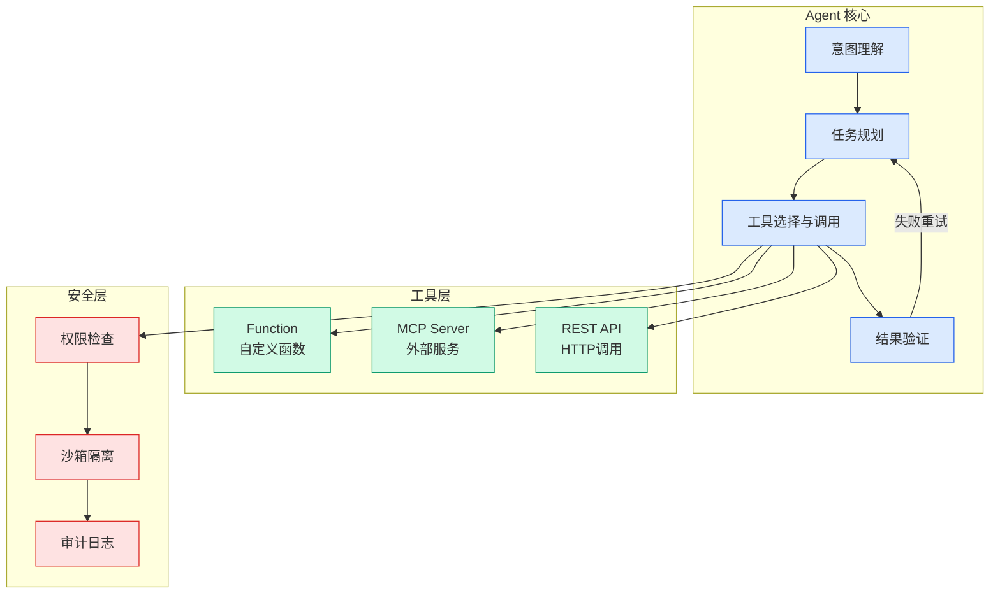

# CLI Agent 模式：MCP 与 Shell Agent

## Ch04.690 CLI Agent 模式：MCP 与 Shell Agent

> 📊 Level ⭐⭐ | 2.8KB | `entities/cli-agent-patterns-mcp-shell-agents.md`

# CLI Agent 模式：MCP 与 Shell Agent

CLI Agent 的设计模式：基于 MCP 协议的工具调用、Shell 级别的进程编排、管道组合。代表实践包括 Claude Code、Codex CLI 等。

## 概念导图

## 深度分析

### MCP 协议：工具调用的标准化接口

MCP（Model Context Protocol）为 CLI Agent 提供了与外部工具交互的标准化接口。通过将工具描述为"资源"和"工具"两层抽象，Agent 既可以被动获取上下文信息（资源），也可以主动触发操作（工具）。这种分层设计与 CLI 的设计哲学天然契合——CLI 本身就是"输入命令→获取输出→处理结果"的循环模式。

### Shell 级进程编排：超越简单工具调用

CLI Agent 的核心特征在于 Shell 级的进程编排能力：管道组合（`|` 将命令输出作为另一个的输入）、进程生命周期管理（启动→监控→超时→终止）、并发控制（后台任务、作业队列）、环境隔离（不同 Agent 进程使用不同工作目录和环境变量）。这些能力让 CLI Agent 从"单步命令执行器"进化为"多步工作流引擎"。

### 管道组合的设计模式

在 CLI Agent 中，管道组合可以抽象为一种设计模式：每个工具是一个"过滤器"——接收结构化输入、产生结构化输出，工具之间通过标准格式（JSON、纯文本、文件路径）传递中间结果。Claude Code、Codex CLI 等实践都采用这种设计——将复杂开发任务拆解为一系列通过管道组合的原子步骤。

## 实践启示

1. **优先实现管道组合**：管道是 CLI Agent 最强大的抽象，让工具之间的数据流变得可预测、可测试。
2. **进程管理是硬需求**：不要忽视超时控制、子进程清理和退出码处理——这些是 CLI Agent 稳定运行的基础。
3. **利用 MCP 生态**：优先选择实现 MCP 协议的工具，避免为每个工具编写自定义适配器。

## 相关实体

- [CLI、MCP 和 CLI+Skill，应该如何选？](ch04/271-skill.html)
- [如何构建生产准备的AI代理：MCP、CLI与技能——适合合适的工作的工具](ch04/298-ai-agent.html)
- [Agent-EvalKit：AWS 开源 CLI Agent 评测工具包](../ch03/035-agent.html)
- [CLI-Anything：让 Agent 自主驱动任意 GUI 软件](../ch03/101-cli-anything.html)
- [AI Agent 的内核是 250 行 while 循环：用 Python + Ollama 从零搭建 CLI Agent 的 7 阶段教程](ch04/617-python.html)

---

